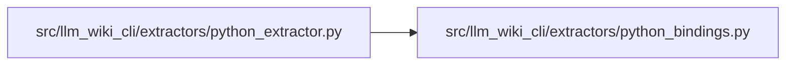

# python_bindings Module

**Path:** `src/llm_wiki_cli/extractors/python_bindings.py`

## Description

Conservative syntax-only binding facts for captured Python calls.

## Imports

| Source | Symbols |
|--------|---------|
| `__future__` | `annotations` |
| `ast` | `ast` |
| `builtins` | `builtins` |
| `dataclasses` | `dataclass` |

## Local dependency map

<!-- Auto-generated local dependency summary. Do not edit by hand. -->

### Internal neighbors

| Direction | Module |
|---|---|
| Inbound | [python_extractor](../modules/python_extractor.md) |

## Classes

| Class | Line | Bases | Description |
|-------|------|-------|-------------|
| [_ScopeNames](../entities/ScopeNames.md) | 33 | `ast.NodeVisitor` | — |
| [PythonBindings](../entities/PythonBindings.md) | 144 | — | — |
| [_BindingAnalyzer](../entities/BindingAnalyzer.md) | 149 | — | — |

## Functions

| Function | Signature | Decorators | Description |
|----------|-----------|------------|-------------|
| `_lookup` | `(env: dict, name: str) -> dict` | — | — |
| `_target_names` | `(node: ast.AST) -> set[str]` | — | — |
| `_scope_names` | `(body: list[ast.stmt]) -> _ScopeNames` | — | — |
| `_parameters` | `(args: ast.arguments) -> set[str]` | — | — |
| `import_bindings` | `(node: ast.Import \| ast.ImportFrom) -> dict[str, dict]` | — | — |
| `analyze_python_bindings` | `(tree: ast.Module) -> PythonBindings` | — | — |
