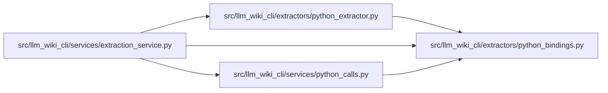

# python_bindings Module

**Path:** `src/llm_wiki_cli/extractors/python_bindings.py`

## Description

Conservative syntax-only binding facts for captured Python calls.

## Imports

| Source | Symbols |
|--------|---------|
| `__future__` | `annotations` |
| `ast` | `ast` |
| `builtins` | `builtins` |
| `collections` | `Counter` |
| `copy` | `deepcopy` |
| `dataclasses` | `dataclass` |

## Local dependency map

<!-- Auto-generated local dependency summary. Do not edit by hand. -->

```mermaid
flowchart LR
    n0["src/llm_wiki_cli/extractors/python_bindings.py"]
    n1["src/llm_wiki_cli/extractors/python_extractor.py"]
    n2["src/llm_wiki_cli/services/extraction_service.py"]
    n3["src/llm_wiki_cli/services/python_calls.py"]
    n1 --> n0
    n2 --> n0
    n2 --> n1
    n2 --> n3
    n3 --> n0
    click n0 "../modules/python_bindings.md"
    click n1 "../modules/python_extractor.md"
    click n2 "../modules/extraction_service.md"
    click n3 "../modules/python_calls.md"
```

### Internal neighbors

| Direction | Module |
|---|---|
| Inbound | [python_extractor](../modules/python_extractor.md) |
| Inbound | [extraction_service](../modules/extraction_service.md) |
| Inbound | [python_calls](../modules/python_calls.md) |

## Classes

| Class | Line | Bases | Description |
|-------|------|-------|-------------|
| [_ScopeNames](../entities/ScopeNames.md) | 206 | `ast.NodeVisitor` | — |
| [PythonBindings](../entities/PythonBindings.md) | 320 | — | — |
| [_BindingAnalyzer](../entities/BindingAnalyzer.md) | 326 | — | — |

## Functions

| Function | Signature | Decorators | Description |
|----------|-----------|------------|-------------|
| `_unresolved` | `(node, reason)` | — | — |
| `_callee_path` | `(node)` | — | — |
| `_module_declarations` | `(tree)` | — | — |
| `_module_classes` | `(tree)` | — | — |
| `_namespace_statements` | `(body)` | — | Walk namespace statements without interpreting nested callable bodies. |
| `_dispatch_facts` | `(tree, module)` | — | Qualify only allocation/dispatch syntax actually present in this AST. |
| `_lookup` | `(env: dict, name: str) -> dict` | — | — |
| `_target_names` | `(node: ast.AST) -> set[str]` | — | — |
| `_definition_expressions` | `(node)` | — | — |
| `_walrus_names` | `(node: ast.AST) -> set[str]` | — | Find containing-scope writes without entering deferred callable bodies. |
| `_scope_names` | `(body: list[ast.stmt]) -> _ScopeNames` | — | — |
| `_parameters` | `(args: ast.arguments) -> set[str]` | — | — |
| `import_bindings` | `(node: ast.Import \| ast.ImportFrom) -> dict[str, dict]` | — | — |
| `analyze_python_bindings` | `(tree: ast.Module) -> PythonBindings` | — | — |
| `valid_python_constructor_facts` | `(inventory, *, require_capability = True)` | — | Validate published syntax facts without reading or parsing source. |
