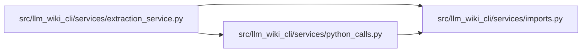

# python_calls Module

**Path:** `src/llm_wiki_cli/services/python_calls.py`

## Description

Shared Python call resolution using captured lexical binding evidence.

## Imports

| Source | Symbols |
|--------|---------|
| `.imports` | `ModulePathResolver` |
| `__future__` | `annotations` |
| `collections.abc` | `Mapping` |
| `dataclasses` | `dataclass` |
| `typing` | `TYPE_CHECKING` |

## Local dependency map

<!-- Auto-generated local dependency summary. Do not edit by hand. -->

### Internal neighbors

| Direction | Module |
|---|---|
| Inbound | [extraction_service](../modules/extraction_service.md) |
| Outbound | [imports](../modules/imports.md) |

## Classes

| Class | Line | Bases | Description |
|-------|------|-------|-------------|
| [PythonCallContext](../entities/PythonCallContext.md) | 14 | — | — |
| [_PythonCallResolver](../entities/PythonCallResolver.md) | 66 | — | — |

## Functions

| Function | Signature | Decorators | Description |
|----------|-----------|------------|-------------|
| `_declared_symbol` | `(data: Mapping, name: str) -> bool` | — | — |
| `_module_binding` | `(data: Mapping, name: str) -> dict` | — | — |
| `resolve_python_call` | `(call: dict, filepath: str, data: dict, context: PythonCallContext)` | — | — |
