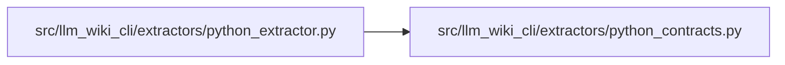

# python_contracts Module

**Path:** `src/llm_wiki_cli/extractors/python_contracts.py`

## Description

Pure AST helpers for reconstructable Python declaration contracts.

The helpers in this module deliberately operate on syntax only.  They never
import or evaluate the inspected project, which keeps extraction deterministic
and safe for applications whose imports have startup side effects.

## Imports

| Source | Symbols |
|--------|---------|
| `__future__` | `annotations` |
| `ast` | `ast` |
| `collections.abc` | `Callable`, `Mapping` |

## Local dependency map

<!-- Auto-generated local dependency summary. Do not edit by hand. -->

### Internal neighbors

| Direction | Module |
|---|---|
| Inbound | [python_extractor](../modules/python_extractor.md) |

## Functions

| Function | Signature | Decorators | Description |
|----------|-----------|------------|-------------|
| `expression_to_str` | `(node: ast.AST \| None) -> str` | — | Return canonical, readable Python syntax for *node*. |
| `reference_to_str` | `(node: ast.AST \| None) -> str` | — | Return a dotted name for a simple name/attribute expression. |
| `normalize_reference` | `(node_or_name: ast.AST \| str \| None, import_aliases: Mapping[str, str]) -> str` | — | Resolve the root binding of a simple reference through imports. |
| `_argument_record` | `(arg: ast.arg, kind: str) -> dict` | — | — |
| `extract_parameters` | `(args: ast.arguments, *, omit_method_receiver: bool = False) -> list[dict]` | — | Return all parameters in declaration order with explicit kinds. |
| `_subscript_elements` | `(node: ast.Subscript) -> list[ast.AST]` | — | — |
| `_unwrap_annotated` | `(annotation: ast.AST, import_aliases: Mapping[str, str]) -> tuple[ast.AST, list[ast.AST]]` | — | — |
| `_is_none_annotation` | `(node: ast.AST) -> bool` | — | — |
| `_parse_forward_annotation` | `(node: ast.AST) -> ast.AST` | — | — |
| `annotation_is_nullable` | `(annotation: ast.AST, import_aliases: Mapping[str, str]) -> bool` | — | Whether an annotation explicitly permits ``None``. |
| `literal_values` | `(annotation: ast.AST, import_aliases: Mapping[str, str]) -> list[str]` | — | Collect declared values from nested ``Literal`` annotations. |
| `_is_ellipsis` | `(node: ast.AST \| None) -> bool` | — | — |
| `_literal_string` | `(node: ast.AST \| None) -> str \| None` | — | — |
| `_field_call` | `(node: ast.AST \| None, import_aliases: Mapping[str, str]) -> ast.Call \| None` | — | — |
| `_unknown` | `(property_name: str, node: ast.AST) -> dict[str, str]` | — | — |
| `_parse_examples` | `(node: ast.AST) -> list[str]` | — | — |
| `_is_static_literal` | `(node: ast.AST) -> bool` | — | — |
| `_example_nodes` | `(node: ast.AST) -> list[ast.AST]` | — | — |
| `_apply_field_call` | `(result: dict, call: ast.Call, import_aliases: Mapping[str, str]) -> None` | — | — |
| `extract_class_attributes` | `(node: ast.ClassDef, import_aliases: Mapping[str, str]) -> list[dict]` | — | Extract normalized annotated attributes and Pydantic field metadata. |
| `normalized_bases` | `(node: ast.ClassDef, import_aliases: Mapping[str, str]) -> list[str]` | — | — |
| `class_kind` | `(node: ast.ClassDef, import_aliases: Mapping[str, str]) -> str` | — | — |
| `is_pydantic_model` | `(node: ast.ClassDef, import_aliases: Mapping[str, str]) -> bool` | — | — |
| `finalize_model_kinds` | `(classes: list[dict]) -> None` | — | Propagate Pydantic model classification through local subclasses. |
| `finalize_inventory_model_kinds` | `(inventory: Mapping[str, dict], *, module_candidates: Callable[[str, str], set[str]] \| None = None) -> None` | — | Propagate Pydantic model identity through imported local base classes. |
| `extract_enum_attributes` | `(node: ast.ClassDef) -> list[dict]` | — | Extract declared Enum member expressions without executing them. |
| `_config_entry` | `(name: str, value: ast.AST, source: str, line: int) -> dict` | — | — |
| `_config_entries_from_call` | `(call: ast.Call, source: str) -> list[dict]` | — | — |
| `_config_entries_from_dict` | `(node: ast.Dict, source: str) -> list[dict]` | — | — |
| `extract_model_config` | `(node: ast.ClassDef, import_aliases: Mapping[str, str]) -> list[dict]` | — | Extract Pydantic v1/v2 model configuration assignments. |
| `extract_validator` | `(node: ast.FunctionDef \| ast.AsyncFunctionDef, import_aliases: Mapping[str, str]) -> dict \| None` | — | Return normalized Pydantic validator metadata for a method. |
| `type_alias_record` | `(name: str, value: ast.AST, line: int, import_aliases: Mapping[str, str], *, deep: bool, inferred: bool = False, type_params: list[str] \| None = None) -> dict` | — | — |
| `explicit_type_alias` | `(node: ast.AnnAssign, import_aliases: Mapping[str, str], *, deep: bool) -> dict \| None` | — | — |
| `inferred_type_alias` | `(node: ast.Assign, import_aliases: Mapping[str, str], *, deep: bool) -> dict \| None` | — | — |
