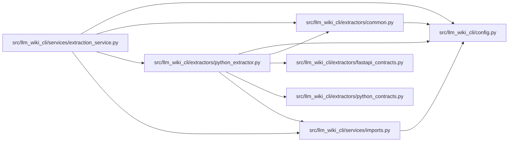

# python_extractor Module

**Path:** `src/llm_wiki_cli/extractors/python_extractor.py`

## Description

Python AST extractor for agent-wiki-cli.

## Imports

| Source | Symbols |
|--------|---------|
| `..config` | `build_gitignore_matcher` |
| `..services.imports` | `build_module_path_resolver` |
| `.common` | `discover_source_files` |
| `.fastapi_contracts` | `extract_fastapi_declarations` |
| `.python_contracts` | `class_kind`, `explicit_type_alias`, `expression_to_str`, `extract_class_attributes`, `extract_enum_attributes`, `extract_model_config`, `extract_parameters`, `extract_validator`, `finalize_inventory_model_kinds`, `finalize_model_kinds`, `inferred_type_alias`, `is_pydantic_model`, `type_alias_record` |
| `__future__` | `annotations` |
| `ast` | `ast` |
| `pathlib` | `Path` |
| `sys` | `sys` |

## Local dependency map

<!-- Auto-generated local dependency summary. Do not edit by hand. -->

### Internal neighbors

| Direction | Module |
|---|---|
| Inbound | [extraction_service](../modules/extraction_service.md) |
| Outbound | [config](../modules/config.md) |
| Outbound | [common](../modules/common.md) |
| Outbound | [fastapi_contracts](../modules/fastapi_contracts.md) |
| Outbound | [python_contracts](../modules/python_contracts.md) |
| Outbound | [imports](../modules/imports.md) |

## Classes

| Class | Line | Bases | Description |
|-------|------|-------|-------------|
| [_DataEffectVisitor](../entities/DataEffectVisitor.md) | 493 | `ast.NodeVisitor` | — |
| [ComponentVisitor](../entities/ComponentVisitor.md) | 897 | `ast.NodeVisitor` | — |
| [PythonExtractor](../entities/PythonExtractor.md) | 1347 | — | Extractor for Python source files using the built-in :mod:`ast` module. |

## Functions

| Function | Signature | Decorators | Description |
|----------|-----------|------------|-------------|
| `_annotation_to_str` | `(node) -> str` | — | Convert an AST annotation node to a readable string. |
| `_default_to_str` | `(node) -> str` | — | Convert a default-value AST node to a readable string. |
| `_simple_reference_to_str` | `(node) -> str` | — | Return a dotted reference for simple name/attribute expressions. |
| `_is_simple_subscript_slice` | `(node) -> bool` | — | — |
| `_summarize_expression` | `(node) -> dict[str, str]` | — | Summarize an AST expression without retaining arbitrary source text. |
| `_extract_decorators` | `(node) -> list[str]` | — | Extract decorator names from a node. |
| `_call_arguments` | `(node: ast.Call) -> dict` | — | — |
| `_call_record` | `(node: ast.Call, *, include_arguments: bool = False) -> dict \| None` | — | Build a call record from an ``ast.Call`` node. |
| `_extract_calls` | `(node) -> list[dict]` | — | Collect direct call targets within a function/method body. |
| `_bound_import_name` | `(alias: ast.alias, *, from_import: bool = False) -> str` | — | — |
| `_iter_binding_targets` | `(target) -> list[ast.AST]` | — | — |
| `_target_bound_names` | `(target) -> set[str]` | — | — |
| `_argument_bound_names` | `(args: ast.arguments) -> set[str]` | — | — |
| `_extract_module_globals` | `(tree: ast.Module) -> set[str]` | — | — |
| `_import_alias_target` | `(alias: ast.alias, *, module: str = '') -> tuple[str, str] \| None` | — | — |
| `_import_aliases_from_statement` | `(statement) -> dict[str, str]` | — | — |
| `_extract_import_aliases` | `(tree: ast.Module) -> dict[str, str]` | — | — |
| `_normalize_reference` | `(name: str, import_aliases: dict[str, str]) -> str` | — | — |
| `_open_mode` | `(node: ast.Call) -> str \| None` | — | — |
| `_classify_open_call` | `(node: ast.Call) -> str \| None` | — | — |
| `_classify_boundary_call` | `(normalized: str, node: ast.Call) -> str \| None` | — | — |
| `_boundary_call_record` | `(node: ast.Call, import_aliases: dict[str, str]) -> dict \| None` | — | — |
| `_environment_subscript_record` | `(node: ast.Subscript, import_aliases: dict[str, str], kind: str) -> dict \| None` | — | — |
| `_collect_function_scope` | `(node) -> tuple[set[str], set[str], dict[str, str]]` | — | — |
| `_attribute_read_name` | `(node: ast.Attribute) -> str` | — | — |
| `_write_record` | `(target, global_declarations: set[str]) -> dict \| None` | — | — |
| `_extract_data_effects` | `(node, params: list[dict], module_globals: set[str], module_import_aliases: dict[str, str], return_annotation: str, *, coverage: dict[str, dict] \| None = None) -> dict` | — | — |
| `_assign_target_name` | `(targets) -> str` | — | First simple ``Name`` target of an assignment (e.g. ``app`` in |
| `_module_call_record` | `(call: ast.Call, target: str = '') -> dict \| None` | — | Build a module-level side-effect record, optionally with its bound name. |
| `_extract_module_calls` | `(tree: ast.Module) -> list[dict]` | — | Collect module-scope executable calls (import-time side effects). |
| `_extract_function_info` | `(node, deep: bool = False, module_globals: set[str] \| None = None, module_import_aliases: dict[str, str] \| None = None, *, omit_method_receiver: bool = False, data_effect_observations: list[dict] \| None = None, observation_symbol: str \| None = None) -> dict` | — | Extract full function/method info from a FunctionDef or AsyncFunctionDef. |
| `_extract_class_attributes` | `(node, module_import_aliases: dict[str, str] \| None = None) -> list[dict]` | — | Extract annotated attributes from a class body (Pydantic fields, dataclass fields, etc.). |
| `_string_list` | `(node) -> list[str]` | — | Return the string constants of a ``List``/``Tuple`` literal (else empty). |
| `_safe_name_or_attribute` | `(node) -> dict \| None` | — | — |
| `_safe_constant_value` | `(node) -> dict \| None` | — | Summarize small static constant values without executing user code. |
| `_is_main_guard` | `(test) -> bool` | — | Detect an ``if __name__ == "__main__"`` test node. |
| `_scan_python_files` | `(src_dir: str, deep: bool = False, only_files: list[str] \| None = None, include_empty: bool = False, source_files: list[str] \| None = None, data_effect_observations: list[dict] \| None = None, import_location_observations: list[dict] \| None = None) -> dict` | — | Scan Python files under *src_dir* and return a raw inventory dict. |
