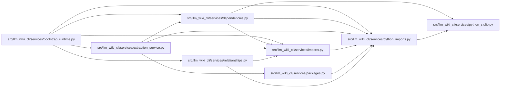

# python_imports Module

**Path:** `src/llm_wiki_cli/services/python_imports.py`

## Description

Pure Python import-root indexing over an already selected inventory.

## Imports

| Source | Symbols |
|--------|---------|
| `.python_stdlib` | `python_stdlib_module_names` |
| `__future__` | `annotations` |
| `collections` | `defaultdict` |
| `collections.abc` | `Mapping` |
| `dataclasses` | `dataclass` |
| `pathlib` | `PurePosixPath` |
| `posixpath` | `posixpath` |
| `sys` | `sys` |

## Local dependency map

<!-- Auto-generated local dependency summary. Do not edit by hand. -->

### Internal neighbors

| Direction | Module |
|---|---|
| Inbound | [bootstrap_runtime](../modules/bootstrap_runtime.md) |
| Inbound | [services_dependencies](../modules/services_dependencies.md) |
| Inbound | [extraction_service](../modules/extraction_service.md) |
| Inbound | [imports](../modules/imports.md) |
| Inbound | [packages](../modules/packages.md) |
| Inbound | [relationships](../modules/relationships.md) |
| Outbound | [python_stdlib](../modules/python_stdlib.md) |

## Classes

| Class | Line | Bases | Description |
|-------|------|-------|-------------|
| [PythonImportScope](../entities/PythonImportScope.md) | 37 | — | — |
| [PythonModuleIndex](../entities/PythonModuleIndex.md) | 44 | — | — |

## Functions

| Function | Signature | Decorators | Description |
|----------|-----------|------------|-------------|
| `is_python_source` | `(filepath: str, data: object = None) -> bool` | — | — |
| `normalized_root` | `(value: object) -> str \| None` | — | — |
| `under_root` | `(path: str, root: str) -> bool` | — | — |
| `_relative_target` | `(module: str, importer: str) -> str \| None` | — | — |
