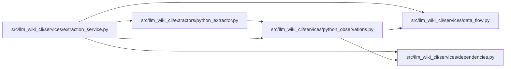

# python_observations Module

**Path:** `src/llm_wiki_cli/services/python_observations.py`

## Description

Canonical Python observation envelopes and per-source cache validation.

## Imports

| Source | Symbols |
|--------|---------|
| `.data_flow` | `_data_effect_coverage_index`, `_data_effect_coverage_index` |
| `.dependencies` | `_import_location_index` |
| `__future__` | `annotations` |
| `collections.abc` | `Iterable`, `Mapping` |
| `copy` | `deepcopy` |

## Local dependency map

<!-- Auto-generated local dependency summary. Do not edit by hand. -->

### Internal neighbors

| Direction | Module |
|---|---|
| Inbound | [python_extractor](../modules/python_extractor.md) |
| Inbound | [extraction_service](../modules/extraction_service.md) |
| Outbound | [data_flow](../modules/data_flow.md) |
| Outbound | [services_dependencies](../modules/services_dependencies.md) |

## Functions

| Function | Signature | Decorators | Description |
|----------|-----------|------------|-------------|
| `data_effect_sidecar` | `(records: Iterable[dict]) -> dict` | — | — |
| `import_sidecar` | `(records: Iterable[dict]) -> dict` | — | — |
| `partition_sidecars` | `(effects: dict \| None, imports: dict \| None, paths: Iterable[str]) -> dict[str, dict]` | — | Store explicit empty observations separately from unavailable capabilities. |
| `valid_cached_sidecars` | `(value: object, path: str, inventory: dict, *, effects: bool, imports: bool) -> bool` | — | Validate requested schemas, source ownership, coverage, and import identity. |
