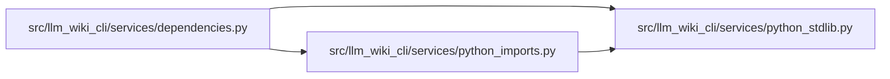

# python_stdlib Module

**Path:** `src/llm_wiki_cli/services/python_stdlib.py`

## Description

Shared, interpreter-compatible Python standard-library module names.

## Imports

| Source | Symbols |
|--------|---------|
| `__future__` | `annotations` |
| `sys` | `sys` |

## Local dependency map

<!-- Auto-generated local dependency summary. Do not edit by hand. -->

### Internal neighbors

| Direction | Module |
|---|---|
| Inbound | [services_dependencies](../modules/services_dependencies.md) |
| Inbound | [python_imports](../modules/python_imports.md) |

## Functions

| Function | Signature | Decorators | Description |
|----------|-----------|------------|-------------|
| `python_stdlib_module_names` | `() -> frozenset[str]` | — | — |
