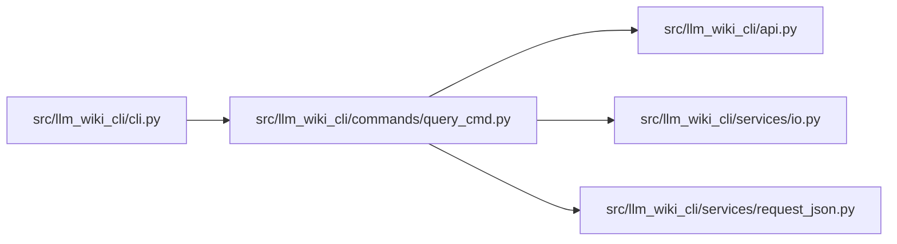

# query_cmd Module

**Path:** `src/llm_wiki_cli/commands/query_cmd.py`

## Description

Adapts bounded file/stdin JSON to the supported exact documentation query API. Scope, provenance and response bounds are preserved. Invalid input and workspace failures retain distinct exits, and an output file is written only when explicitly requested.

## Imports

| Source | Symbols |
|--------|---------|
| `..` | `api` |
| `..services.io` | `write_text_output`, `write_utf8_stdout` |
| `..services.request_json` | `load_request` |
| `__future__` | `annotations` |
| `json` | `json` |
| `sys` | `sys` |

## Local dependency map

<!-- Auto-generated local dependency summary. Do not edit by hand. -->

### Internal neighbors

| Direction | Module |
|---|---|
| Inbound | [cli](../modules/cli.md) |
| Outbound | [api](../modules/api.md) |
| Outbound | [io](../modules/io.md) |
| Outbound | [request_json](../modules/request_json.md) |

## Functions

| Function | Signature | Decorators | Description |
|----------|-----------|------------|-------------|
| `run` | `(args)` | — | — |