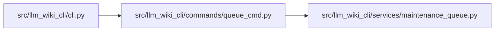

# queue_cmd Module

**Path:** `src/llm_wiki_cli/commands/queue_cmd.py`

## Description

Read-only managed-wiki maintenance triage.

## Imports

| Source | Symbols |
|--------|---------|
| `..services.maintenance_queue` | `build_maintenance_queue`, `render_queue` |
| `json` | `json` |

## Local dependency map

<!-- Auto-generated local dependency summary. Do not edit by hand. -->

### Internal neighbors

| Direction | Module |
|---|---|
| Inbound | [cli](../modules/cli.md) |
| Outbound | [maintenance_queue](../modules/maintenance_queue.md) |

## Functions

| Function | Signature | Decorators | Description |
|----------|-----------|------------|-------------|
| `run` | `(args)` | — | — |
