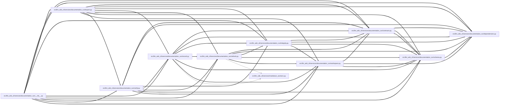

# record Module

**Path:** `src/llm_wiki_cli/services/documentation_run/record.py`

## Description

Documentation-run record services.

## Imports

| Source | Symbols |
|--------|---------|
| `..markdown_sections` | `GENERATED_INDEX_INTROS` |
| `.contracts` | `*` |
| `.dependencies` | `*` |
| `.integrity` | `*` |
| `.refresh` | `*` |
| `.schema` | `*` |
| `.workspace` | `*` |
| `__future__` | `annotations` |

## Local dependency map

<!-- Auto-generated local dependency summary. Do not edit by hand. -->
<!-- Thick arrows (==>) mark edges inside an import cycle. -->

### Internal neighbors

| Direction | Module |
|---|---|
| Inbound | [documentation_run___init__](../modules/documentation_run___init__.md) |
| Inbound | [export](../modules/export.md) |
| Inbound | [verify](../modules/verify.md) |
| Outbound | [documentation_run_contracts](../modules/documentation_run_contracts.md) |
| Outbound | [documentation_run_dependencies](../modules/documentation_run_dependencies.md) |
| Outbound | [integrity](../modules/integrity.md) |
| Outbound | [refresh](../modules/refresh.md) |
| Outbound | [documentation_run_schema](../modules/documentation_run_schema.md) |
| Outbound | [workspace](../modules/workspace.md) |
| Outbound | [markdown_sections](../modules/markdown_sections.md) |

## Functions

| Function | Signature | Decorators | Description |
|----------|-----------|------------|-------------|
| `_validate_result_work_ids` | `(result: DocumentationAgentResult, worklist: Mapping[str, Any], *, stage: str, wiki_root: Path) -> None` | — | — |
| `_reconcile_imported_page_edits` | `(result: DocumentationAgentResult, worklist: Mapping[str, Any], *, actual_changed: Iterable[str], before_tree: TreeBaseline, after_tree: TreeBaseline, wiki_root: Path) -> list[dict[str, Any]]` | — | — |
| `_reconcile_semantic_readiness` | `(workspace_root: Path, run: DocumentationRun, result: DocumentationAgentResult, worklist: Mapping[str, Any]) -> dict[str, Any]` | — | — |
| `_verify_user_docs_gate` | `(wiki_root: Path, run: DocumentationRun, result: DocumentationAgentResult \| None = None) -> None` | — | — |
| `_canonical_evidence_targets` | `(guide: Path, text: str, wiki_root: Path) -> tuple[str, ...]` | — | — |
| `_merge_unique` | `(target: list[str], values: Iterable[str]) -> None` | — | — |
| `_merge_agent_findings` | `(run: DocumentationRun, findings: Iterable[Mapping[str, Any]]) -> None` | — | — |
| `_finding_text_values` | `(value: Any) -> list[str]` | — | — |
| `_record_review_ledger_iteration` | `(workspace_root: Path, run: DocumentationRun, *, review_result: DocumentationAgentResult, review_result_path: Path) -> dict[str, Any]` | — | — |
| `_record_site_review_findings` | `(workspace_root: Path, run: DocumentationRun, *, export_path: Path, check_path: Path, check_payload: Mapping[str, Any]) -> dict[str, Any]` | — | — |
| `_approve_review_ledger` | `(workspace_root: Path, run: DocumentationRun, *, checks: Iterable[Mapping[str, Any]]) -> None` | — | — |
| `_has_unresolved_high_findings` | `(findings: Iterable[Mapping[str, Any]]) -> bool` | — | — |
| `_review_adjustment_state` | `(findings: Iterable[Mapping[str, Any]]) -> str` | — | — |
| `record_documentation_agent_result` | `(workspace: str \| Path, result: DocumentationAgentResult \| Mapping[str, Any]) -> DocumentationRun` | — | Validate, independently reconcile, and persist a worker result. |
| `_preflight_documentation_native_evidence` | `(workspace_root: Path, run: DocumentationRun, result: DocumentationAgentResult, *, actual_changed: Iterable[str]) -> None` | — | Reject malformed evidence before native refresh can mutate authority. |
| `_capture_native_evidence_transaction` | `(workspace_root: Path, run: DocumentationRun, *, phase: str) -> _NativeEvidenceTransaction` | — | — |
| `_rollback_native_evidence_transaction` | `(run: DocumentationRun, transaction: _NativeEvidenceTransaction, *, cause: BaseException) -> None` | — | — |
| `_reconcile_documentation_native_evidence` | `(workspace_root: Path, run: DocumentationRun, result: DocumentationAgentResult, *, refreshed_knowledge_view: KnowledgeReadView \| None = None) -> tuple[list[dict[str, Any]], list[dict[str, Any]]]` | — | Recompute native claim coordinates and verify out-of-band captures. |
