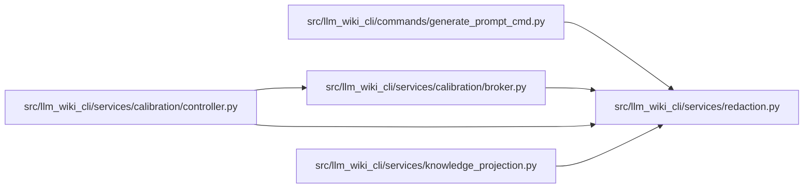

# redaction Module

**Path:** `src/llm_wiki_cli/services/redaction.py`

## Description

Shared best-effort redaction for credential-like text.

The patterns in this module intentionally combine the credential matchers used
by prompt generation, documentation calibration, OCI dispatch, and public
knowledge projection.  Pattern matching is a safety net, not proof that text is
free of secrets.

## Imports

| Source | Symbols |
|--------|---------|
| `__future__` | `annotations` |
| `collections.abc` | `Callable` |
| `re` | `re` |

## Local dependency map

<!-- Auto-generated local dependency summary. Do not edit by hand. -->

### Internal neighbors

| Direction | Module |
|---|---|
| Inbound | [generate_prompt_cmd](../modules/generate_prompt_cmd.md) |
| Inbound | [broker](../modules/broker.md) |
| Inbound | [controller](../modules/controller.md) |
| Inbound | [knowledge_projection](../modules/knowledge_projection.md) |

## Functions

| Function | Signature | Decorators | Description |
|----------|-----------|------------|-------------|
| `_assignment_replacement` | `(match: re.Match[str]) -> str` | — | — |
| `_likely_secret_replacement` | `(match: re.Match[str]) -> str` | — | — |
| `redact_credentials` | `(text: str) -> tuple[str, int]` | — | Replace credential-like values in *text* and return the match count. |
