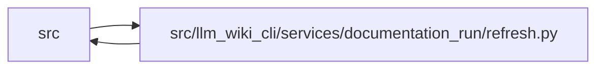

# refresh Module

**Path:** `src/llm_wiki_cli/services/documentation_run/refresh.py`

## Description

Documentation-run refresh services.

## Imports

| Source | Symbols |
|--------|---------|
| `..knowledge_consumption` | `load_knowledge_read_view` |
| `..knowledge_observability` | `knowledge_freshness_disclosure` |
| `..markdown_sections` | `preserve_index_custom_sections` |
| `.contracts` | `*` |
| `.dependencies` | `*` |
| `.integrity` | `*` |
| `.schema` | `*` |
| `.workspace` | `*` |
| `__future__` | `annotations` |

## Local dependency map

<!-- Auto-generated local dependency summary. Do not edit by hand. -->

> Module-level dependencies exceed the generated-diagram limits, so the diagram and table below group them by top-level package. Counts report the number of module neighbors in each package.

### Internal neighbors

| Direction | Module |
|---|---|
| Inbound | `src` (5) |
| Outbound | `src` (8) |

> All 13 module neighbor(s) are summarized by package because the module-level view exceeds the 12-node limit.

## Functions

| Function | Signature | Decorators | Description |
|----------|-----------|------------|-------------|
| `_capture_native_artifact_bytes` | `(wiki_root: Path) -> dict[str, bytes \| None]` | — | — |
| `_rollback_native_artifact_bytes` | `(wiki_root: Path, snapshot: Mapping[str, bytes \| None], *, cause: BaseException) -> None` | — | — |
| `_capture_exact_file_bytes` | `(paths: Iterable[Path]) -> dict[Path, bytes \| None]` | — | — |
| `_rollback_exact_file_bytes` | `(snapshot: Mapping[Path, bytes \| None], *, cause: BaseException) -> None` | — | — |
| `_rollback_native_refresh_transaction` | `(wiki_root: Path, artifact_snapshot: Mapping[str, bytes \| None], control_snapshot: Mapping[Path, bytes \| None], *, cause: BaseException) -> None` | — | — |
| `_refresh_prepared_native_projection` | `(workspace_root: Path, *, run_id: str, wiki_root: Path, source_root: Path, trust_source_plugins: bool, helper_cache_root: Path \| None, source_selection: str \| Path \| None) -> dict[str, Any]` | — | — |
| `_refresh_and_reanchor_native_projection` | `(workspace_root: Path, run: DocumentationRun, *, phase: str, changed_wiki_paths: Iterable[str]) -> tuple[dict[str, Any] \| None, KnowledgeReadView \| None]` | — | — |
| `_write_native_refresh_evidence` | `(workspace_root: Path, *, phase: str, payload: Mapping[str, Any]) -> Path` | — | — |
| `_assert_native_only_ownership_change` | `(before: Mapping[str, str], after: Mapping[str, str]) -> None` | — | — |
| `_native_refresh_payload` | `(*, run_id: str, phase: str, refresh: DocumentationNativeRefresh, ownership_before: Mapping[str, str], ownership_after: Mapping[str, str], changed_wiki_paths: Iterable[str], verification_evaluation: Mapping[str, Any]) -> dict[str, Any]` | — | — |
| `_native_artifact_transition` | `(before: Mapping[str, str], after: Mapping[str, str], path: str, *, absent_status: str, changed_status: str) -> dict[str, Any]` | — | — |
| `_native_refresh_verification_evaluation` | `(wiki_root: Path) -> dict[str, Any]` | — | — |
| `_apply_native_verification_limitation` | `(run: DocumentationRun, evaluation: Mapping[str, Any]) -> None` | — | — |
| `source_identity` | `(source_root: str \| Path, baseline: TreeBaseline) -> dict[str, Any]` | — | — |
| `_assert_resume_compatible` | `(workspace_root: Path, run: DocumentationRun, *, policy: DocumentationMutationPolicy, baseline_strategy: str, intake: DocumentationIntakeBrief, site_name: str, freshness_policy: str, semantic_budget: int, adjustment_loop_limit: int, distribution_format: str, link_mode: str, knowledge_mode: str, knowledge_public_repository_identity: str \| None) -> None` | — | — |
| `_assert_intake_compatible` | `(recorded: DocumentationIntakeBrief, supplied: DocumentationIntakeBrief) -> None` | — | — |
| `_assert_runtime_roots_compatible` | `(workspace_root: Path, policy: DocumentationMutationPolicy) -> None` | — | — |
| `_capture_refresh_continuation` | `(workspace_root: Path, run: DocumentationRun) -> _RefreshContinuationSnapshot` | — | Capture only prior imported or reconciled agent-owned Markdown. |
| `_refresh_continuation_candidate_paths` | `(workspace_root: Path, run: DocumentationRun) -> dict[str, set[str]]` | — | — |
| `_prior_generated_descriptions` | `(wiki_root: Path) -> dict[str, str]` | — | Map generated module/entity descriptions from the prior manifest. |
| `_source_identity_changed` | `(snapshot: _RefreshContinuationSnapshot, current: Mapping[str, Any]) -> bool` | — | — |
| `_restore_refresh_continuation` | `(wiki_root: Path, snapshot: _RefreshContinuationSnapshot) -> tuple[list[Mapping[str, Any]], dict[str, Any]]` | — | Merge prior agent-owned surfaces onto a new deterministic wiki. |
| `_merge_refresh_semantic_page` | `(relative: str, record: Mapping[str, Any], current: str) -> tuple[str, str] \| None` | — | — |
| `_refresh_owned_heading` | `(relative: str) -> str \| None` | — | — |
| `_level_two_markdown_section` | `(markdown: str, heading: str) -> tuple[int, int, str] \| None` | — | — |
| `_level_two_section_body` | `(section: tuple[int, int, str]) -> str` | — | — |
| `_normalise_semantic_comparison` | `(value: str) -> str` | — | — |
| `_is_preservable_semantic_body` | `(value: str) -> bool` | — | — |
| `_without_generated_markdown_sections` | `(markdown: str) -> str` | — | — |
| `_ensure_final_newline` | `(value: str) -> str` | — | — |
| `_mark_continuation_pages_needing_grounding` | `(worklist: dict[str, Any], preserved_paths: tuple[str, ...]) -> None` | — | — |
| `_commit_initial_prepare` | `(transaction: _InitialPrepareTransaction) -> None` | — | — |
| `_rollback_initial_prepare` | `(transaction: _InitialPrepareTransaction) -> None` | — | — |
| `_archive_owned_run` | `(workspace_root: Path, run: DocumentationRun, *, transaction: _RefreshArchiveTransaction) -> str` | — | — |
| `_refresh_transaction_path` | `(workspace_root: Path) -> Path` | — | — |
| `_write_refresh_transaction_marker` | `(transaction: _RefreshArchiveTransaction) -> None` | — | — |
| `_commit_refresh_archive` | `(transaction: _RefreshArchiveTransaction) -> None` | — | — |
| `_recover_interrupted_refresh` | `(workspace_root: Path) -> None` | — | — |
| `_rollback_refresh_archive` | `(transaction: _RefreshArchiveTransaction) -> None` | — | — |
| `_remove_refresh_owned_path` | `(workspace_root: Path, target: Path) -> None` | — | — |
| `_remove_refresh_transaction_marker` | `(workspace_root: Path) -> None` | — | — |
| `_preserve_imported_semantic_markdown` | `(wiki_root: Path, imported_text: Mapping[str, str]) -> list[str]` | — | Keep imported semantic prose available after a workspace-only refresh. |
| `_semantic_owner_markdown` | `(text: str) -> str` | — | — |
