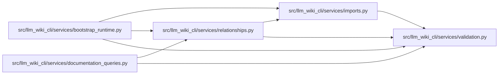

# relationships Module

**Path:** `src/llm_wiki_cli/services/relationships.py`

## Description

Pure entity and callable relationship summaries.

The summaries in this module are intentionally plain dictionaries derived from
the source inventory, optional resolved call edges, and optional entry-point
flows. They do not read or write files and do not render Markdown.

## Imports

| Source | Symbols |
|--------|---------|
| `.imports` | `build_module_path_resolver` |
| `.validation` | `positive_int_or_none` |
| `__future__` | `annotations` |
| `collections` | `defaultdict` |
| `pathlib` | `PurePosixPath` |
| `typing` | `Iterable`, `Mapping`, `Optional` |

## Local dependency map

<!-- Auto-generated local dependency summary. Do not edit by hand. -->

### Internal neighbors

| Direction | Module |
|---|---|
| Inbound | [bootstrap_runtime](../modules/bootstrap_runtime.md) |
| Inbound | [documentation_queries](../modules/documentation_queries.md) |
| Outbound | [imports](../modules/imports.md) |
| Outbound | [validation](../modules/validation.md) |

## Functions

| Function | Signature | Decorators | Description |
|----------|-----------|------------|-------------|
| `_sort_key` | `(value: object) -> tuple[str, str]` | — | — |
| `_module_name` | `(filepath: Optional[str]) -> Optional[str]` | — | — |
| `_class_ref` | `(name: str, filepath: Optional[str]) -> dict` | — | — |
| `_endpoint_ref` | `(endpoint: Mapping, edge: Mapping) -> dict` | — | — |
| `_bounded` | `(records: Iterable[dict], limit: int \| None = _RELATION_LIMIT) -> list[dict]` | — | — |
| `_record_sort_key` | `(record: Mapping) -> tuple` | — | — |
| `_dedupe_sorted` | `(records: Iterable[dict], limit: int \| None = _RELATION_LIMIT) -> list[dict]` | — | — |
| `_iter_class_records` | `(inventory: Mapping) -> Iterable[tuple[str, str, Mapping]]` | — | — |
| `_build_class_index` | `(inventory: Mapping) -> tuple[dict, dict]` | — | — |
| `_imported_class_bindings` | `(inventory: Mapping, filepath: str, by_key: Mapping, resolver) -> dict[str, tuple[str, str]]` | — | — |
| `_resolve_base_key` | `(raw_base: str, filepath: str, by_key: Mapping[tuple[str, str], Mapping], by_name: Mapping[str, list[tuple[str, str]]], imported: Mapping[str, tuple[str, str]], resolver) -> Optional[tuple[str, str]]` | — | — |
| `_resolved_bases` | `(inventory: Mapping, by_key: Mapping[tuple[str, str], Mapping], by_name: Mapping[str, list[tuple[str, str]]], relation_limit: int \| None = _RELATION_LIMIT) -> dict[tuple[str, str], list[dict]]` | — | — |
| `_subclasses_by_base` | `(bases_by_class: Mapping[tuple[str, str], list[dict]], relation_limit: int \| None = _RELATION_LIMIT) -> dict[tuple[str, str], list[dict]]` | — | — |
| `_iter_callable_records` | `(inventory: Mapping) -> Iterable[tuple[str, str, dict]]` | — | — |
| `_callable_index` | `(inventory: Mapping) -> dict[tuple[str, str], dict]` | — | — |
| `_mentions_any` | `(text: object, visible_names: Iterable[str]) -> bool` | — | — |
| `_callable_mentions_class` | `(callable_info: Mapping, visible_names: set[str]) -> bool` | — | — |
| `_visible_class_bindings` | `(inventory: Mapping, filepath: str, by_key: Mapping[tuple[str, str], Mapping], resolver) -> dict[str, tuple[str, str]]` | — | — |
| `_type_reference_records` | `(inventory: Mapping, by_key: Mapping[tuple[str, str], Mapping], callables: Mapping[tuple[str, str], dict]) -> dict[tuple[str, str], list[dict]]` | — | — |
| `_class_call_references` | `(call_edges: Iterable[Mapping], by_key: Mapping[tuple[str, str], Mapping]) -> dict[tuple[str, str], list[dict]]` | — | — |
| `_import_reference_records` | `(inventory: Mapping, by_key: Mapping[tuple[str, str], Mapping], existing_references: Mapping[tuple[str, str], list[dict]]) -> dict[tuple[str, str], list[dict]]` | — | — |
| `_merge_reference_maps` | `(*maps: Mapping[tuple[str, str], list[dict]], relation_limit: int \| None = _RELATION_LIMIT) -> dict` | — | — |
| `_function_links` | `(call_edges: Iterable[Mapping], callables: Mapping[tuple[str, str], dict], relation_limit: int \| None = _RELATION_LIMIT) -> tuple[dict, dict]` | — | — |
| `_flow_id` | `(flow: Mapping) -> str` | — | — |
| `_flow_category` | `(flow: Mapping) -> str` | — | — |
| `_flow_label` | `(flow: Mapping) -> str` | — | — |
| `_flow_memberships` | `(flows: Iterable[Mapping], callables: Mapping[tuple[str, str], dict], relation_limit: int \| None = _RELATION_LIMIT) -> dict[tuple[str, str], list[dict]]` | — | — |
| `_class_summary` | `(filepath: str, name: str, cls: Mapping, bases_by_class: Mapping[tuple[str, str], list[dict]], subclasses_by_class: Mapping[tuple[str, str], list[dict]], references_by_class: Mapping[tuple[str, str], list[dict]], relation_limit: int \| None = _RELATION_LIMIT) -> dict` | — | — |
| `_function_summary` | `(filepath: str, symbol: str, callable_info: Mapping, callers: Mapping[tuple[str, str], list[dict]], callees: Mapping[tuple[str, str], list[dict]], entrypoints: Mapping[tuple[str, str], list[dict]]) -> dict` | — | — |
| `_build_entity_relationship_summaries` | `(inventory: Mapping, call_edges: Optional[Iterable[Mapping]] = None, flows: Optional[Iterable[Mapping]] = None, *, relation_limit: int \| None) -> dict` | — | — |
| `_detail_line` | `(value: object) -> int \| None` | — | — |
| `_normalize_detailed_record` | `(value: object, *, key: str \| None = None) -> object` | — | — |
| `_summary_collection_coverage` | `(observed: int, emitted: int) -> dict` | — | — |
| `_detailed_summary` | `(summary: Mapping, collection_fields: tuple[str, ...]) -> dict` | — | — |
| `_unbounded_summary_coverage` | `(observed: int) -> dict` | — | — |
| `_page_reference_projection` | `(records: Iterable[dict]) -> tuple[list[dict], dict]` | — | Return bounded logical references for generated entity pages. |
| `build_entity_page_relationship_summaries` | `(inventory: Mapping, call_edges: Optional[Iterable[Mapping]] = None, flows: Optional[Iterable[Mapping]] = None) -> dict` | — | Build the internal relationship projection used by generated pages. |
| `build_detailed_entity_relationship_summaries` | `(inventory: Mapping, call_edges: Optional[Iterable[Mapping]] = None, flows: Optional[Iterable[Mapping]] = None) -> dict` | — | Build a versioned relationship-summary view with exact omissions. |
| `build_entity_relationship_summaries` | `(inventory: Mapping, call_edges: Optional[Iterable[Mapping]] = None, flows: Optional[Iterable[Mapping]] = None, *, detailed: bool = False) -> dict` | — | Build bounded class and callable relationship summaries. |
