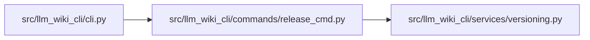

# release_cmd Module

**Path:** `src/llm_wiki_cli/commands/release_cmd.py`

## Description

release_cmd — stamp the [Unreleased] CHANGELOG section with the current version.

Transforms::

    ## [Unreleased]
    ...changes...

    ## [0.1.5] - 2026-04-11
    ...

Into::

    ## [Unreleased]

    ## [0.1.6] - 2026-04-12
    ...changes...

    ## [0.1.5] - 2026-04-11
    ...

And updates the reference links at the bottom of the file.

## Imports

| Source | Symbols |
|--------|---------|
| `..services.versioning` | `find_version_file`, `read_version` |
| `__future__` | `annotations` |
| `datetime` | `date` |
| `pathlib` | `Path` |
| `re` | `re` |
| `subprocess` | `subprocess` |
| `sys` | `sys` |

## Local dependency map

<!-- Auto-generated local dependency summary. Do not edit by hand. -->

### Internal neighbors

| Direction | Module |
|---|---|
| Inbound | [cli](../modules/cli.md) |
| Outbound | [versioning](../modules/versioning.md) |

## Functions

| Function | Signature | Decorators | Description |
|----------|-----------|------------|-------------|
| `_unreleased_has_content` | `(text: str) -> bool` | — | Return True if the [Unreleased] section contains at least one non-blank line. |
| `_detect_repo_url` | `(changelog_text: str) -> str \| None` | — | Extract the GitHub compare base URL from existing reference links. |
| `stamp_changelog` | `(changelog_path: Path, version: str, today: str \| None = None) -> tuple[str, bool]` | — | Stamp the [Unreleased] section with *version* and return ``(new_text, stamped)``. |
| `run` | `(args)` | — | — |
