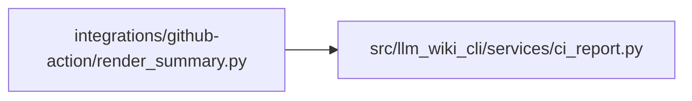

# render_summary Module

**Path:** `integrations/github-action/render_summary.py`

## Description

Validates the complete doctor JSON contract used by the GitHub composite action
and renders its job summary. It cross-checks the captured process exit code,
normalizes health sections into Markdown, appends the summary to the path
provided by GitHub, exposes the resulting status, and applies the configured
degraded or unhealthy failure threshold.

## Imports

| Source | Symbols |
|--------|---------|
| `__future__` | `annotations` |
| `argparse` | `argparse` |
| `collections.abc` | `Mapping` |
| `hashlib` | `hashlib` |
| `json` | `json` |
| `llm_wiki_cli.services.ci_report` | `validate_doctor_payload` |
| `os` | `os` |
| `pathlib` | `Path` |
| `typing` | `Any` |

## Local dependency map

<!-- Auto-generated local dependency summary. Do not edit by hand. -->

### Internal neighbors

| Direction | Module |
|---|---|
| Outbound | [ci_report](../modules/ci_report.md) |

## Functions

| Function | Signature | Decorators | Description |
|----------|-----------|------------|-------------|
| `_arguments` | `() -> argparse.Namespace` | — | — |
| `_object` | `(value: object, field: str) -> Mapping[str, Any]` | — | — |
| `_string` | `(value: object, field: str) -> str` | — | — |
| `_required_object` | `(value: object, field: str, expected: frozenset[str]) -> Mapping[str, Any]` | — | — |
| `_exact_object` | `(value: object, field: str, expected: frozenset[str]) -> Mapping[str, Any]` | — | — |
| `_enum` | `(value: object, field: str, allowed: frozenset[str] \| Mapping[str, int]) -> str` | — | — |
| `_boolean` | `(value: object, field: str) -> bool` | — | — |
| `_nullable_boolean` | `(value: object, field: str) -> bool \| None` | — | — |
| `_nonnegative_integer` | `(value: object, field: str) -> int` | — | — |
| `_string_list` | `(value: object, field: str) -> list[str]` | — | — |
| `_freshness_counts` | `(value: object, field: str) -> Mapping[str, Any] \| None` | — | — |
| `_validate_availability` | `(value: object) -> None` | — | — |
| `_validate_freshness` | `(value: object) -> None` | — | — |
| `_validate_snapshot` | `(value: object) -> None` | — | — |
| `_validate_governance` | `(value: object) -> None` | — | — |
| `_validate_drift` | `(value: object) -> None` | — | — |
| `_validate_verification` | `(value: object) -> None` | — | — |
| `_strict_json_object` | `(pairs: list[tuple[str, Any]]) -> dict[str, Any]` | — | — |
| `_reject_nonfinite` | `(value: str) -> None` | — | — |
| `load_report` | `(path: str \| Path, *, doctor_exit_code: int, expected_strict: bool \| None = None) -> Mapping[str, Any]` | — | Load and strictly validate the complete doctor v1 contract. |
| `_clip_utf8` | `(value: str, limit: int = CELL_MAX_BYTES) -> str` | — | — |
| `_cell` | `(value: object) -> str` | — | — |
| `render_summary` | `(report: Mapping[str, Any]) -> str` | — | Return a compact Markdown table without interpreting human text. |
| `_append` | `(path: str \| None, content: str) -> None` | — | — |
| `_write_receipt` | `(path: str \| None, *, report_path: str \| Path, report: Mapping[str, Any], fail_on: str, doctor_exit_code: int, dashboard_exit_code: int) -> None` | — | — |
| `main` | `() -> int` | — | — |