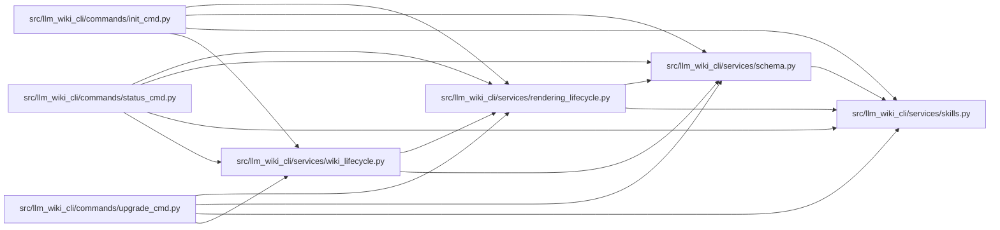

# rendering_lifecycle Module

**Path:** `src/llm_wiki_cli/services/rendering_lifecycle.py`

## Description

Profile selection and live managed-schema lifecycle classification.

This module is deliberately free of filesystem mutation.  Commands provision
and verify the managed reference first, then use these helpers to choose a
render profile or explain the live schema/reference combination.

## Imports

| Source | Symbols |
|--------|---------|
| `.schema` | `SCHEMA_BLOCK_VERSION`, `ManagedSchemaBlock`, `ManagedSchemaBlockState`, `SchemaRenderProfile` |
| `.skills` | `ReferenceSkillState`, `ReferenceSkillVerification` |
| `__future__` | `annotations` |
| `dataclasses` | `dataclass` |
| `enum` | `Enum` |

## Local dependency map

<!-- Auto-generated local dependency summary. Do not edit by hand. -->

### Internal neighbors

| Direction | Module |
|---|---|
| Inbound | [init_cmd](../modules/init_cmd.md) |
| Inbound | [status_cmd](../modules/status_cmd.md) |
| Inbound | [upgrade_cmd](../modules/upgrade_cmd.md) |
| Inbound | [wiki_lifecycle](../modules/wiki_lifecycle.md) |
| Outbound | [services_schema](../modules/services_schema.md) |
| Outbound | [skills](../modules/skills.md) |

## Classes

| Class | Kind | Line | Bases / Target | Description |
|-------|------|------|----------------|-------------|
| [RenderReason](../entities/RenderReason.md) | Enum | 22 | `str`, `Enum` | Stable reasons persisted alongside the last rendered profile. |
| [ManagedLifecycleState](../entities/ManagedLifecycleState.md) | Enum | 34 | `str`, `Enum` | Stable live combinations reported by ``llm-wiki status``. |
| [RenderDecision](../entities/RenderDecision.md) | Class | 49 | — | One deterministic profile choice from intent and verified state. |
| [LifecycleStatus](../entities/LifecycleStatus.md) | Class | 63 | — | Live status fields required by the managed lifecycle contract. |

## Functions

| Function | Signature | Decorators | Description |
|----------|-----------|------------|-------------|
| `select_render_profile` | `(*, reference_enabled: bool, reference_state: ReferenceSkillState) -> RenderDecision` | — | Choose compact only for an enabled, verified-current reference. |
| `reference_recovery_command` | `(*, skills_dir: str, details: tuple[str, ...] = ()) -> str` | — | Return a state-aware, authority-bounded managed-reference recovery. |
| `classify_lifecycle_status` | `(*, schema: ManagedSchemaBlock, reference: ReferenceSkillVerification, reference_enabled: bool, skills_dir: str, configured_profile: object = None, configured_reason: object = None) -> LifecycleStatus` | — | Combine live marker/reference state; config is mismatch evidence only. |
