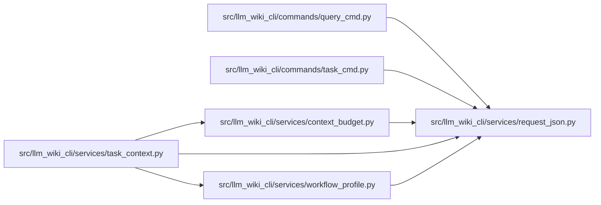

# request_json Module

**Path:** `src/llm_wiki_cli/services/request_json.py`

## Description

Loads explicit JSON request files or stdin under a one-mebibyte UTF-8 bound. Duplicate keys, nonfinite numbers, malformed text and non-object requests fail before the request reaches workspace readers.

## Imports

| Source | Symbols |
|--------|---------|
| `__future__` | `annotations` |
| `json` | `json` |
| `pathlib` | `Path` |
| `sys` | `sys` |
| `typing` | `Any` |

## Local dependency map

<!-- Auto-generated local dependency summary. Do not edit by hand. -->

### Internal neighbors

| Direction | Module |
|---|---|
| Inbound | [query_cmd](../modules/query_cmd.md) |
| Inbound | [task_cmd](../modules/task_cmd.md) |
| Inbound | [context_budget](../modules/context_budget.md) |
| Inbound | [task_context](../modules/task_context.md) |
| Inbound | [workflow_profile](../modules/workflow_profile.md) |

## Functions

| Function | Signature | Decorators | Description |
|----------|-----------|------------|-------------|
| `_pairs` | `(items)` | — | — |
| `_constant` | `(value)` | — | — |
| `parse_request` | `(raw: bytes \| str) -> dict[str, Any]` | — | — |
| `load_request` | `(path: str) -> dict[str, Any]` | — | — |