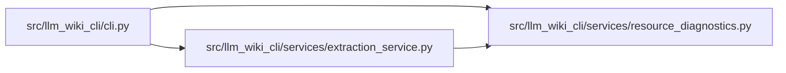

# resource_diagnostics Module

**Path:** `src/llm_wiki_cli/services/resource_diagnostics.py`

## Description

_Auto-generated from `src/llm_wiki_cli/services/resource_diagnostics.py`._

## Imports

| Source | Symbols |
|--------|---------|
| `__future__` | `annotations` |
| `collections.abc` | `Iterator` |
| `errno` | `errno` |

## Local dependency map

<!-- Auto-generated local dependency summary. Do not edit by hand. -->

### Internal neighbors

| Direction | Module |
|---|---|
| Inbound | [cli](../modules/cli.md) |
| Inbound | [extraction_service](../modules/extraction_service.md) |

## Functions

| Function | Signature | Decorators | Description |
|----------|-----------|------------|-------------|
| `_exception_chain` | `(exc: BaseException) -> Iterator[BaseException]` | — | — |
| `resource_failure_hint` | `(exc: BaseException, *, executor_start: bool = False) -> str \| None` | — | Return portable recovery guidance for recognised capacity failures. |
| `format_resource_failure` | `(exc: BaseException, *, executor_start: bool = False) -> str` | — | Append a resource hint to an exception message when one is recognised. |
