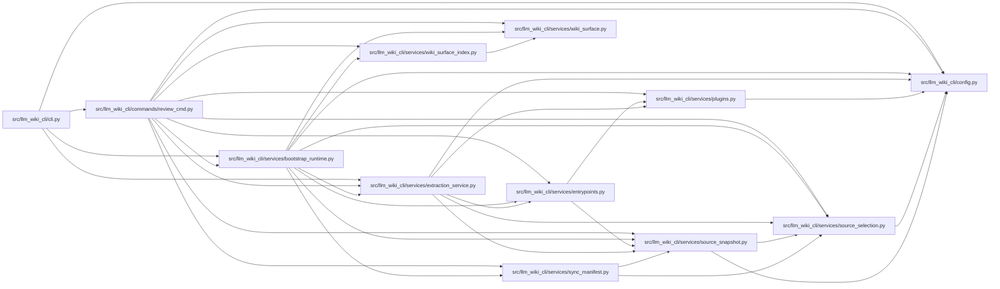

# review_cmd Module

**Path:** `src/llm_wiki_cli/commands/review_cmd.py`

## Description

Performs a static, wiki-aware review of a supplied patch or Git diff. It maps
changed source and dependency paths to canonical module, entity, flow,
workflow, infrastructure, and architecture pages, then reports missing or
possibly stale coverage as Markdown or structured findings. Source selection
is validated before the diff is interpreted.

## Imports

| Source | Symbols |
|--------|---------|
| `..config` | `DEFAULT_WIKI_DIR`, `validate_path`, `validate_source_root` |
| `..services.bootstrap_runtime` | `build_entity_occurrence_page_map`, `build_entity_page_map`, `build_module_page_map` |
| `..services.entrypoints` | `get_entry_points`, `read_console_scripts` |
| `..services.extraction_service` | `filter_source_diff`, `get_inventory_result` |
| `..services.plugins` | `runtime_plugin_fallback_root`, `runtime_project_plugins_enabled` |
| `..services.source_selection` | `resolve_source_selection`, `validate_persisted_source_selection_identity` |
| `..services.source_snapshot` | `SourceSnapshot`, `build_source_snapshot`, `capture_source_selection_inputs` |
| `..services.sync_manifest` | `SyncManifest` |
| `..services.wiki_surface` | `PageKind`, `collect_wiki_pages` |
| `..services.wiki_surface_index` | `SURFACE_INDEX_FILENAME`, `WIKI_SURFACE_INDEX_SCHEMA_VERSION`, `build_surface_index` |
| `__future__` | `annotations` |
| `dataclasses` | `asdict`, `dataclass` |
| `json` | `json` |
| `pathlib` | `Path` |
| `subprocess` | `subprocess` |
| `sys` | `sys` |

## Local dependency map

<!-- Auto-generated local dependency summary. Do not edit by hand. -->

### Internal neighbors

| Direction | Module |
|---|---|
| Inbound | [cli](../modules/cli.md) |
| Outbound | [config](../modules/config.md) |
| Outbound | [bootstrap_runtime](../modules/bootstrap_runtime.md) |
| Outbound | [entrypoints](../modules/entrypoints.md) |
| Outbound | [extraction_service](../modules/extraction_service.md) |
| Outbound | [plugins](../modules/plugins.md) |
| Outbound | [source_selection](../modules/source_selection.md) |
| Outbound | [source_snapshot](../modules/source_snapshot.md) |
| Outbound | [sync_manifest](../modules/sync_manifest.md) |
| Outbound | [wiki_surface](../modules/wiki_surface.md) |
| Outbound | [wiki_surface_index](../modules/wiki_surface_index.md) |

## Classes

| Class | Line | Bases | Description |
|-------|------|-------|-------------|
| [ReviewFinding](../entities/ReviewFinding.md) | 70 | — | — |

## Functions

| Function | Signature | Decorators | Description |
|----------|-----------|------------|-------------|
| `_read_patch` | `(args, *, src_dir: str \| None = None) -> str` | — | — |
| `_changed_paths` | `(diff_text: str) -> list[str]` | — | — |
| `_added_imports_by_file` | `(diff_text: str) -> dict[str, list[str]]` | — | — |
| `_is_dependency_path` | `(path: str) -> bool` | — | — |
| `_workflow_pages` | `(wiki_dir: Path) -> dict[str, str]` | — | — |
| `_surface_text_pages` | `(wiki_dir: Path, kinds: set[PageKind]) -> dict[str, str]` | — | — |
| `_symbol_reference_pages` | `(wiki_dir: Path) -> dict[str, str]` | — | — |
| `_workflow_symbol_index` | `(workflows: dict[str, str], symbols: set[str]) -> dict[str, set[str]]` | — | — |
| `_load_surface_index_pages` | `(wiki_dir: Path) -> list[dict] \| None` | — | — |
| `_build_surface_index_pages` | `(wiki_dir: Path, inventory: dict, src_dir: str, module_page_map: dict[str, str], entity_page_map: dict[tuple[str, str], str], entity_occurrence_page_map: dict[tuple[str, str, int], str], source_snapshot: SourceSnapshot \| None = None) -> list[dict]` | — | — |
| `_surface_index_pages` | `(wiki_dir: Path, inventory: dict, src_dir: str, module_page_map: dict[str, str], entity_page_map: dict[tuple[str, str], str], entity_occurrence_page_map: dict[tuple[str, str, int], str], source_snapshot: SourceSnapshot \| None = None) -> list[dict]` | — | — |
| `_flow_pages_by_source` | `(wiki_dir: Path, inventory: dict, src_dir: str, module_page_map: dict[str, str], entity_page_map: dict[tuple[str, str], str], entity_occurrence_page_map: dict[tuple[str, str, int], str], source_snapshot: SourceSnapshot \| None = None) -> dict[str, list[str]]` | — | — |
| `_related_pages_for_source` | `(path: str, inventory: dict, module_page_map: dict[str, str], entity_page_map: dict[tuple[str, str], str], entity_occurrence_page_map: dict[tuple[str, str, int], str], flow_pages_by_source: dict[str, list[str]]) -> list[str]` | — | — |
| `_preflight_review_source_selection` | `(src_dir: str, wiki_dir: Path, source_selection: str \| Path \| None) -> SourceSnapshot` | — | — |
| `build_findings` | `(diff_text: str, *, src_dir: str = '.', wiki_dir: str = DEFAULT_WIKI_DIR, source_selection: str \| Path \| None = None) -> list[ReviewFinding]` | — | — |
| `render_markdown` | `(findings: list[ReviewFinding]) -> str` | — | — |
| `render_json` | `(findings: list[ReviewFinding]) -> str` | — | — |
| `run` | `(args) -> None` | — | — |
