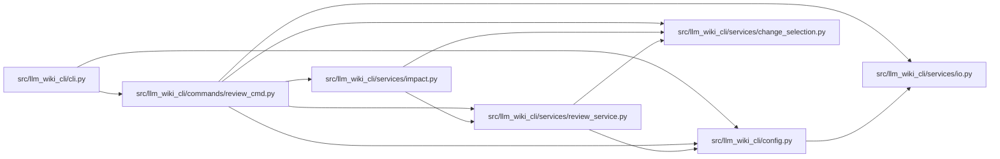

# review_cmd Module

**Path:** `src/llm_wiki_cli/commands/review_cmd.py`

## Description

Reviews a patch, Git range, staged changes, or supplied source paths against the
selected wiki. Shared analysis maps sources to module, entity, flow, workflow,
infrastructure, and architecture pages. Source selection is validated before
the change input is interpreted.

Impact output reports candidate coverage, dependency edges, and static API
operations through deterministic JSON, bounded Markdown, or GitHub annotations.
It remains advisory and reports unknown coverage explicitly for deleted sources
without retained provenance. The existing Markdown and JSON review formats
continue to expose individual findings.

## Imports

| Source | Symbols |
|--------|---------|
| `..config` | `DEFAULT_WIKI_DIR`, `validate_path`, `validate_source_root` |
| `..services.change_selection` | `changes_from_args` |
| `..services.impact` | `build_impact`, `render_github`, `render_summary` |
| `..services.io` | `write_text_output` |
| `..services.review_service` | `ReviewFinding`, `_preflight_review_source_selection`, `build_findings` |
| `__future__` | `annotations` |
| `dataclasses` | `asdict` |
| `json` | `json` |
| `pathlib` | `Path` |
| `subprocess` | `subprocess` |
| `sys` | `sys` |

## Local dependency map

<!-- Auto-generated local dependency summary. Do not edit by hand. -->

### Internal neighbors

| Direction | Module |
|---|---|
| Inbound | [cli](../modules/cli.md) |
| Outbound | [config](../modules/config.md) |
| Outbound | [change_selection](../modules/change_selection.md) |
| Outbound | [impact](../modules/impact.md) |
| Outbound | [io](../modules/io.md) |
| Outbound | [review_service](../modules/review_service.md) |

## Functions

| Function | Signature | Decorators | Description |
|----------|-----------|------------|-------------|
| `_read_patch` | `(args, *, src_dir: str \| None = None) -> str` | — | — |
| `render_markdown` | `(findings: list[ReviewFinding]) -> str` | — | — |
| `render_json` | `(findings: list[ReviewFinding]) -> str` | — | — |
| `run` | `(args) -> None` | — | — |
