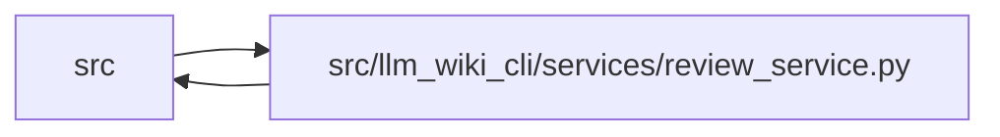

# review_service Module

**Path:** `src/llm_wiki_cli/services/review_service.py`

## Description

Provides shared source-to-wiki analysis for review and impact output over one
captured source basis. Exact page provenance resolves ambiguous module/entity
names, while flow and workflow references extend coverage to entrypoints.
Patch-aware review can assess accompanying wiki changes; supplied-path analysis
reports candidate coverage. Missing sources retain known page mappings or
explicitly unknown former coverage, with follow-up appropriate to deletion or
rename.

## Imports

| Source | Symbols |
|--------|---------|
| `..config` | `DEFAULT_WIKI_DIR` |
| `..extractors.common` | `LANGUAGE_EXTENSIONS` |
| `.bootstrap_runtime` | `build_entity_occurrence_page_map`, `build_entity_page_map`, `build_module_page_map` |
| `.change_selection` | `_git`, `affected_page_map`, `patch_paths`, `select_changes`, `source_relative_paths` |
| `.entrypoints` | `get_entry_points`, `read_console_scripts` |
| `.extraction_service` | `filter_source_diff`, `get_inventory_result` |
| `.plugins` | `runtime_plugin_fallback_root`, `runtime_project_plugins_enabled` |
| `.source_selection` | `resolve_source_selection`, `validate_persisted_source_selection_identity` |
| `.source_snapshot` | `SourceSnapshot`, `build_source_snapshot`, `capture_source_selection_inputs` |
| `.sync_manifest` | `SyncManifest` |
| `.wiki_surface` | `PageKind`, `collect_wiki_pages` |
| `.wiki_surface_index` | `SURFACE_INDEX_FILENAME`, `WIKI_SURFACE_INDEX_SCHEMA_VERSION`, `build_surface_index` |
| `__future__` | `annotations` |
| `dataclasses` | `dataclass` |
| `json` | `json` |
| `pathlib` | `Path` |

## Local dependency map

<!-- Auto-generated local dependency summary. Do not edit by hand. -->

> Module-level dependencies exceed the generated-diagram limits, so the diagram and table below group them by top-level package. Counts report the number of module neighbors in each package.

### Internal neighbors

| Direction | Module |
|---|---|
| Inbound | `src` (2) |
| Outbound | `src` (12) |

> All 14 module neighbor(s) are summarized by package because the module-level view exceeds the 12-node limit.

## Classes

| Class | Line | Bases | Description |
|-------|------|-------|-------------|
| [ReviewFinding](../entities/ReviewFinding.md) | 80 | — | — |
| [ReviewAnalysis](../entities/ReviewAnalysis.md) | 89 | — | — |

## Functions

| Function | Signature | Decorators | Description |
|----------|-----------|------------|-------------|
| `_changed_paths` | `(diff_text: str) -> list[str]` | — | — |
| `_added_imports_by_file` | `(diff_text: str) -> dict[str, list[str]]` | — | — |
| `_is_dependency_path` | `(path: str) -> bool` | — | — |
| `_workflow_pages` | `(wiki_dir: Path) -> dict[str, str]` | — | — |
| `_surface_text_pages` | `(wiki_dir: Path, kinds: set[PageKind]) -> dict[str, str]` | — | — |
| `_symbol_reference_pages` | `(wiki_dir: Path) -> dict[str, str]` | — | — |
| `_workflow_symbol_index` | `(workflows: dict[str, str], symbols: set[str]) -> dict[str, set[str]]` | — | — |
| `_load_surface_index_pages` | `(wiki_dir: Path) -> list[dict] \| None` | — | — |
| `_build_surface_index_pages` | `(wiki_dir: Path, inventory: dict, src_dir: str, module_page_map: dict[str, str], entity_page_map: dict[tuple[str, str], str], entity_occurrence_page_map: dict[tuple[str, str, int], str], source_snapshot: SourceSnapshot \| None = None, include_plugins: bool = True) -> list[dict]` | — | — |
| `_surface_index_pages` | `(wiki_dir: Path, inventory: dict, src_dir: str, module_page_map: dict[str, str], entity_page_map: dict[tuple[str, str], str], entity_occurrence_page_map: dict[tuple[str, str, int], str], source_snapshot: SourceSnapshot \| None = None, include_plugins: bool = True) -> list[dict]` | — | — |
| `_flow_pages_by_source` | `(wiki_dir: Path, inventory: dict, src_dir: str, module_page_map: dict[str, str], entity_page_map: dict[tuple[str, str], str], entity_occurrence_page_map: dict[tuple[str, str, int], str], source_snapshot: SourceSnapshot \| None = None) -> dict[str, list[str]]` | — | — |
| `_related_pages_for_source` | `(path: str, inventory: dict, module_page_map: dict[str, str], entity_page_map: dict[tuple[str, str], str], entity_occurrence_page_map: dict[tuple[str, str, int], str], flow_pages_by_source: dict[str, list[str]]) -> list[str]` | — | — |
| `_preflight_review_source_selection` | `(src_dir: str, wiki_dir: Path, source_selection: str \| Path \| None) -> SourceSnapshot` | — | — |
| `build_analysis` | `(diff_text: str, *, src_dir: str = '.', wiki_dir: str = DEFAULT_WIKI_DIR, source_selection: str \| Path \| None = None, changes: dict \| None = None, include_plugins: bool = True, helper_cache_dir: str \| None = None) -> ReviewAnalysis` | — | — |
| `build_findings` | `(diff_text: str, **kwargs) -> list[ReviewFinding]` | — | — |
