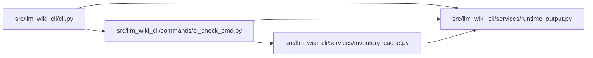

# runtime_output Module

**Path:** `src/llm_wiki_cli/services/runtime_output.py`

## Description

Best-effort implicit output and preflighted operator-selected destinations.

## Imports

| Source | Symbols |
|--------|---------|
| `__future__` | `annotations` |
| `collections.abc` | `Callable` |
| `dataclasses` | `dataclass` |
| `os` | `os` |
| `pathlib` | `Path` |
| `sys` | `sys` |
| `tempfile` | `tempfile` |

## Local dependency map

<!-- Auto-generated local dependency summary. Do not edit by hand. -->

### Internal neighbors

| Direction | Module |
|---|---|
| Inbound | [cli](../modules/cli.md) |
| Inbound | [ci_check_cmd](../modules/ci_check_cmd.md) |
| Inbound | [inventory_cache](../modules/inventory_cache.md) |

## Classes

| Class | Line | Bases | Description |
|-------|------|-------|-------------|
| [RuntimeOutputError](../entities/RuntimeOutputError.md) | 13 | `ValueError` | An explicitly requested runtime destination is unusable. |
| [RuntimeDestination](../entities/RuntimeDestination.md) | 37 | — | — |

## Functions

| Function | Signature | Decorators | Description |
|----------|-----------|------------|-------------|
| `stderr_warning` | `(message: str) -> None` | — | Warnings do not interfere with machine-readable stdout or computation. |
| `warn` | `(sink: WarningSink \| None, message: str) -> None` | — | — |
| `preflight_output_path` | `(path: Path) -> None` | — | Probe same-directory creation/replacement without touching the real output. |
| `prepare_destination` | `(path: Path \| None, *, kind: str, explicit: bool = False, warning: WarningSink \| None = None) -> RuntimeDestination` | — | — |
