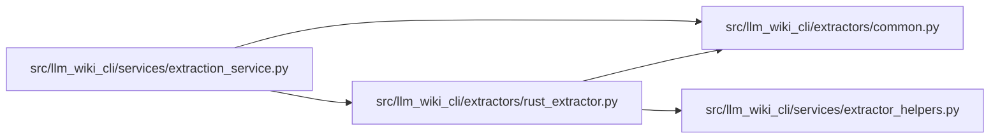

# rust_extractor Module

**Path:** `src/llm_wiki_cli/extractors/rust_extractor.py`

## Description

Rust AST extractor for agent-wiki-cli.

Implements :class:`~llm_wiki_cli.extractors.ExtractorProtocol` by delegating
to a bundled Rust binary (``rust_scripts/src/main.rs``) that uses the ``syn``
crate for Rust AST parsing.

Requirements
------------
* Rust helper prepared with ``llm-wiki prepare-extractors``.

## Imports

| Source | Symbols |
|--------|---------|
| `..services.extractor_helpers` | `ENV_EXTRACTOR_TIMEOUT`, `extractor_timeout_seconds`, `get_prepared_binary`, `missing_helper_message` |
| `.common` | `chunk_source_files_for_cli`, `discover_source_files`, `filter_bundled_inventory` |
| `__future__` | `annotations` |
| `dataclasses` | `dataclass` |
| `json` | `json` |
| `pathlib` | `Path` |
| `subprocess` | `subprocess` |
| `sys` | `sys` |

## Local dependency map

<!-- Auto-generated local dependency summary. Do not edit by hand. -->

### Internal neighbors

| Direction | Module |
|---|---|
| Inbound | [extraction_service](../modules/extraction_service.md) |
| Outbound | [common](../modules/common.md) |
| Outbound | [extractor_helpers](../modules/extractor_helpers.md) |

## Classes

| Class | Line | Bases | Description |
|-------|------|-------|-------------|
| [RustExtractionRequest](../entities/RustExtractionRequest.md) | 36 | — | Internal request object for Rust extraction orchestration. |
| [RustExtractor](../entities/RustExtractor.md) | 46 | — | Extractor for Rust source files using a prepared helper binary. |
