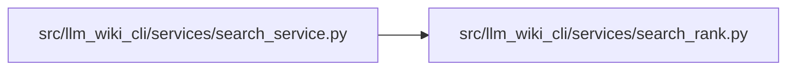

# search_rank Module

**Path:** `src/llm_wiki_cli/services/search_rank.py`

## Description

Ranks wiki pages offline using lexical, title, path, symbol, and internal-link
signals, with precedence for exact page identities. Results expose matching
reasons, content hashes, and the ranking version, with stable ordering shared by
CLI and MCP consumers. The scan is bounded to 10,000 pages and 64 MiB of UTF-8
content; callers can restrict the selected wiki or page kinds to fit the limits.

## Imports

| Source | Symbols |
|--------|---------|
| `__future__` | `annotations` |
| `collections` | `Counter` |
| `hashlib` | `hashlib` |
| `math` | `math` |
| `posixpath` | `posixpath` |
| `re` | `re` |
| `unicodedata` | `unicodedata` |
| `urllib.parse` | `unquote`, `urlsplit` |

## Local dependency map

<!-- Auto-generated local dependency summary. Do not edit by hand. -->

### Internal neighbors

| Direction | Module |
|---|---|
| Inbound | [search_service](../modules/search_service.md) |

## Functions

| Function | Signature | Decorators | Description |
|----------|-----------|------------|-------------|
| `_tokens` | `(text)` | — | — |
| `rank_pages` | `(pages, query: str, *, limit = 20, max_pages = MAX_SEARCH_PAGES, max_bytes = MAX_SEARCH_BYTES) -> dict` | — | Consume page records once; retain compact matches and local link counts. |