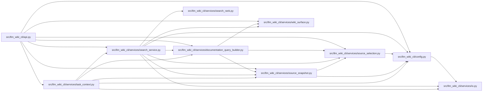

# search_service Module

**Path:** `src/llm_wiki_cli/services/search_service.py`

## Description

Shares wiki page discovery and ranked or substring search across public consumers. Ranking preserves exact identities, reasons, corpus commitments and collection bounds without introducing an MCP dependency into ordinary Python or CLI search.

## Imports

| Source | Symbols |
|--------|---------|
| `.` | `wiki_surface` |
| `..config` | `validate_path`, `validate_source_root` |
| `.documentation_query_builder` | `normalize_documentation_query_limit`, `validate_live_query_source_selection` |
| `.io` | `read_md` |
| `.search_rank` | `MAX_SEARCH_BYTES`, `MAX_SEARCH_PAGES`, `rank_pages` |
| `.source_selection` | `resolve_source_selection` |
| `.source_snapshot` | `build_source_snapshot`, `capture_source_selection_inputs` |
| `__future__` | `annotations` |
| `collections.abc` | `Callable`, `Iterable` |
| `pathlib` | `Path` |
| `re` | `re` |
| `typing` | `Any` |

## Local dependency map

<!-- Auto-generated local dependency summary. Do not edit by hand. -->

### Internal neighbors

| Direction | Module |
|---|---|
| Inbound | [api](../modules/api.md) |
| Inbound | [task_context](../modules/task_context.md) |
| Outbound | [config](../modules/config.md) |
| Outbound | [documentation_query_builder](../modules/documentation_query_builder.md) |
| Outbound | [io](../modules/io.md) |
| Outbound | [search_rank](../modules/search_rank.md) |
| Outbound | [source_selection](../modules/source_selection.md) |
| Outbound | [source_snapshot](../modules/source_snapshot.md) |
| Outbound | [wiki_surface](../modules/wiki_surface.md) |

## Functions

| Function | Signature | Decorators | Description |
|----------|-----------|------------|-------------|
| `normalize_search` | `(query: object, kinds: object, limit: object, mode: object)` | — | Validate before discovering source or wiki inputs. |
| `search_records` | `(records: Iterable[dict[str, Any]], query: str, *, limit: int, mode: str)` | — | Apply the same ranking and legacy substring contracts to captured pages. |
| `page_records` | `(wiki_root: Path, kinds: set[str], *, reader: Callable = read_md)` | — | — |
| `search_wiki` | `(query, *, src_dir = '.', wiki_dir = 'docs/llm_wiki', kinds = None, limit = 20, mode = 'ranked', source_selection = None, allow_external_src = False)` | — | — |