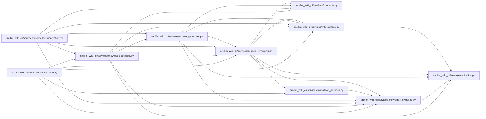

# section_ownership Module

**Path:** `src/llm_wiki_cli/services/section_ownership.py`

## Description

Conservative section ownership, scoped hashes, and semantic merge policy.

Ownership in this module is finer-grained than ``wiki_surface.SurfaceRole``.
The latter remains the compatibility summary for a complete page; this module
describes only the canonical sections that current generation and sync
behavior can identify without guessing.

## Imports

| Source | Symbols |
|--------|---------|
| `.contracts` | `SECTION_OWNERSHIP_EXTENSION_KEY`, `SECTION_OWNERSHIP_SCHEMA_VERSION` |
| `.knowledge_evidence` | `hash_json`, `sha256_bytes` |
| `.markdown_sections` | `GENERATED_INDEX_ENTRY_POINT_FLOWS_HEADING`, `GENERATED_INDEX_HTTP_API_CONTRACTS_HEADING`, `SECTION_ORDER_DOMAIN`, `MarkdownSection`, `MarkdownSectionDocument`, `mixed_table_projection`, `normalize_markdown`, `parse_markdown_document`, `preserve_table_description_cells`, `replace_section_body`, `section_locator`, `section_body`, `should_preserve_semantic_value`, `table_description_cells` |
| `.validation` | `require_exact_fields`, `require_int_at_least`, `require_mapping`, `require_nonempty_text`, `require_sequence`, `require_sha256` |
| `.wiki_surface` | `PageKind` |
| `__future__` | `annotations` |
| `collections` | `defaultdict` |
| `collections.abc` | `Iterable`, `Mapping`, `Sequence` |
| `dataclasses` | `dataclass` |
| `enum` | `Enum` |
| `re` | `re` |
| `typing` | `cast` |

## Local dependency map

<!-- Auto-generated local dependency summary. Do not edit by hand. -->

### Internal neighbors

| Direction | Module |
|---|---|
| Inbound | [sync_cmd](../modules/sync_cmd.md) |
| Inbound | [knowledge_artifacts](../modules/knowledge_artifacts.md) |
| Inbound | [knowledge_generation](../modules/knowledge_generation.md) |
| Inbound | [knowledge_model](../modules/knowledge_model.md) |
| Outbound | [services_contracts](../modules/services_contracts.md) |
| Outbound | [knowledge_evidence](../modules/knowledge_evidence.md) |
| Outbound | [markdown_sections](../modules/markdown_sections.md) |
| Outbound | [validation](../modules/validation.md) |
| Outbound | [wiki_surface](../modules/wiki_surface.md) |

## Classes

| Class | Kind | Line | Bases / Target | Description |
|-------|------|------|----------------|-------------|
| [SectionOwnership](../entities/SectionOwnership.md) | Enum | 50 | `str`, `Enum` | The authority boundary of one parsed Markdown section. |
| [SectionOwnershipError](../entities/SectionOwnershipError.md) | Class | 59 | `ValueError` | Field-specific failure for the persisted section ownership contract. |
| [SectionObservation](../entities/SectionObservation.md) | Class | 69 | — | One ordered section plus its exact and ownership-scoped commitments. |
| [PageSectionObservations](../entities/PageSectionObservations.md) | Class | 111 | — | All ordered section observations for one final Markdown page. |
| [SemanticMergeResult](../entities/SemanticMergeResult.md) | Class | 133 | — | Regenerated Markdown and the number of semantic values restored. |

## Functions

| Function | Signature | Decorators | Description |
|----------|-----------|------------|-------------|
| `_coerce_page_kind` | `(page_kind: PageKind \| str) -> PageKind` | — | — |
| `_top_level_policy` | `(page_kind: PageKind, title: str, canonical_occurrence: int, *, index_preserved: bool) -> SectionOwnership` | — | — |
| `classify_section_ownership` | `(page_kind: PageKind \| str, section: MarkdownSection, *, parent_ownership: SectionOwnership \| None = None, canonical_occurrence: int \| None = None, index_preserved: bool = True) -> SectionOwnership` | — | Classify one section without an optimistic fallback. |
| `_scoped_hashes` | `(section: MarkdownSection, ownership: SectionOwnership) -> tuple[str \| None, str \| None]` | — | — |
| `_preamble_observation` | `(document: MarkdownSectionDocument, page_kind: PageKind, end: int) -> SectionObservation \| None` | — | — |
| `_expected_persisted_ownership` | `(page_kind: PageKind, section: Mapping[str, object], *, parent_ownership: SectionOwnership \| None, canonical_occurrence: int) -> SectionOwnership` | — | — |
| `observe_page_sections` | `(markdown: str, page_locator: str, page_kind: PageKind \| str, *, index_preserved: bool = True) -> PageSectionObservations` | — | Observe ownership and scoped hashes from final post-merge Markdown. |
| `serialize_section_ownership` | `(pages: Iterable[PageSectionObservations]) -> dict[str, object]` | — | Serialize pages deterministically without changing document section order. |
| `validate_section_ownership` | `(payload: object, *, concepts: Mapping[str, tuple[PageKind \| str, str]] \| None = None) -> dict[str, object]` | — | Validate and canonicalize one persisted section ownership extension. |
| `_normalise_section_record` | `(value: object, path: str, *, page_locator: str, seen_sections: set[str]) -> dict[str, object]` | — | — |
| `_section_ordering_hash` | `(page_locator: str, sections: Sequence[Mapping[str, object]]) -> str` | — | — |
| `_section_object` | `(value: object, path: str) -> Mapping[str, object]` | — | — |
| `_section_array` | `(value: object, path: str) -> list[object]` | — | — |
| `_section_fields` | `(value: Mapping[str, object], path: str, allowed: set[str], required: set[str]) -> None` | — | — |
| `_section_string` | `(value: object, path: str) -> str` | — | Preserve raw persisted strings; callers apply their domain constraints. |
| `_section_hash` | `(value: object, path: str) -> str` | — | — |
| `_section_int` | `(value: object, path: str, *, minimum: int) -> int` | — | — |
| `_section_string_array` | `(value: object, path: str) -> list[str]` | — | — |
| `_section_int_array` | `(value: object, path: str, *, minimum: int) -> list[int]` | — | — |
| `section_ownership_extension` | `(pages: Iterable[PageSectionObservations]) -> dict[str, object]` | — | Return the namespaced knowledge-index extension mapping. |
| `merge_semantic_markdown` | `(existing: str, generated: str, table_headings: tuple[str, ...], *, old_description: str \| None = None, old_table_descriptions: dict[str, dict[str, str]] \| None = None) -> SemanticMergeResult` | — | Preserve historical semantic fields in regenerated wiki Markdown. |
| `merge_entity_semantics` | `(existing: str, generated: str, old_semantics: Mapping[str, object] \| None = None) -> SemanticMergeResult` | — | Apply the current entity Description/Attributes/Methods policy. |
| `merge_module_semantics` | `(existing: str, generated: str, old_semantics: Mapping[str, object] \| None = None) -> SemanticMergeResult` | — | Apply the current module Description/Classes/Functions policy. |
| `replace_generated_section` | `(existing: str, generated: str, heading: str) -> str` | — | Replace one current generated section without touching other bytes. |
