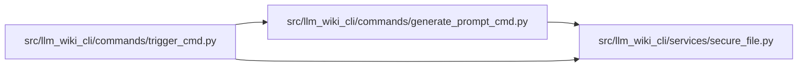

# secure_file Module

**Path:** `src/llm_wiki_cli/services/secure_file.py`

## Description

Helpers for writing local runtime files with best-effort privacy.

## Imports

| Source | Symbols |
|--------|---------|
| `__future__` | `annotations` |
| `os` | `os` |
| `pathlib` | `Path` |

## Local dependency map

<!-- Auto-generated local dependency summary. Do not edit by hand. -->

### Internal neighbors

| Direction | Module |
|---|---|
| Inbound | [generate_prompt_cmd](../modules/generate_prompt_cmd.md) |
| Inbound | [trigger_cmd](../modules/trigger_cmd.md) |

## Functions

| Function | Signature | Decorators | Description |
|----------|-----------|------------|-------------|
| `write_private_text` | `(path: str \| Path, text: str, *, encoding: str = 'utf-8') -> Path` | — | Write text and restrict file permissions where the platform supports it. |
