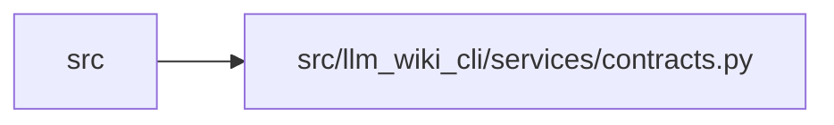

# contracts Module

**Path:** `src/llm_wiki_cli/services/contracts.py`

## Description

Stable machine-readable contracts exposed by source-adapter commands.

The extract contract stays at ``llm-wiki-extract/v1`` while data-flow metadata
is added as optional fields. Consumers must tolerate inventories without
``data_effects``, call argument summaries, top-level ``data_flows``, or the
versioned ``data_flow_details`` sibling because older payloads and non-Python
extractors may not emit them. A schema version bump is reserved for
incompatible shape changes to existing fields.

Dependency/load-order architecture decisions also stay additive under the
current extract contract: deep Python inventory may include ``data_effects`` on
function entries, including bounded ``boundary_effects`` for filesystem,
environment, process, network, output, and logging calls; ``module_calls`` only
when module-level side effects exist; ``main_block_calls`` for calls inside a
Python ``if __name__ == "__main__"`` guard; and ``extract --deep`` may include
a top-level ``data_flows`` list plus a top-level ``dependencies`` block.
The dependency block may contain versioned ``version_details`` records; its
legacy per-language ``versions`` map remains unchanged.
Python dependency reconciliation treats ``sys.stdlib_module_names`` as the
stdlib source when available, falls back to the bundled Python 3.9 list in
dependency analysis, and uses the curated import-to-distribution aliases there
with optional project overrides from ``[tool.llm-wiki.dependency-aliases]``.
Reconstructable Python contracts also remain additive: parameter ``kind``
values preserve declaration separators, while class/attribute records may add
enum members, type-alias targets, normalized Pydantic field state, model
configuration, and validator metadata. Extraction remains syntax-only and
consumers must tolerate these optional records being absent.
Deep Python inventory may additionally expose per-file ``frameworks.fastapi``
declarations and the payload may expose top-level ``api_contracts`` assembled
from static syntax or an authoritative source-contained OpenAPI export. These
records, their diagnostics, and entry-point ``routes`` remain optional under
``llm-wiki-extract/v1``.

## Imports

| Source | Symbols |
|--------|---------|
| `__future__` | `annotations` |

## Local dependency map

<!-- Auto-generated local dependency summary. Do not edit by hand. -->

> Module-level dependencies exceed the generated-diagram limits, so the diagram and table below group them by top-level package. Counts report the number of module neighbors in each package.

### Internal neighbors

| Direction | Module |
|---|---|
| Inbound | `src` (28) |

> All 28 module neighbor(s) are summarized by package because the module-level view exceeds the 12-node limit.
