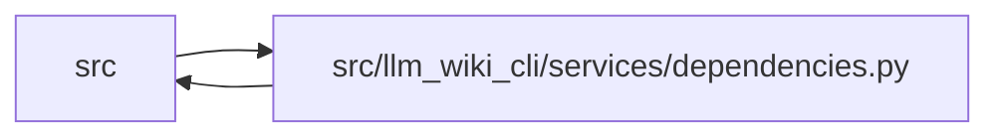

# dependencies Module

**Path:** `src/llm_wiki_cli/services/dependencies.py`

## Description

Internal dependency-graph analysis and external reconciliation.

Builds a module-file → module-file dependency graph from a structural
inventory's ``imports`` records, detects import cycles via strongly-connected
components, computes fan-in/fan-out metrics, and reconciles each
file's external imports against its language's declared dependency manifest —
Python (``pyproject.toml``), TypeScript/JS (``package.json``), Go (``go.mod``),
Rust (``Cargo.toml``), and Haskell (``*.cabal``/``stack.yaml``/``flake.nix``) —
to surface undeclared and unused packages. Analogous to
:mod:`llm_wiki_cli.services.entrypoints`: deterministic, performs no LLM calls,
imports only stdlib (plus the bundled ``tomli`` backport) and
:mod:`llm_wiki_cli.services.imports`, and takes the inventory as plain data
(returning plain dicts/lists). It tolerates slim or non-Python inventory entries
that omit optional fields — absence never raises.

The same module-path resolver that backs call-edge resolution
(:func:`extract_cmd.resolve_call_edges`) is reused here, so import→file
resolution stays consistent across the codebase. Imports that resolve to no
internal file (stdlib, third-party, unresolvable relatives) are collected in an
``unresolved`` bucket; the external dependency classifiers consume that bucket
so an import already resolved to an internal file is never double-counted as
external.

Reconciliation is *language-partitioned*: each language pairs a manifest parser
with an import→package classifier behind a shared dispatcher. A language with
imports but no manifest (everything → undeclared) or a manifest but no imports
(everything → unused) degrades to warnings, never an exception; import→package
name mapping is best-effort per ecosystem, so undeclared/unused are advisory.

## Imports

| Source | Symbols |
|--------|---------|
| `..config` | `is_agent_worktree_path` |
| `.dependency_versions` | `build_dependency_version_details` |
| `.imports` | `build_module_path_resolver` |
| `.source_snapshot` | `SourceSnapshot`, `build_source_snapshot` |
| `.validation` | `path_is_under`, `path_is_under_scope`, `positive_int_or_none` |
| `__future__` | `annotations` |
| `collections` | `defaultdict` |
| `dataclasses` | `dataclass` |
| `heapq` | `heapq` |
| `json` | `json` |
| `os` | `os` |
| `pathlib` | `Path` |
| `re` | `re` |
| `sys` | `sys` |
| `tomli` | `tomllib` |
| `tomllib` | `tomllib` |
| `typing` | `Callable`, `Mapping`, `Optional` |

## Local dependency map

<!-- Auto-generated local dependency summary. Do not edit by hand. -->

> Module-level dependencies exceed the generated-diagram limits, so the diagram and table below group them by top-level package. Counts report the number of module neighbors in each package.

### Internal neighbors

| Direction | Module |
|---|---|
| Inbound | `src` (10) |
| Outbound | `src` (5) |

### External packages

| Language | Used packages | Undeclared packages |
|---|---:|---:|
| python | 1 | 0 |

> All 15 module neighbor(s) are summarized by package because the module-level view exceeds the 12-node limit.

## Classes

| Class | Line | Bases | Description |
|-------|------|-------|-------------|
| [_ManifestScope](../entities/ManifestScope.md) | 716 | — | A scoped dependency manifest rooted at a project-relative directory. |
| [_Manifest](../entities/Manifest.md) | 730 | — | A language's declared dependencies, parsed from its manifest. |
| [_LanguagePlugin](../entities/LanguagePlugin.md) | 752 | — | A manifest parser + import classifier for one language family. |

## Functions

| Function | Signature | Decorators | Description |
|----------|-----------|------------|-------------|
| `_build_symbol_file_index` | `(inventory: dict) -> dict[str, set[str]]` | — | Map each top-level symbol name to the files that define it. |
| `_resolve_target_module` | `(module: str, name: str) -> str` | — | Return the module string to resolve for an import record. |
| `_resolve_internal_targets` | `(imp: dict, filepath: str, resolver, symbol_index) -> set[str]` | — | Return the internal files *imp* (from *filepath*) resolves to. |
| `build_dependency_graph` | `(inventory: dict, project_root: str \| Path \| None = None, *, source_snapshot: SourceSnapshot \| None = None) -> dict` | — | Resolve each file's imports into an internal module-dependency graph. |
| `_positive_line` | `(value: object) -> int \| None` | — | Return a source line only when the extractor supplied a real line. |
| `_unresolved_import_resolution` | `(module: str, name: str, filepath: str, resolver) -> str` | — | Classify a no-candidate import without claiming missing code is external. |
| `_dependency_observation_sort_key` | `(observation: Mapping) -> tuple` | — | — |
| `_import_location_index` | `(import_observations: Mapping \| None) -> tuple[dict[tuple[str, int], Mapping], bool]` | — | Validate an extractor sidecar without turning bad metadata into evidence. |
| `build_dependency_observations` | `(inventory: dict, project_root: str \| Path \| None = None, *, source_snapshot: SourceSnapshot \| None = None, import_observations: Mapping \| None = None) -> dict` | — | Return lossless, versioned import-resolution observations. |
| `build_external_dependency_observations` | `(analysis: Mapping) -> list[dict]` | — | Lift an existing reconciliation report into source/package observations. |
| `_build_adjacency` | `(graph: dict) -> tuple[dict[str, list[str]], set[str], set[str]]` | — | Return ``(adjacency, nodes, self_loops)`` from a dependency graph. |
| `detect_cycles` | `(graph: dict) -> list[list[str]]` | — | Return the import cycles in *graph* as sorted node lists. |
| `dependency_metrics` | `(graph: dict) -> dict` | — | Compute per-module fan-in/fan-out counts and a most-depended ranking. |
| `_condense` | `(graph: dict) -> tuple[dict[str, str], dict[str, list[str]], list[list[str]]]` | — | Condense the graph's strongly-connected components into super-nodes. |
| `topological_order` | `(graph: dict) -> dict` | — | Order modules so each loads after the internal modules it imports. |
| `_factory_kind` | `(name: str) -> str` | — | Classify a function name as a ``"factory"``, ``"wiring"`` helper, or ``""``. |
| `detect_side_effects` | `(inventory: dict) -> dict` | — | List import-time side effects and factory/wiring functions per module. |
| `_python_stdlib` | `() -> frozenset[str]` | — | — |
| `_normalize_python` | `(name: str) -> str` | — | PEP 503 normalization: lowercase, runs of ``-``/``_``/``.`` → ``-``. |
| `_pep508_name` | `(spec: str) -> str` | — | Distribution name from a PEP 508 requirement (drops version/markers/extras). |
| `_snapshot_package_marker_paths` | `(project_root: Path, source_snapshot: SourceSnapshot, predicate: Callable[[str], bool]) -> list[Path]` | — | — |
| `_is_python_requirements_manifest_name` | `(name: str) -> bool` | — | — |
| `_is_python_manifest_name` | `(name: str) -> bool` | — | — |
| `_walk_python_manifest_files` | `(project_root: Path, source_snapshot: SourceSnapshot \| None = None) -> list[Path]` | — | — |
| `_manifest_dir_is_agent_worktree` | `(project_root: Path, root_path: Path, dirname: str) -> bool` | — | — |
| `_python_scope_root` | `(project_root: Path, path: Path) -> str` | — | — |
| `_discover_python_local_modules` | `(project_root: Path, source_snapshot: SourceSnapshot) -> frozenset[str]` | — | — |
| `_requirements_optional` | `(path: Path) -> bool` | — | — |
| `_requirement_name` | `(spec: str) -> str` | — | — |
| `_parse_requirements_file` | `(path: Path) -> tuple[set[str], set[str]]` | — | — |
| `_python_package_import_roots` | `(path: Path, data: dict, project_root: Path, source_snapshot: SourceSnapshot) -> frozenset[str]` | — | — |
| `_python_import_name_from_distribution` | `(name: str) -> str` | — | — |
| `_parse_python_pyproject` | `(path: Path, project_root: Path, source_snapshot: SourceSnapshot) -> tuple[set[str], set[str], dict[str, str], str, frozenset[str]]` | — | — |
| `_parse_python_manifest` | `(project_root: Path, source_snapshot: SourceSnapshot) -> Optional[_Manifest]` | — | — |
| `_python_aliases_for_file` | `(manifest: Optional[_Manifest], filepath: str) -> dict[str, str]` | — | — |
| `_classify_python` | `(module: str, name: str, filepath: str, manifest: Optional[_Manifest]) -> Optional[str]` | — | — |
| `_walk_ts_manifest_files` | `(project_root: Path, source_snapshot: SourceSnapshot \| None = None) -> list[Path]` | — | — |
| `_ts_scope_root` | `(project_root: Path, path: Path) -> str` | — | — |
| `_parse_ts_package_json` | `(path: Path) -> Optional[tuple[set[str], set[str]]]` | — | — |
| `_parse_ts_manifest` | `(project_root: Path, source_snapshot: SourceSnapshot) -> Optional[_Manifest]` | — | — |
| `_classify_ts` | `(module: str, name: str, filepath: str, manifest: Optional[_Manifest]) -> Optional[str]` | — | — |
| `_walk_go_manifest_files` | `(project_root: Path, source_snapshot: SourceSnapshot \| None = None) -> list[Path]` | — | — |
| `_go_scope_root` | `(project_root: Path, path: Path) -> str` | — | — |
| `_parse_go_mod_file` | `(path: Path) -> tuple[str, set[str], set[str], set[str]]` | — | — |
| `_parse_go_manifest` | `(project_root: Path, source_snapshot: SourceSnapshot) -> Optional[_Manifest]` | — | — |
| `_go_require_path` | `(line: str) -> str` | — | First whitespace-delimited token of a ``require`` line: the module path. |
| `_go_require_entry` | `(line: str, comment: str) -> tuple[str, bool]` | — | Return ``(module_path, is_indirect)`` for a ``require`` entry. |
| `_parse_go_replace` | `(line: str) -> tuple[str, str]` | — | — |
| `_is_local_path` | `(target: str) -> bool` | — | — |
| `_go_default_module` | `(path: str) -> str` | — | Heuristic module key when no ``go.mod`` is available: ``host/org/repo``. |
| `_classify_go` | `(module: str, name: str, filepath: str, manifest: Optional[_Manifest]) -> Optional[str]` | — | — |
| `_path_under` | `(path: str, prefix: str) -> bool` | — | — |
| `_normalize_rust` | `(name: str) -> str` | — | Rust crate names are interchangeable across ``-``/``_``; canonicalize. |
| `_parse_rust_manifest` | `(project_root: Path, source_snapshot: SourceSnapshot) -> Optional[_Manifest]` | — | — |
| `_classify_rust` | `(module: str, name: str, filepath: str, manifest: Optional[_Manifest]) -> Optional[str]` | — | — |
| `_is_haskell_manifest_file_name` | `(name: str) -> bool` | — | — |
| `_walk_haskell_manifest_files` | `(project_root: Path, source_snapshot: SourceSnapshot \| None = None) -> list[Path]` | — | — |
| `_haskell_scope_root` | `(project_root: Path, path: Path) -> str` | — | — |
| `_strip_haskell_line_comment` | `(raw: str) -> str` | — | — |
| `_normalize_haskell_package` | `(name: str) -> str` | — | — |
| `_haskell_package_name_from_spec` | `(spec: str) -> str` | — | — |
| `_haskell_packages_from_specs` | `(specs: list[str]) -> set[str]` | — | — |
| `_cabal_stanza` | `(clean_line: str) -> str` | — | — |
| `_cabal_package_name` | `(lines: list[str]) -> str` | — | — |
| `_collect_cabal_field` | `(lines: list[str], index: int) -> tuple[list[str], int]` | — | — |
| `_parse_cabal_file` | `(path: Path) -> tuple[set[str], set[str]]` | — | — |
| `_parse_stack_extra_deps` | `(path: Path) -> set[str]` | — | — |
| `_parse_haskell_nix_hints` | `(path: Path) -> set[str]` | — | — |
| `_parse_haskell_manifest` | `(project_root: Path, source_snapshot: SourceSnapshot) -> Optional[_Manifest]` | — | — |
| `_haskell_module_matches_prefix` | `(module: str, prefix: str) -> bool` | — | — |
| `_classify_haskell` | `(module: str, name: str, filepath: str, manifest: Optional[_Manifest]) -> Optional[str]` | — | — |
| `_load_toml` | `(path: Path) -> Optional[dict]` | — | Parse a TOML file; ``None`` when missing, unreadable, or unparseable. |
| `parse_declared_dependencies` | `(project_root: str = '.', *, source_snapshot: SourceSnapshot \| None = None) -> dict` | — | Parse every available manifest under *project_root*. |
| `_parse_manifests` | `(project_root: Path, *, source_snapshot: SourceSnapshot \| None = None) -> dict[str, _Manifest]` | — | — |
| `classify_imports` | `(inventory: dict, *, graph: Optional[dict] = None, manifests: Optional[dict[str, _Manifest]] = None) -> dict` | — | Group each file's external imports by language and package. |
| `_path_under_scope` | `(filepath: str, scope_root: str) -> bool` | — | — |
| `_nearest_manifest_scope` | `(manifest: Optional[_Manifest], filepath: str) -> Optional[_ManifestScope]` | — | — |
| `_scope_label` | `(scope: Optional[_ManifestScope]) -> str \| None` | — | — |
| `_reconcile_scoped_language` | `(used_packages: dict[str, list[str]], manifest: Optional[_Manifest]) -> dict` | — | — |
| `_python_internal_distribution_uses` | `(inventory: dict, _graph: dict, manifest: Optional[_Manifest]) -> dict[str, list[str]]` | — | — |
| `_merge_used_packages` | `(used: dict[str, dict[str, list[str]]], language: str, additions: dict[str, list[str]]) -> None` | — | — |
| `_version_record` | `(version: str, resolved_from: str) -> dict[str, str]` | — | — |
| `_version_sort_key` | `(version: str) -> tuple` | — | — |
| `_keep_highest_version` | `(versions: dict[str, dict[str, str]], package: str, version: str, source: str) -> None` | — | — |
| `_lockfile_dirs` | `(root: Path, excluded_dirs: frozenset[str]) -> list[Path]` | — | — |
| `_go_sum_versions` | `(project_root: Path, source_snapshot: SourceSnapshot \| None = None) -> dict[str, dict[str, str]]` | — | — |
| `_cargo_lock_versions` | `(project_root: Path, source_snapshot: SourceSnapshot \| None = None) -> dict[str, dict[str, str]]` | — | — |
| `_requirements_pin_versions` | `(project_root: Path, source_snapshot: SourceSnapshot \| None = None) -> dict[str, dict[str, str]]` | — | — |
| `_poetry_lock_versions` | `(project_root: Path, source_snapshot: SourceSnapshot \| None = None) -> dict[str, dict[str, str]]` | — | — |
| `_python_lock_versions` | `(project_root: Path, source_snapshot: SourceSnapshot \| None = None) -> dict[str, dict[str, str]]` | — | — |
| `_package_lock_name` | `(package_path: str) -> str` | — | — |
| `_package_lock_versions` | `(project_root: Path, source_snapshot: SourceSnapshot \| None = None) -> dict[str, dict[str, str]]` | — | — |
| `_pnpm_package_key` | `(line: str) -> tuple[str, str]` | — | — |
| `_pnpm_lock_versions` | `(project_root: Path, source_snapshot: SourceSnapshot \| None = None) -> dict[str, dict[str, str]]` | — | — |
| `_typescript_lock_versions` | `(project_root: Path, source_snapshot: SourceSnapshot \| None = None) -> dict[str, dict[str, str]]` | — | — |
| `_lockfile_versions` | `(project_root: Path, source_snapshot: SourceSnapshot \| None = None) -> dict[str, dict[str, dict[str, str]]]` | — | — |
| `_attach_versions` | `(report: dict, versions: dict[str, dict[str, str]]) -> None` | — | — |
| `_unresolved_path_aliases_by_language` | `(inventory: dict, graph: dict) -> dict[str, dict]` | — | — |
| `reconcile_dependencies` | `(inventory: dict, project_root: str = '.', *, graph: Optional[dict] = None, source_snapshot: SourceSnapshot \| None = None) -> dict` | — | Reconcile used external imports against declared dependencies per language. |
| `analyze_dependencies` | `(inventory: dict, project_root: str = '.', *, source_snapshot: SourceSnapshot \| None = None) -> dict` | — | Run the full dependency analysis once, sharing the internal graph. |
| `top_level_package` | `(filepath: str) -> str` | — | Return the top-level package of *filepath* (its first path component). |
| `package_dependency_graph` | `(graph: dict) -> dict` | — | Collapse a module graph to a top-level-package graph. |
