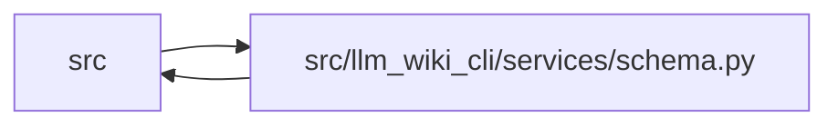

# schema Module

**Path:** `src/llm_wiki_cli/services/schema.py`

## Description

Shared schema utilities for agent constraint blocks.

Provides functions to build, strip, and replace the LLM Wiki constraint
block that is injected into agent schema files (CLAUDE.md, .cursorrules, etc.).

## Imports

| Source | Symbols |
|--------|---------|
| `.io` | `first_unsafe_path_component`, `write_bytes_atomic` |
| `.paths` | `shell_quote` |
| `.plugins` | `iter_components`, `read_component_text` |
| `.skills` | `skills_install_dir` |
| `__future__` | `annotations` |
| `collections.abc` | `Iterable` |
| `dataclasses` | `dataclass` |
| `enum` | `Enum` |
| `pathlib` | `Path` |
| `re` | `re` |

## Local dependency map

<!-- Auto-generated local dependency summary. Do not edit by hand. -->

> Module-level dependencies exceed the generated-diagram limits, so the diagram and table below group them by top-level package. Counts report the number of module neighbors in each package.

### Internal neighbors

| Direction | Module |
|---|---|
| Inbound | `src` (10) |
| Outbound | `src` (4) |

> All 14 module neighbor(s) are summarized by package because the module-level view exceeds the 12-node limit.

## Classes

| Class | Kind | Line | Bases / Target | Description |
|-------|------|------|----------------|-------------|
| [SchemaRenderProfile](../entities/SchemaRenderProfile.md) | Enum | 27 | `str`, `Enum` | Supported managed-schema rendering profiles. |
| [ManagedSchemaBlockState](../entities/ManagedSchemaBlockState.md) | Enum | 34 | `str`, `Enum` | Machine-readable classification of one managed schema block. |
| [ManagedSchemaPathError](../entities/ManagedSchemaPathError.md) | Class | 45 | `ValueError` | Raised when a managed schema path cannot be accessed safely. |
| [ManagedSchemaBlockError](../entities/ManagedSchemaBlockError.md) | Class | 49 | `ValueError` | Raised when a malformed managed block cannot be replaced safely. |
| [ManagedSchemaBlock](../entities/ManagedSchemaBlock.md) | Class | 54 | — | Parsed metadata for a managed schema block without health inference. |

## Functions

| Function | Signature | Decorators | Description |
|----------|-----------|------------|-------------|
| `require_safe_schema_path` | `(path: str \| Path) -> Path` | — | Return a schema path only when no symlink/reparse/traversal can redirect it. |
| `_source_selection_args` | `(source_selection: str \| Path \| None) -> str` | — | — |
| `_sync_instructions` | `(source_selection: str \| Path \| None, skills_dir: str) -> str` | — | — |
| `_issue_reporting_instructions` | `(wiki_dir: str) -> str` | — | — |
| `_compact_issue_reporting_instructions` | `(wiki_dir: str) -> str` | — | — |
| `_wiki_instructions` | `(wiki_dir: str, skills_dir: str, *, issue_reporting: bool = False, source_selection: str \| Path \| None = None) -> str` | — | — |
| `_compact_wiki_instructions` | `(wiki_dir: str, skills_dir: str, *, issue_reporting: bool = False, source_selection: str \| Path \| None = None) -> str` | — | Return the always-loaded knowledge-first safety and routing kernel. |
| `_schema_profile_marker` | `(render_profile: SchemaRenderProfile) -> str` | — | — |
| `build_schema_content` | `(agent: str, wiki_dir: str, *, render_profile: SchemaRenderProfile, quality_hints: bool = True, issue_reporting: bool = False, source_selection: str \| Path \| None = None) -> str` | — | Build a deterministic constraint block for the selected profile. |
| `pin_source_selection_command_recipes` | `(content: str, source_selection: str \| Path \| None) -> str` | — | Pin source-reading recipes inside one generated constraint block. |
| `classify_managed_schema_block` | `(content: str) -> ManagedSchemaBlock` | — | Classify managed-block metadata without inspecting generated prose. |
| `require_managed_schema_profile` | `(content: str, expected_profile: SchemaRenderProfile) -> ManagedSchemaBlock` | — | Require a staged document to contain exactly the requested managed block. |
| `require_replaceable_managed_schema` | `(content: str) -> ManagedSchemaBlock` | — | Require existing managed markers to be absent or unambiguous. |
| `strip_wiki_block` | `(content: str) -> str` | — | Remove one managed block without rewriting surrounding document bytes. |
| `decode_managed_document_bytes` | `(content: bytes) -> str` | — | Decode for marker splicing while retaining supported legacy bytes. |
| `encode_managed_document_text` | `(content: str) -> bytes` | — | Encode marker-spliced text while restoring surrogate-escaped bytes. |
| `replace_schema_block` | `(schema_path: Path, new_content: str) -> None` | — | Replace the constraint block in an existing schema file, preserving user content. |
| `replace_schema_block_content` | `(existing: str, new_content: str) -> str` | — | Return content with its managed constraint block replaced or appended. |
| `_preferred_line_ending` | `(content: str) -> str` | — | Return the existing document's first line ending without normalizing it. |
| `_append_separator` | `(content: str, newline: str) -> str` | — | Return only the separator needed to append a managed block. |
| `skill_start_marker` | `(plugin_id: str, skill_id: str) -> str` | — | — |
| `skill_end_marker` | `(plugin_id: str, skill_id: str) -> str` | — | — |
| `build_skill_block` | `(plugin_id: str, skill_id: str, skill_content: str) -> str` | — | — |
| `strip_skill_blocks` | `(content: str, *, plugin_id: str \| None = None, skill_id: str \| None = None) -> str` | — | Remove managed plugin skill blocks from schema content. |
| `replace_skill_block` | `(schema_path: Path, plugin_id: str, skill_id: str, skill_content: str) -> None` | — | — |
| `replace_skill_block_content` | `(existing: str, plugin_id: str, skill_id: str, skill_content: str) -> str` | — | Return content with one plugin skill block refreshed in memory. |
| `refresh_skill_blocks_content` | `(existing: str, skill_blocks: Iterable[tuple[str, str, str]]) -> tuple[str, list[str]]` | — | Refresh plugin skill blocks in memory and return their identifiers. |
| `build_upgraded_schema_content` | `(existing: str, managed_content: str, skill_blocks: Iterable[tuple[str, str, str]]) -> tuple[str, list[str]]` | — | Compose a managed-block upgrade and plugin refresh without writing. |
| `installed_skill_block_contents` | `() -> tuple[tuple[str, str, str], ...]` | — | Load configured plugin skill blocks for in-memory schema composition. |
| `refresh_skill_blocks` | `(agent: str, wiki_dir: str) -> list[str]` | — | Refresh all installed skill blocks in the active agent schema file. |
| `strip_plugin_skill_blocks` | `(plugin_id: str) -> list[str]` | — | Strip one plugin's skill blocks from every known schema file. |
