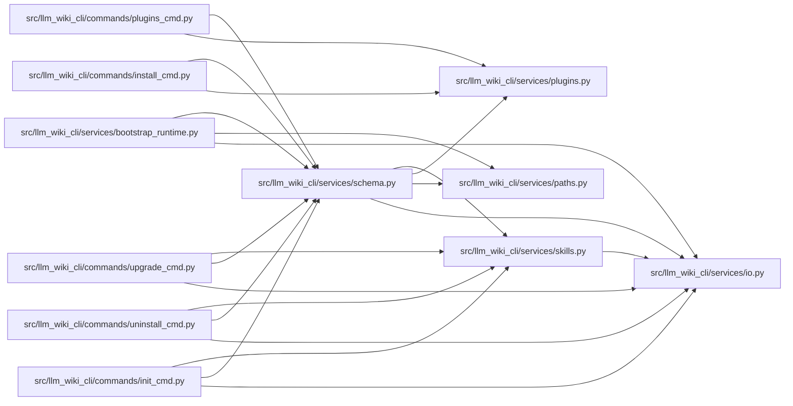

# schema Module

**Path:** `src/llm_wiki_cli/services/schema.py`

## Description

Shared schema utilities for agent constraint blocks.

Provides functions to build, strip, and replace the LLM Wiki constraint
block that is injected into agent schema files (CLAUDE.md, .cursorrules, etc.).

## Imports

| Source | Symbols |
|--------|---------|
| `.io` | `read_md`, `write_md` |
| `.paths` | `shell_quote` |
| `.plugins` | `iter_components`, `read_component_text` |
| `.skills` | `skills_install_dir` |
| `__future__` | `annotations` |
| `pathlib` | `Path` |
| `re` | `re` |

## Local dependency map

<!-- Auto-generated local dependency summary. Do not edit by hand. -->

### Internal neighbors

| Direction | Module |
|---|---|
| Inbound | [init_cmd](../modules/init_cmd.md) |
| Inbound | [install_cmd](../modules/install_cmd.md) |
| Inbound | [plugins_cmd](../modules/plugins_cmd.md) |
| Inbound | [uninstall_cmd](../modules/uninstall_cmd.md) |
| Inbound | [upgrade_cmd](../modules/upgrade_cmd.md) |
| Inbound | [bootstrap_runtime](../modules/bootstrap_runtime.md) |
| Outbound | [io](../modules/io.md) |
| Outbound | [paths](../modules/paths.md) |
| Outbound | [plugins](../modules/plugins.md) |
| Outbound | [skills](../modules/skills.md) |

## Functions

| Function | Signature | Decorators | Description |
|----------|-----------|------------|-------------|
| `_source_selection_args` | `(source_selection: str \| Path \| None) -> str` | — | — |
| `_sync_instructions` | `(source_selection: str \| Path \| None) -> str` | — | — |
| `_issue_reporting_instructions` | `(wiki_dir: str) -> str` | — | — |
| `_wiki_instructions` | `(wiki_dir: str, skills_dir: str, *, issue_reporting: bool = False, source_selection: str \| Path \| None = None) -> str` | — | — |
| `build_schema_content` | `(agent: str, wiki_dir: str, *, quality_hints: bool = True, issue_reporting: bool = False, source_selection: str \| Path \| None = None) -> str` | — | Build the full constraint block for the given agent and wiki directory. |
| `pin_source_selection_command_recipes` | `(content: str, source_selection: str \| Path \| None) -> str` | — | Pin source-reading recipes inside one generated constraint block. |
| `strip_wiki_block` | `(content: str) -> str` | — | Remove the LLM Wiki constraint block from file content. |
| `replace_schema_block` | `(schema_path: Path, new_content: str) -> None` | — | Replace the constraint block in an existing schema file, preserving user content. |
| `skill_start_marker` | `(plugin_id: str, skill_id: str) -> str` | — | — |
| `skill_end_marker` | `(plugin_id: str, skill_id: str) -> str` | — | — |
| `build_skill_block` | `(plugin_id: str, skill_id: str, skill_content: str) -> str` | — | — |
| `strip_skill_blocks` | `(content: str, *, plugin_id: str \| None = None, skill_id: str \| None = None) -> str` | — | Remove managed plugin skill blocks from schema content. |
| `replace_skill_block` | `(schema_path: Path, plugin_id: str, skill_id: str, skill_content: str) -> None` | — | — |
| `refresh_skill_blocks` | `(agent: str, wiki_dir: str) -> list[str]` | — | Refresh all installed skill blocks in the active agent schema file. |
| `strip_plugin_skill_blocks` | `(plugin_id: str) -> list[str]` | — | Strip one plugin's skill blocks from every known schema file. |
