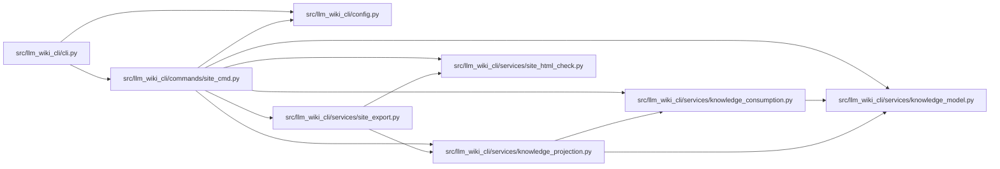

# site_cmd Module

**Path:** `src/llm_wiki_cli/commands/site_cmd.py`

## Description

Commands for exporting LLM Wiki into a static-site-friendly mirror.

## Imports

| Source | Symbols |
|--------|---------|
| `..config` | `DEFAULT_WIKI_DIR`, `validate_path` |
| `..services.knowledge_consumption` | `load_knowledge_read_view` |
| `..services.knowledge_model` | `KnowledgeProjectionProfile` |
| `..services.knowledge_projection` | `KnowledgeProjection`, `project_knowledge` |
| `..services.site_export` | `SUPPORTED_KNOWLEDGE_METADATA`, `SUPPORTED_SITE_PROFILES`, `SUPPORTED_SITE_FORMATS`, `SiteExportError`, `check_site_hub`, `check_site_mirror`, `export_site_hub`, `export_site_mirror`, `render_report_json`, `render_report_text`, `resolve_site_hub_sources` |
| `..services.site_html_check` | `SUPPORTED_LINK_MODES` |
| `__future__` | `annotations` |
| `sys` | `sys` |

## Local dependency map

<!-- Auto-generated local dependency summary. Do not edit by hand. -->

### Internal neighbors

| Direction | Module |
|---|---|
| Inbound | [cli](../modules/cli.md) |
| Outbound | [config](../modules/config.md) |
| Outbound | [knowledge_consumption](../modules/knowledge_consumption.md) |
| Outbound | [knowledge_model](../modules/knowledge_model.md) |
| Outbound | [knowledge_projection](../modules/knowledge_projection.md) |
| Outbound | [site_export](../modules/site_export.md) |
| Outbound | [site_html_check](../modules/site_html_check.md) |

## Functions

| Function | Signature | Decorators | Description |
|----------|-----------|------------|-------------|
| `_print_report` | `(report, output_format: str, *, action: str) -> None` | — | — |
| `_hub_requested` | `(args) -> bool` | — | — |
| `_validate_hub_args` | `(args) -> tuple[str \| None, list[str]]` | — | — |
| `_knowledge_metadata` | `(args) -> str \| None` | — | — |
| `_load_knowledge_projection` | `(wiki_dir: str, args) -> KnowledgeProjection \| None` | — | — |
| `_load_hub_knowledge_projections` | `(*, wiki_root: str \| None, wikis: list[str], args) -> dict[str, KnowledgeProjection] \| None` | — | — |
| `run` | `(args) -> None` | — | — |
