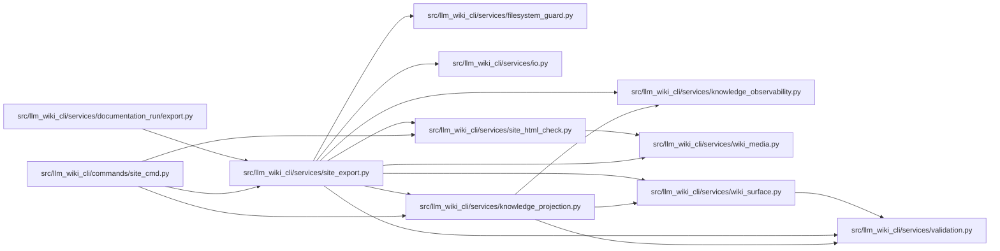

# site_export Module

**Path:** `src/llm_wiki_cli/services/site_export.py`

## Description

Pure static-site mirror export support for LLM Wiki.

The canonical wiki remains ``docs/llm_wiki``. This service builds a derived
Markdown mirror for static-site tooling without invoking external builders.

## Imports

| Source | Symbols |
|--------|---------|
| `.` | `wiki_surface` |
| `.filesystem_guard` | `fresh_no_follow_stat` |
| `.io` | `read_md`, `write_md` |
| `.knowledge_observability` | `UNEVALUATED_FRESHNESS_DISCLOSURE` |
| `.knowledge_projection` | `UNKNOWN_VALUE`, `KnowledgeProjection`, `KnowledgeProjectionError`, `validate_projection_summaries` |
| `.site_html_check` | `SUPPORTED_LINK_MODES`, `check_built_site_links` |
| `.validation` | `path_is_within`, `paths_overlap`, `require_existing_directory`, `require_sha256`, `require_string`, `resolve_portable_workspace_path` |
| `.wiki_media` | `build_asset_index`, `collect_media_references`, `iter_markdown_link_targets`, `mask_markdown_code`, `media_type_for_path` |
| `__future__` | `annotations` |
| `collections.abc` | `Mapping` |
| `dataclasses` | `dataclass`, `field` |
| `hashlib` | `hashlib` |
| `json` | `json` |
| `os` | `os` |
| `pathlib` | `Path` |
| `posixpath` | `posixpath` |
| `re` | `re` |
| `shutil` | `shutil` |
| `stat` | `stat` |
| `typing` | `Any`, `Iterable`, `Optional`, `Union` |
| `unicodedata` | `unicodedata` |
| `urllib.parse` | `unquote` |

## Local dependency map

<!-- Auto-generated local dependency summary. Do not edit by hand. -->

### Internal neighbors

| Direction | Module |
|---|---|
| Inbound | [site_cmd](../modules/site_cmd.md) |
| Inbound | [export](../modules/export.md) |
| Outbound | [filesystem_guard](../modules/filesystem_guard.md) |
| Outbound | [io](../modules/io.md) |
| Outbound | [knowledge_observability](../modules/knowledge_observability.md) |
| Outbound | [knowledge_projection](../modules/knowledge_projection.md) |
| Outbound | [site_html_check](../modules/site_html_check.md) |
| Outbound | [validation](../modules/validation.md) |
| Outbound | [wiki_media](../modules/wiki_media.md) |
| Outbound | [wiki_surface](../modules/wiki_surface.md) |

## Classes

| Class | Line | Bases | Description |
|-------|------|-------|-------------|
| [SiteExportError](../entities/SiteExportError.md) | 108 | `ValueError` | Raised for invalid static-site export requests. |
| [SiteExportOperation](../entities/SiteExportOperation.md) | 113 | — | — |
| [SitePublicationSelection](../entities/SitePublicationSelection.md) | 121 | — | Immutable, path-safe policy selections for one generated site. |
| [SitePublicationReceipt](../entities/SitePublicationReceipt.md) | 156 | — | Validated publication receipt loaded from an exported mirror. |
| [SiteExportReport](../entities/SiteExportReport.md) | 168 | — | — |
| [FrontMatterParseResult](../entities/FrontMatterParseResult.md) | 265 | — | — |
| [HubWikiSource](../entities/HubWikiSource.md) | 272 | — | — |

## Functions

| Function | Signature | Decorators | Description |
|----------|-----------|------------|-------------|
| `_projection_report_freshness` | `(projection: KnowledgeProjection \| None) -> str \| None` | — | — |
| `_hub_report_freshness` | `(projections: Mapping[str, KnowledgeProjection] \| None) -> tuple[str \| None, dict[str, str]]` | — | — |
| `_canonical_json_bytes` | `(value: Any) -> bytes` | — | — |
| `_opaque_digest` | `(value: Any) -> str` | — | — |
| `_file_digest` | `(path: Path) -> str` | — | — |
| `_normalized_site_name` | `(value: str) -> str` | — | — |
| `_normalized_source_id` | `(value: str) -> str` | — | — |
| `_source_identity` | `(*, wiki: Path \| None = None, sources: Iterable[HubWikiSource] \| None = None) -> tuple[str, tuple[tuple[str, str], ...]]` | — | — |
| `_knowledge_selection` | `(*, knowledge_metadata: str \| None, projections: Iterable[KnowledgeProjection] = ()) -> tuple[str, str, str]` | — | — |
| `_build_publication_selection` | `(*, format: str, profile: str, site_name: str, distribution_mode: str, front_matter: bool, knowledge_metadata: str \| None, projections: Iterable[KnowledgeProjection], source_kind: str, source_identity: tuple[tuple[str, str], ...]) -> SitePublicationSelection` | — | — |
| `_selection_id` | `(selection: SitePublicationSelection) -> str` | — | — |
| `_publication_payload` | `(*, state: str, selection: SitePublicationSelection, export_id: str = '', commitments: tuple[tuple[str, str], ...] = (), projection_hashes: tuple[str, ...] = ()) -> dict[str, Any]` | — | — |
| `_publication_marker_payload` | `(*, selection_id: str, export_id: str) -> dict[str, str]` | — | — |
| `_write_publication_json` | `(path: Path, payload: Mapping[str, Any]) -> None` | — | — |
| `_publication_metadata_path` | `(root: Path, name: str) -> Path` | — | — |
| `_publication_commitment_path` | `(root: Path, relative: str) -> Path` | — | — |
| `_preflight_publication_export` | `(out: Path, selection: SitePublicationSelection) -> None` | — | — |
| `_begin_publication_export` | `(out: Path, selection: SitePublicationSelection, *, dry_run: bool) -> None` | — | — |
| `_publication_commitments` | `(report: SiteExportReport, *, out: Path) -> tuple[tuple[str, str], ...]` | — | — |
| `_publication_export_id` | `(*, commitments: tuple[tuple[str, str], ...], projection_hashes: tuple[str, ...]) -> str` | — | — |
| `_complete_publication_export` | `(report: SiteExportReport, *, out: Path, selection: SitePublicationSelection, projection_hashes: tuple[str, ...]) -> None` | — | — |
| `_require_string` | `(value: Any, field_name: str) -> str` | — | — |
| `_require_digest` | `(value: Any, field_name: str, *, allow_empty: bool = False) -> str` | — | — |
| `_selection_from_payload` | `(value: Any) -> SitePublicationSelection` | — | — |
| `_load_publication_receipt` | `(path: Path) -> SitePublicationReceipt` | — | — |
| `_load_publication_marker` | `(path: Path) -> dict[str, str]` | — | — |
| `_publication_issue` | `(*, category: str, path: Path, message: str, target: str = '') -> dict[str, str]` | — | — |
| `_apply_receipt_to_report` | `(report: SiteExportReport, receipt: SitePublicationReceipt) -> None` | — | — |
| `_check_publication_receipt` | `(report: SiteExportReport, *, out: Path) -> SitePublicationReceipt \| None` | — | — |
| `_check_marker_matches_receipt` | `(report: SiteExportReport, *, marker_path: Path, receipt: SitePublicationReceipt, category_prefix: str) -> None` | — | — |
| `_selection_mismatch_issues` | `(*, receipt: SitePublicationReceipt, expected: SitePublicationSelection, receipt_path: Path) -> list[dict[str, str]]` | — | — |
| `export_site_mirror` | `(*, wiki_dir: Union[str, Path], out_dir: Union[str, Path], format: str = 'plain', front_matter: bool = False, dry_run: bool = False, allow_overwrite_source: bool = False, docusaurus_id_prefix: str = '', file_friendly: bool = False, profile: str = 'reference', site_name: Optional[str] = None, knowledge_metadata: str \| None = None, knowledge_projection: KnowledgeProjection \| None = None, _publication_metadata: bool = True) -> SiteExportReport` | — | Export a static-site-friendly Markdown mirror of the canonical wiki. |
| `export_site_hub` | `(*, out_dir: Union[str, Path], wiki_root: Union[str, Path, None] = None, wikis: Iterable[Union[str, Path]] \| None = None, format: str = 'plain', front_matter: bool = False, dry_run: bool = False, allow_overwrite_source: bool = False, file_friendly: bool = False, profile: str = 'reference', site_name: Optional[str] = None, knowledge_metadata: str \| None = None, knowledge_projections: Mapping[str, KnowledgeProjection] \| None = None) -> SiteExportReport` | — | Export multiple source wikis into a namespaced static-site hub. |
| `check_site_mirror` | `(*, wiki_dir: Union[str, Path], out_dir: Union[str, Path], docusaurus_id_prefix: str = '', built_site_dir: Union[str, Path, None] = None, link_mode: str = 'http', format: str \| None = None, profile: str = 'reference', site_name: Optional[str] = None, knowledge_metadata: str \| None = None, knowledge_projection: KnowledgeProjection \| None = None, _publication_metadata: bool = True) -> SiteExportReport` | — | Validate that an exported static-site mirror is present and linked. |
| `check_site_hub` | `(*, out_dir: Union[str, Path], wiki_root: Union[str, Path, None] = None, wikis: Iterable[Union[str, Path]] \| None = None, built_site_dir: Union[str, Path, None] = None, link_mode: str = 'http', format: str \| None = None, profile: str = 'reference', site_name: Optional[str] = None, knowledge_metadata: str \| None = None, knowledge_projections: Mapping[str, KnowledgeProjection] \| None = None) -> SiteExportReport` | — | Validate a namespaced multi-wiki static-site hub. |
| `render_report_text` | `(report: SiteExportReport, *, action: str) -> str` | — | — |
| `render_report_json` | `(report: SiteExportReport) -> str` | — | — |
| `_build_export_page` | `(page: wiki_surface.WikiSurfacePage, content: str, export_rel_by_source: dict[Path, str], *, display_title: str, site_format: str, front_matter: bool, sidebar_position: int, source_path: Optional[str], docusaurus_id_prefix: str = '', knowledge_summary: Mapping[str, str] \| None = None) -> str` | — | — |
| `_build_generated_reference_page` | `(page: wiki_surface.WikiSurfacePage, content: str, export_rel_by_source: dict[Path, str], *, site_format: str, display_title: str \| None = None, front_matter: bool = False, sidebar_position: int = 1, knowledge_summary: Mapping[str, str] \| None = None) -> str` | — | — |
| `_build_user_index_page` | `(pages: list[wiki_surface.WikiSurfacePage], page_contents: dict[str, str], display_titles: dict[str, str], *, site_name: str, site_format: str, front_matter: bool) -> str` | — | — |
| `_build_title_front_matter` | `(title: str, *, site_format: str) -> list[str]` | — | — |
| `_append_user_index_links` | `(lines: list[str], pages: list[wiki_surface.WikiSurfacePage], display_titles: dict[str, str], *, empty_text: str) -> None` | — | — |
| `_pages_by_kind` | `(pages: list[wiki_surface.WikiSurfacePage], kind: wiki_surface.PageKind) -> list[wiki_surface.WikiSurfacePage]` | — | — |
| `_core_workflow_pages` | `(pages: list[wiki_surface.WikiSurfacePage], page_contents: dict[str, str]) -> list[wiki_surface.WikiSurfacePage]` | — | — |
| `_architecture_pages` | `(pages: list[wiki_surface.WikiSurfacePage]) -> list[wiki_surface.WikiSurfacePage]` | — | — |
| `_build_front_matter` | `(page: wiki_surface.WikiSurfacePage, title: str, *, site_format: str, sidebar_position: int, source_path: Optional[str], docusaurus_id_prefix: str = '', docusaurus_id_override: str \| None = None, knowledge_summary: Mapping[str, str] \| None = None) -> str` | — | — |
| `_record_write_operation` | `(report: SiteExportReport, *, source: str, target: Path, content: str) -> None` | — | — |
| `_record_mkdocs_file_friendly_override` | `(report: SiteExportReport, *, source: str, out: Path, file_friendly: bool) -> None` | — | — |
| `_record_asset_operations` | `(report: SiteExportReport, *, wiki: Path, out: Path, page_contents: dict[str, str]) -> None` | — | — |
| `_record_asset_copy_operation` | `(report: SiteExportReport, *, source: Path, target: Path) -> None` | — | — |
| `_same_file_bytes` | `(left: Path, right: Path) -> bool` | — | — |
| `_stale_exported_assets` | `(referenced: set[str], out: Path) -> list[str]` | — | — |
| `_stale_asset_warnings` | `(wiki: Path, out: Path) -> list[dict[str, str]]` | — | — |
| `_exported_asset_paths` | `(root: Path) -> list[str]` | — | — |
| `_build_mkdocs_config` | `(pages: list[wiki_surface.WikiSurfacePage], display_titles: dict[str, str], *, site_name: str = 'LLM Wiki', file_friendly: bool = False) -> str` | — | — |
| `_build_mkdocs_user_config` | `(pages: list[wiki_surface.WikiSurfacePage], page_contents: dict[str, str], display_titles: dict[str, str], source_paths: dict[str, str], *, site_name: str, file_friendly: bool = False) -> str` | — | — |
| `_user_nav_groups` | `(pages: list[wiki_surface.WikiSurfacePage], page_contents: dict[str, str], display_titles: dict[str, str], source_paths: dict[str, str], *, site_name: str) -> list[tuple[str, list[tuple[str, str]]]]` | — | — |
| `_nav_entries` | `(pages: list[wiki_surface.WikiSurfacePage], display_titles: dict[str, str]) -> list[tuple[str, str]]` | — | — |
| `_build_hub_index` | `(rows: list[tuple[str, int]], *, site_name: str = 'LLM Wiki Hub') -> str` | — | — |
| `_hub_source_page_data` | `(source: HubWikiSource) -> tuple[list[wiki_surface.WikiSurfacePage], dict[str, str]]` | — | — |
| `_build_mkdocs_hub_config` | `(sources: list[HubWikiSource], *, site_name: str = 'LLM Wiki Hub', file_friendly: bool = False) -> str` | — | — |
| `_mkdocs_file_friendly_config_lines` | `() -> list[str]` | — | — |
| `_build_docusaurus_hub_sidebar` | `(sources: list[HubWikiSource], *, docusaurus_id_prefixes: Mapping[str, str] \| None = None) -> str` | — | — |
| `_build_docusaurus_sidebar` | `(pages: list[wiki_surface.WikiSurfacePage], *, docusaurus_id_prefix: str = '') -> str` | — | — |
| `_build_docusaurus_user_sidebar` | `(pages: list[wiki_surface.WikiSurfacePage], page_contents: dict[str, str], display_titles: dict[str, str], source_paths: dict[str, str], *, docusaurus_id_prefix: str = '') -> str` | — | — |
| `_docusaurus_sidebar_items` | `(pages: list[wiki_surface.WikiSurfacePage], *, docusaurus_id_prefix: str = '') -> list[Any]` | — | — |
| `_flow_has_substantive_behavior` | `(content: str) -> bool` | — | — |
| `_markdown_section` | `(content: str, title: str) -> Optional[str]` | — | — |
| `_is_test_or_fixture_page` | `(page: wiki_surface.WikiSurfacePage, source_paths: dict[str, str]) -> bool` | — | — |
| `_contains_placeholder` | `(content: str) -> bool` | — | — |
| `_resolve_hub_sources` | `(*, wiki_root: Union[str, Path, None], wikis: Iterable[Union[str, Path]] \| None) -> list[HubWikiSource]` | — | — |
| `resolve_site_hub_sources` | `(*, wiki_root: Union[str, Path, None], wikis: Iterable[Union[str, Path]] \| None) -> list[HubWikiSource]` | — | Resolve hub inputs for callers that must prepare one projection each. |
| `_hub_front_matter_id_prefix` | `(source: HubWikiSource, *, knowledge_metadata: str \| None, knowledge_projections: Mapping[str, KnowledgeProjection] \| None) -> str` | — | — |
| `_preflight_hub_knowledge_projections` | `(sources: list[HubWikiSource], *, knowledge_metadata: str \| None, knowledge_projections: Mapping[str, KnowledgeProjection] \| None) -> None` | — | — |
| `_preflight_hub_root_output_collisions` | `(sources: list[HubWikiSource], *, out: Path, format: str, file_friendly: bool) -> None` | — | — |
| `_expected_mirror_markdown_paths` | `(pages: list[wiki_surface.WikiSurfacePage], *, profile: str) -> frozenset[str]` | — | — |
| `_expected_hub_markdown_paths` | `(sources: list[HubWikiSource]) -> frozenset[str]` | — | — |
| `_preflight_existing_unexpected_knowledge_pages` | `(out: Path, *, expected_paths: frozenset[str]) -> None` | — | — |
| `_check_existing_unexpected_knowledge_pages` | `(out: Path, *, expected_paths: frozenset[str]) -> list[dict[str, str]]` | — | — |
| `_find_unexpected_knowledge_pages` | `(out: Path, *, expected_paths: frozenset[str]) -> list[Path]` | — | — |
| `_read_bounded_enriched_markdown` | `(path: Path, *, root: Path, expected_metadata: os.stat_result) -> str` | — | — |
| `_contains_projected_knowledge_metadata` | `(path: Path, content: str) -> bool` | — | — |
| `_preflight_knowledge_projection` | `(pages: list[wiki_surface.WikiSurfacePage], *, knowledge_metadata: str \| None, knowledge_projection: KnowledgeProjection \| None) -> dict[str, dict[str, str]] \| None` | — | — |
| `_validate_knowledge_metadata_mode` | `(value: str) -> None` | — | — |
| `_load_surface_index_sources` | `(wiki: Path) -> dict[str, str]` | — | — |
| `_rewrite_markdown_links` | `(content: str, page: wiki_surface.WikiSurfacePage, export_rel_by_source: dict[Path, str]) -> str` | — | — |
| `_rewrite_markdown_link_line` | `(original_line: str, masked_line: str, page: wiki_surface.WikiSurfacePage, export_rel_by_source: dict[Path, str]) -> str` | — | — |
| `_check_mirror_markdown_links` | `(page_path: Path, content: str, out_dir: Path) -> list[dict[str, str]]` | — | — |
| `_parse_front_matter` | `(page_path: Path, content: str) -> FrontMatterParseResult` | — | — |
| `_parse_front_matter_key_value` | `(line: str) -> Optional[tuple[str, str]]` | — | — |
| `_parse_front_matter_scalar` | `(value: str) -> Optional[str]` | — | — |
| `_yaml_unquote` | `(value: str) -> Optional[str]` | — | — |
| `_check_front_matter_metadata` | `(page: wiki_surface.WikiSurfacePage, page_path: Path, metadata: dict[str, Any], *, docusaurus_id_prefix: str = '', docusaurus_id_override: str \| None = None, knowledge_summary: Mapping[str, str] \| None = None) -> list[dict[str, str]]` | — | — |
| `_check_projection_free_user_landing` | `(out: Path) -> list[dict[str, str]]` | — | — |
| `_check_hub_front_matter_id_collisions` | `(out: Path, sources: list[HubWikiSource]) -> list[dict[str, str]]` | — | — |
| `_check_knowledge_metadata_references` | `(pages: list[wiki_surface.WikiSurfacePage], out: Path, *, profile: str, expected_summaries: Mapping[str, Mapping[str, str]]) -> list[dict[str, str]]` | — | — |
| `_check_hub_knowledge_uid_collisions` | `(out: Path, sources: list[HubWikiSource]) -> list[dict[str, str]]` | — | — |
| `_check_user_profile_quality` | `(out: Path, *, site_name: Optional[str]) -> tuple[list[dict[str, str]], list[dict[str, str]]]` | — | — |
| `_primary_user_docs_have_media` | `(index_path: Path, guide_paths: list[Path]) -> bool` | — | — |
| `_generated_reference_paths` | `(out: Path) -> list[Path]` | — | — |
| `_placeholder_findings` | `(path: Path, *, category: str) -> list[dict[str, str]]` | — | — |
| `_malformed_front_matter_issue` | `(page_path: Path, message: str) -> dict[str, str]` | — | — |
| `_missing_front_matter_key_issue` | `(page_path: Path, target: str) -> dict[str, str]` | — | — |
| `_front_matter_mismatch_issue` | `(page_path: Path, target: str, *, expected: str, actual: str) -> dict[str, str]` | — | — |
| `_iter_markdown_link_targets` | `(content: str) -> list[str]` | — | — |
| `_local_markdown_link_base` | `(target: str) -> Optional[str]` | — | — |
| `_rewrite_markdown_link` | `(match: re.Match[str], page: wiki_surface.WikiSurfacePage, export_rel_by_source: dict[Path, str]) -> str` | — | — |
| `_relative_export_link` | `(page: wiki_surface.WikiSurfacePage, target: str, export_rel_by_source: dict[Path, str]) -> Optional[str]` | — | — |
| `_markdown_title` | `(content: str, fallback: str) -> str` | — | — |
| `_build_display_titles` | `(pages: list[wiki_surface.WikiSurfacePage], page_contents: dict[str, str]) -> dict[str, str]` | — | — |
| `_disambiguated_display_title` | `(page: wiki_surface.WikiSurfacePage, title: str) -> str` | — | — |
| `_page_id_context` | `(page_id: str, title: str) -> str` | — | — |
| `_title_part_candidates` | `(title: str) -> list[list[str]]` | — | — |
| `_parts_match` | `(left: list[str], right: list[str]) -> bool` | — | — |
| `_docusaurus_doc_id` | `(page: wiki_surface.WikiSurfacePage, *, prefix: str = '') -> str` | — | — |
| `_escape_docusaurus_mdx_text` | `(content: str) -> str` | — | — |
| `_escape_docusaurus_mdx_line` | `(line: str) -> str` | — | — |
| `_escape_docusaurus_mdx_segment` | `(segment: str) -> str` | — | — |
| `_is_allowed_raw_media_html` | `(line: str) -> bool` | — | — |
| `_yaml_quote` | `(value: str) -> str` | — | — |
| `_validate_format` | `(format: str) -> None` | — | — |
| `_validate_profile` | `(profile: str) -> None` | — | — |
| `_validate_export_site_name` | `(profile: str, site_name: Optional[str]) -> None` | — | — |
| `_validate_file_friendly` | `(format: str, *, file_friendly: bool) -> None` | — | — |
| `_validate_link_mode` | `(link_mode: str) -> None` | — | — |
| `_distribution_mode` | `(file_friendly: bool) -> str` | — | — |
| `_distribution_mode_label` | `(mode: str) -> str` | — | — |
| `_validate_output_base` | `(wiki: Path, out: Path, *, allow_overwrite_source: bool) -> None` | — | — |
| `_paths_overlap` | `(left: Path, right: Path) -> bool` | — | — |
| `_is_relative_to` | `(path: Path, root: Path) -> bool` | — | — |
| `_safe_join` | `(root: Path, relative: str) -> Path` | — | — |
| `_validate_existing_dir` | `(path: Path, label: str) -> None` | — | — |
| `_is_external_link` | `(target: str) -> bool` | — | — |
