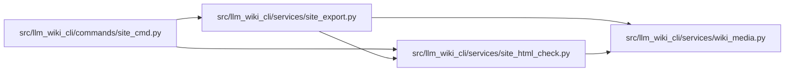

# site_html_check Module

**Path:** `src/llm_wiki_cli/services/site_html_check.py`

## Description

Built static-site HTML link validation.

## Imports

| Source | Symbols |
|--------|---------|
| `.wiki_media` | `split_srcset_candidates` |
| `__future__` | `annotations` |
| `html.parser` | `HTMLParser` |
| `pathlib` | `Path` |
| `posixpath` | `posixpath` |
| `typing` | `Callable`, `Iterable`, `Optional`, `Union` |
| `urllib.parse` | `unquote`, `urlsplit` |

## Local dependency map

<!-- Auto-generated local dependency summary. Do not edit by hand. -->

### Internal neighbors

| Direction | Module |
|---|---|
| Inbound | [site_cmd](../modules/site_cmd.md) |
| Inbound | [site_export](../modules/site_export.md) |
| Outbound | [wiki_media](../modules/wiki_media.md) |

## Classes

| Class | Line | Bases | Description |
|-------|------|-------|-------------|
| [_HrefParser](../entities/HrefParser.md) | 20 | `HTMLParser` | — |

## Functions

| Function | Signature | Decorators | Description |
|----------|-----------|------------|-------------|
| `check_built_site_links` | `(*, built_site_dir: Union[str, Path], link_mode: str = 'http') -> list[dict[str, str]]` | — | Return link issues found in built ``*.html`` files. |
| `_validate_link_mode` | `(link_mode: str) -> None` | — | — |
| `_check_href` | `(html_path: Path, href: str, *, root: Path, link_mode: str) -> Optional[dict[str, str]]` | — | — |
| `_check_media_src` | `(html_path: Path, src: str, *, root: Path) -> Optional[dict[str, str]]` | — | — |
| `_resolve_local_html_target` | `(html_path: Path, raw_target: str, *, root: Path, subject: str, missing_category: str, candidate_paths: Callable[[str], Iterable[Path]], precheck: Optional[Callable[[str], Optional[dict[str, str]]]] = None) -> Optional[dict[str, str]]` | — | — |
| `_media_candidate` | `(html_path: Path, path: str, *, root: Path) -> Path` | — | — |
| `_candidate_targets` | `(html_path: Path, path: str, *, root: Path, link_mode: str) -> Iterable[Path]` | — | — |
| `_is_file_directory_url` | `(path: str) -> bool` | — | — |
| `_issue` | `(category: str, html_path: Path, href: str, message: str) -> dict[str, str]` | — | — |
