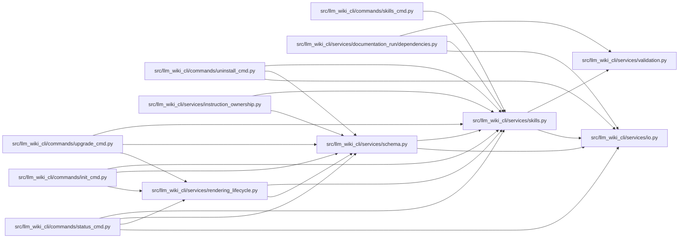

# skills Module

**Path:** `src/llm_wiki_cli/services/skills.py`

## Description

Bundled agent skill management for LLM Wiki.

The package ships agent skills (Claude Code-compatible ``SKILL.md``
workflow directories) under ``llm_wiki_cli/skills/``.  This module lists
them, exports them to an arbitrary destination (for example, a personal
``~/.claude/skills`` directory), and installs them into the configured
agent's project directory: ``.claude/skills`` for Claude and the neutral
``.llm-wiki/skills`` directory for other configured agents.

## Imports

| Source | Symbols |
|--------|---------|
| `.io` | `first_unsafe_path_component`, `read_md`, `write_md` |
| `.validation` | `require_safe_base_path` |
| `__future__` | `annotations` |
| `dataclasses` | `dataclass`, `field` |
| `enum` | `Enum` |
| `json` | `json` |
| `os` | `os` |
| `pathlib` | `Path` |
| `stat` | `stat` |
| `typing` | `Any`, `Callable` |

## Local dependency map

<!-- Auto-generated local dependency summary. Do not edit by hand. -->

### Internal neighbors

| Direction | Module |
|---|---|
| Inbound | [init_cmd](../modules/init_cmd.md) |
| Inbound | [skills_cmd](../modules/skills_cmd.md) |
| Inbound | [status_cmd](../modules/status_cmd.md) |
| Inbound | [uninstall_cmd](../modules/uninstall_cmd.md) |
| Inbound | [upgrade_cmd](../modules/upgrade_cmd.md) |
| Inbound | [documentation_run_dependencies](../modules/documentation_run_dependencies.md) |
| Inbound | [instruction_ownership](../modules/instruction_ownership.md) |
| Inbound | [rendering_lifecycle](../modules/rendering_lifecycle.md) |
| Inbound | [services_schema](../modules/services_schema.md) |
| Outbound | [io](../modules/io.md) |
| Outbound | [validation](../modules/validation.md) |

## Classes

| Class | Kind | Line | Bases / Target | Description |
|-------|------|------|----------------|-------------|
| [SkillsError](../entities/SkillsError.md) | Class | 110 | `ValueError` | Raised for invalid skill list/export/install requests. |
| [ReferenceSkillState](../entities/ReferenceSkillState.md) | Enum | 114 | `str`, `Enum` | Stable live/provisioning states for the managed reference skill. |
| [ReferenceSkillReason](../entities/ReferenceSkillReason.md) | Enum | 125 | `str`, `Enum` | Stable lifecycle reason codes paired with :class:`ReferenceSkillState`. |
| [BundledSkill](../entities/BundledSkill.md) | Class | 137 | — | — |
| [SkillOperation](../entities/SkillOperation.md) | Class | 154 | — | — |
| [SkillsReport](../entities/SkillsReport.md) | Class | 161 | — | One export/install result with requested and effective skill identities. |
| [ReferenceSkillVerification](../entities/ReferenceSkillVerification.md) | Class | 191 | — | One read-only classification of the live managed-reference tree. |
| [ReferenceSkillProvisionResult](../entities/ReferenceSkillProvisionResult.md) | Class | 224 | — | Safe installation attempt plus its authoritative live verification. |
| [_SkillSelection](../entities/SkillSelection.md) | Class | 808 | — | One validated, dependency-closed skill selection. |
| [_TreeSnapshot](../entities/TreeSnapshot.md) | Class | 975 | — | — |

## Functions

| Function | Signature | Decorators | Description |
|----------|-----------|------------|-------------|
| `skills_install_dir` | `(agent: str \| None) -> Path` | — | Project-relative skills directory for *agent*. |
| `list_bundled_skills` | `(skills_root: Path \| None = None) -> list[BundledSkill]` | — | Collect bundled skills in deterministic order. |
| `export_skills` | `(dest_dir: str \| Path, *, skills: list[str] \| None = None, force: bool = False, skills_root: Path \| None = None) -> SkillsReport` | — | Copy bundled skills into ``dest_dir`` (one directory per skill). |
| `install_skills` | `(project_dir: str \| Path = '.', *, skills: list[str] \| None = None, force: bool = False, target: str \| Path = DEFAULT_INSTALL_TARGET, skills_root: Path \| None = None) -> SkillsReport` | — | Install bundled skills into a project's agent skills directory. |
| `install_reference_skill` | `(project_dir: str \| Path = '.', *, agent: str \| None = None, force: bool = False, target: str \| Path \| None = None, skills_root: Path \| None = None) -> SkillsReport` | — | Install (or refresh) the CLI-owned `wiki-reference` skill. |
| `verify_reference_skill` | `(project_dir: str \| Path = '.', *, agent: str \| None = None, target: str \| Path \| None = None, skills_root: Path \| None = None) -> ReferenceSkillVerification` | — | Verify the live managed-reference tree without mutating the filesystem. |
| `provision_reference_skill` | `(project_dir: str \| Path = '.', *, agent: str \| None = None, force: bool = False, target: str \| Path \| None = None, skills_root: Path \| None = None) -> ReferenceSkillProvisionResult` | — | Install and verify ``wiki-reference`` without leaking routine failures. |
| `_provision_reference_skill_guarded` | `(project_dir: str \| Path = '.', *, agent: str \| None = None, force: bool = False, target: str \| Path \| None = None, skills_root: Path \| None = None, pre_mutation_check: Callable[[], None] \| None = None) -> ReferenceSkillProvisionResult` | — | Provision after an optional caller-owned authority revalidation. |
| `reference_skill_state` | `(project_dir: str \| Path = '.', *, agent: str \| None = None, target: str \| Path \| None = None, skills_root: Path \| None = None) -> str` | — | Compatibility classification: absent, unmodified, or modified. |
| `render_report_text` | `(report: SkillsReport, *, action: str) -> str` | — | — |
| `render_report_json` | `(report: SkillsReport) -> str` | — | — |
| `render_skill_list_text` | `(skills: list[BundledSkill]) -> str` | — | — |
| `render_skill_list_json` | `(skills: list[BundledSkill]) -> str` | — | — |
| `_select_skills` | `(requested: list[str] \| None, *, skills_root: Path \| None = None) -> _SkillSelection` | — | Resolve requested skills and their deterministic transitive closure. |
| `_preflight_reference_requirement` | `(selected: list[BundledSkill], *, skills_root: Path \| None) -> tuple[str, ...] \| None` | — | Require a current managed reference for selected dependent workflows. |
| `_declares_transitive_dependency` | `(skill_id: str, dependency_id: str) -> bool` | — | Return whether the active central map links one skill to another. |
| `_skill_files` | `(skill_dir: Path) -> tuple[str, ...]` | — | — |
| `_expected_skill_files` | `(skill: BundledSkill) -> tuple[str, ...]` | — | — |
| `_reference_install_path` | `(project_dir: str \| Path, *, agent: str \| None, target: str \| Path \| None) -> Path` | — | — |
| `_reference_verification` | `(state: ReferenceSkillState, path: Path, details: tuple[str, ...] \| list[str] = ()) -> ReferenceSkillVerification` | — | — |
| `_safe_reference_verification` | `(project_dir: str \| Path, *, agent: str \| None, target: str \| Path \| None, skills_root: Path \| None) -> ReferenceSkillVerification` | — | — |
| `_merge_details` | `(*groups: tuple[str, ...] \| list[str]) -> tuple[str, ...]` | — | — |
| `_reference_expected_directories` | `() -> frozenset[str]` | — | — |
| `_reference_package_contents` | `(skills_root: Path \| None) -> tuple[dict[str, str] \| None, tuple[str, ...]]` | — | — |
| `_snapshot_details` | `(snapshot: _TreeSnapshot, *, expected_files: frozenset[str], expected_directories: frozenset[str], prefix: str = '') -> tuple[str, ...]` | — | — |
| `_path_kind` | `(path: Path) -> str` | — | Classify a path without following symlinks or reparse points. |
| `_is_regular_file` | `(path: Path) -> bool` | — | — |
| `_directory_ancestry_is_safe` | `(path: Path) -> bool` | — | Reject unsafe aliases or non-directories in the existing path prefix. |
| `_nearest_existing_directory` | `(path: Path) -> Path \| None` | — | Return the nearest existing directory after strict alias validation. |
| `_append_issue` | `(report: SkillsReport, *, category: str, path: Path, message: str) -> None` | — | — |
| `_ensure_regular_directory` | `(path: Path, *, root: Path \| None = None, report: SkillsReport) -> bool` | — | Create a missing directory without traversing an unsafe existing entry. |
| `_tree_snapshot` | `(root: Path) -> _TreeSnapshot` | — | Inventory one tree without following aliases or hiding read failures. |
| `_tree_entries` | `(root: Path) -> tuple[set[str], set[str]] \| None` | — | Return regular files/directories, rejecting every other tree entry. |
| `_skill_tree_matches` | `(installed_dir: Path, skill: BundledSkill) -> bool` | — | — |
| `_parse_skill_frontmatter` | `(content: str) -> tuple[str, str]` | — | — |
| `_ensure_safe_base` | `(path: Path) -> None` | — | — |
