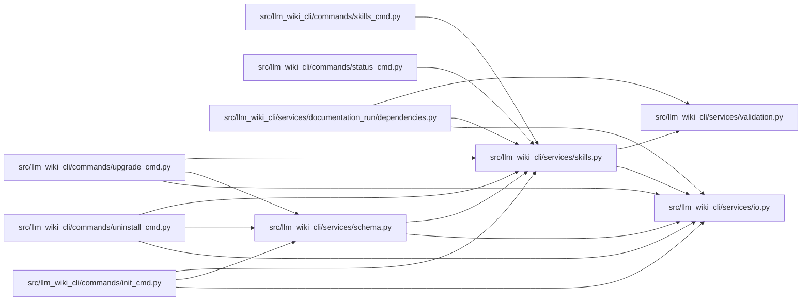

# skills Module

**Path:** `src/llm_wiki_cli/services/skills.py`

## Description

Bundled agent skill management for LLM Wiki.

The package ships agent skills (Claude Code-compatible ``SKILL.md``
workflow directories) under ``llm_wiki_cli/skills/``.  This module lists
them, exports them to an arbitrary destination (e.g. a personal
``~/.claude/skills`` directory), and installs them into the current
project's ``.claude/skills`` directory.

## Imports

| Source | Symbols |
|--------|---------|
| `.io` | `read_md`, `write_md` |
| `.validation` | `require_safe_base_path` |
| `__future__` | `annotations` |
| `dataclasses` | `dataclass`, `field` |
| `json` | `json` |
| `pathlib` | `Path` |
| `typing` | `Any` |

## Local dependency map

<!-- Auto-generated local dependency summary. Do not edit by hand. -->

### Internal neighbors

| Direction | Module |
|---|---|
| Inbound | [init_cmd](../modules/init_cmd.md) |
| Inbound | [skills_cmd](../modules/skills_cmd.md) |
| Inbound | [status_cmd](../modules/status_cmd.md) |
| Inbound | [uninstall_cmd](../modules/uninstall_cmd.md) |
| Inbound | [upgrade_cmd](../modules/upgrade_cmd.md) |
| Inbound | [documentation_run_dependencies](../modules/documentation_run_dependencies.md) |
| Inbound | [services_schema](../modules/services_schema.md) |
| Outbound | [io](../modules/io.md) |
| Outbound | [validation](../modules/validation.md) |

## Classes

| Class | Line | Bases | Description |
|-------|------|-------|-------------|
| [SkillsError](../entities/SkillsError.md) | 58 | `ValueError` | Raised for invalid skill list/export/install requests. |
| [BundledSkill](../entities/BundledSkill.md) | 63 | — | — |
| [SkillOperation](../entities/SkillOperation.md) | 80 | — | — |
| [SkillsReport](../entities/SkillsReport.md) | 87 | — | — |

## Functions

| Function | Signature | Decorators | Description |
|----------|-----------|------------|-------------|
| `skills_install_dir` | `(agent: str \| None) -> Path` | — | Project-relative skills directory for *agent*. |
| `list_bundled_skills` | `(skills_root: Path \| None = None) -> list[BundledSkill]` | — | Collect bundled skills in deterministic order. |
| `export_skills` | `(dest_dir: str \| Path, *, skills: list[str] \| None = None, force: bool = False, skills_root: Path \| None = None) -> SkillsReport` | — | Copy bundled skills into ``dest_dir`` (one directory per skill). |
| `install_skills` | `(project_dir: str \| Path = '.', *, skills: list[str] \| None = None, force: bool = False, target: str \| Path = DEFAULT_INSTALL_TARGET, skills_root: Path \| None = None) -> SkillsReport` | — | Install bundled skills into a project's agent skills directory. |
| `install_reference_skill` | `(project_dir: str \| Path = '.', *, agent: str \| None = None, force: bool = False, target: str \| Path \| None = None, skills_root: Path \| None = None) -> SkillsReport` | — | Install (or refresh) the CLI-owned `wiki-reference` skill. |
| `reference_skill_state` | `(project_dir: str \| Path = '.', *, agent: str \| None = None, target: str \| Path \| None = None, skills_root: Path \| None = None) -> str` | — | Classify the installed `wiki-reference` copy: absent, unmodified, or modified. |
| `render_report_text` | `(report: SkillsReport, *, action: str) -> str` | — | — |
| `render_report_json` | `(report: SkillsReport) -> str` | — | — |
| `render_skill_list_text` | `(skills: list[BundledSkill]) -> str` | — | — |
| `render_skill_list_json` | `(skills: list[BundledSkill]) -> str` | — | — |
| `_select_skills` | `(requested: list[str] \| None, *, skills_root: Path \| None = None) -> list[BundledSkill]` | — | — |
| `_skill_files` | `(skill_dir: Path) -> tuple[str, ...]` | — | — |
| `_parse_skill_frontmatter` | `(content: str) -> tuple[str, str]` | — | — |
| `_ensure_safe_base` | `(path: Path) -> None` | — | — |
