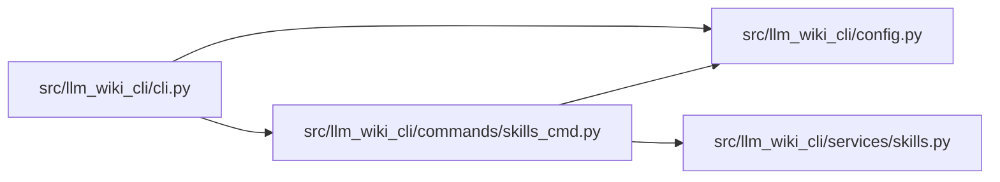

# skills_cmd Module

**Path:** `src/llm_wiki_cli/commands/skills_cmd.py`

## Description

Commands for listing, exporting, and installing bundled agent skills.

## Imports

| Source | Symbols |
|--------|---------|
| `..config` | `DEFAULT_WIKI_DIR`, `get_agent_config_path`, `read_config`, `validate_path` |
| `..services.skills` | `DEFAULT_INSTALL_TARGET`, `SkillsError`, `export_skills`, `install_skills`, `list_bundled_skills`, `render_report_json`, `render_report_text`, `render_skill_list_json`, `render_skill_list_text`, `skills_install_dir` |
| `__future__` | `annotations` |
| `sys` | `sys` |

## Local dependency map

<!-- Auto-generated local dependency summary. Do not edit by hand. -->

### Internal neighbors

| Direction | Module |
|---|---|
| Inbound | [cli](../modules/cli.md) |
| Outbound | [config](../modules/config.md) |
| Outbound | [skills](../modules/skills.md) |

## Functions

| Function | Signature | Decorators | Description |
|----------|-----------|------------|-------------|
| `_default_install_dest` | `() -> str` | — | Resolve the install destination from the configured agent. |
| `_print_report` | `(report, output_format: str, *, action: str) -> None` | — | — |
| `run` | `(args) -> None` | — | — |
