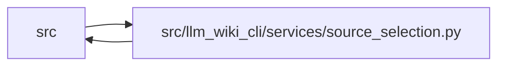

# source_selection Module

**Path:** `src/llm_wiki_cli/services/source_selection.py`

## Description

Defines and validates the canonical repository source boundary. Policies use
literal repository-relative include roots and stricter descendant excludes,
reject ambiguous or unsafe filesystem shapes, and produce deterministic
identity and input commitments. Resolution supports the default
`.llm-wiki/source-selection.json` or an explicit source-root-relative profile.

## Imports

| Source | Symbols |
|--------|---------|
| `..config` | `EXCLUDED_DIRS`, `is_agent_worktree_path` |
| `.validation` | `portable_path_key`, `require_repository_relative_path` |
| `__future__` | `annotations` |
| `collections.abc` | `Mapping` |
| `copy` | `deepcopy` |
| `dataclasses` | `dataclass` |
| `hashlib` | `hashlib` |
| `json` | `json` |
| `os` | `os` |
| `pathlib` | `Path` |
| `re` | `re` |
| `stat` | `stat` |
| `typing` | `Any` |

## Local dependency map

<!-- Auto-generated local dependency summary. Do not edit by hand. -->

> Module-level dependencies exceed the generated-diagram limits, so the diagram and table below group them by top-level package. Counts report the number of module neighbors in each package.

### Internal neighbors

| Direction | Module |
|---|---|
| Inbound | `src` (29) |
| Outbound | `src` (2) |

> All 31 module neighbor(s) are summarized by package because the module-level view exceeds the 12-node limit.

## Classes

| Class | Line | Bases | Description |
|-------|------|-------|-------------|
| [SourceSelectionError](../entities/SourceSelectionError.md) | 39 | `ValueError` | Field-specific failure loading or validating source selection. |
| [SourceSelectionPolicy](../entities/SourceSelectionPolicy.md) | 181 | — | Validated, immutable source-selection policy bound to one repository. |

## Functions

| Function | Signature | Decorators | Description |
|----------|-----------|------------|-------------|
| `_require_selection_path` | `(value: object, field: str) -> str` | — | Delegate repository-path validation to the shared strict validator. |
| `_selection_path` | `(value: object, field: str, *, reject_glob: bool) -> str` | — | — |
| `_is_under` | `(path: str, root: str) -> bool` | — | — |
| `_is_strictly_under` | `(path: str, root: str) -> bool` | — | — |
| `_validate_case_spelling` | `(paths: tuple[str, ...]) -> None` | — | — |
| `_validate_no_overlaps` | `(paths: tuple[str, ...], field: str) -> None` | — | — |
| `_normalized_policy_paths` | `(include: object, exclude: object) -> tuple[tuple[str, ...], tuple[str, ...]]` | — | — |
| `canonical_selection_payload` | `(policy: SourceSelectionPolicy) -> bytes` | — | Serialize semantic policy fields independent of formatting/list order. |
| `selection_fingerprint` | `(policy: SourceSelectionPolicy) -> str` | — | Return a domain-stable SHA-256 over canonical semantic policy bytes. |
| `path_is_selected` | `(policy: SourceSelectionPolicy \| None, rel_path: str) -> bool` | — | Return whether a strict repository-relative path is inside *policy*. |
| `selection_may_contain_path` | `(policy: SourceSelectionPolicy \| None, rel_path: str) -> bool` | — | Return whether a directory is selected or is an ancestor of selection. |
| `_is_link_or_reparse_stat` | `(metadata: os.stat_result) -> bool` | — | — |
| `path_is_link_or_reparse` | `(path: Path) -> bool` | — | Return whether *path* is a symlink or Windows reparse point. |
| `_locate_exact_path` | `(root: Path, rel_path: str, *, allow_leaf_link: bool = False) -> Path \| None` | — | — |
| `locate_exact_repository_path` | `(root: Path, rel_path: str, *, allow_leaf_link: bool = False) -> Path \| None` | — | Locate an exact-case path without traversing links or reparse points. |
| `_read_config` | `(path: Path) -> bytes` | — | — |
| `_duplicate_checked_object` | `(pairs: list[tuple[str, Any]]) -> dict[str, Any]` | — | — |
| `_decode_config` | `(content: bytes) -> Mapping[str, object]` | — | — |
| `_policy_from_content` | `(*, root: Path, rel_path: str, origin: str, content: bytes) -> SourceSelectionPolicy` | — | — |
| `_register_portable_filesystem_path` | `(spellings: dict[str, str], rel_path: str) -> None` | — | — |
| `_bounded_directory_entries` | `(directory: Path, *, selected_root: str, remaining: int) -> list[os.DirEntry[str]]` | — | — |
| `_validate_policy_filesystem` | `(policy: SourceSelectionPolicy) -> None` | — | — |
| `_override_text` | `(override: str \| Path) -> str` | — | — |
| `resolve_source_selection` | `(root: str \| Path, override: str \| Path \| None = None) -> SourceSelectionPolicy \| None` | — | Load an explicit or repository-default selection policy. |
| `_validated_identity` | `(value: object, field: str) -> dict[str, str]` | — | — |
| `source_selection_identity_from_generation_inputs` | `(generation_inputs: Mapping[str, object] \| None) -> dict[str, str] \| None` | — | Strictly decode the optional persisted source-selection identity. |
| `_validated_selection_inputs` | `(value: object, field: str) -> dict[str, object]` | — | — |
| `source_selection_inputs_from_generation_inputs` | `(generation_inputs: Mapping[str, object] \| None) -> dict[str, object] \| None` | — | Strictly decode configured selection-control content commitments. |
| `validate_persisted_source_selection_identity` | `(persisted_generation_inputs: Mapping[str, object] \| None, live_identity: Mapping[str, object] \| None, *, operation: str, explicit_path_authorized: bool = False, allow_same_path_update: bool = False, live_selection_inputs: Mapping[str, object] \| None \| object = _UNSET_SELECTION_INPUTS) -> None` | — | Fail closed when a live selection would cross a persisted boundary. |
| `with_source_selection_generation_input` | `(generation_inputs: Mapping[str, object] \| None, identity: Mapping[str, object] \| None, selection_inputs: Mapping[str, object] \| None = None) -> dict[str, object]` | — | Return generation inputs with canonical selection identity merged. |