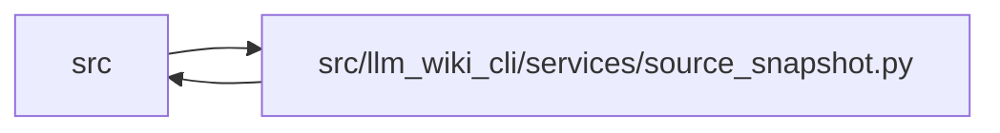

# source_snapshot Module

**Path:** `src/llm_wiki_cli/services/source_snapshot.py`

## Description

Performs one bounded, `.gitignore`-aware traversal shared by extractors,
dependency reconciliation, and infrastructure scans. The immutable snapshot
classifies supported and unsupported source, package markers, Docker, Compose,
and targeted YAML candidates; captures exact input hashes; and retains the
resolved source-selection policy so downstream consumers do not rediscover a
different tree.

## Imports

| Source | Symbols |
|--------|---------|
| `..config` | `COMPOSE_PATTERNS`, `DOCKERFILE_PATTERNS`, `EXCLUDED_DIRS`, `GitIgnoreMatcher`, `_GitignoreRule`, `_parse_gitignore_text`, `is_agent_worktree_path` |
| `..extractors.common` | `GENERATED_JAVASCRIPT_BUNDLE_LANGUAGE`, `LANGUAGE_EXTENSIONS`, `is_bundled_helper_implementation_path`, `is_generated_javascript_bundle_path`, `normalize_include_tests` |
| `.knowledge_envelope` | `ConsumedInput` |
| `.source_selection` | `SOURCE_SELECTION_INPUTS_SCHEMA_VERSION`, `SourceSelectionError`, `SourceSelectionPolicy`, `locate_exact_repository_path`, `path_is_link_or_reparse`, `path_is_selected`, `resolve_source_selection`, `selection_may_contain_path` |
| `.validation` | `portable_path_key`, `require_repository_relative_path` |
| `__future__` | `annotations` |
| `collections.abc` | `Iterable`, `Mapping` |
| `dataclasses` | `dataclass` |
| `fnmatch` | `fnmatch` |
| `hashlib` | `hashlib` |
| `os` | `os` |
| `pathlib` | `Path` |
| `stat` | `stat` |
| `typing` | `TYPE_CHECKING` |

## Local dependency map

<!-- Auto-generated local dependency summary. Do not edit by hand. -->

> Module-level dependencies exceed the generated-diagram limits, so the diagram and table below group them by top-level package. Counts report the number of module neighbors in each package.

### Internal neighbors

| Direction | Module |
|---|---|
| Inbound | `src` (33) |
| Outbound | `src` (5) |

> All 38 module neighbor(s) are summarized by package because the module-level view exceeds the 12-node limit.

## Classes

| Class | Line | Bases | Description |
|-------|------|-------|-------------|
| [SourceSnapshotError](../entities/SourceSnapshotError.md) | 91 | `ValueError` | Field-specific failure selecting captured source snapshot state. |
| [SourceFile](../entities/SourceFile.md) | 101 | — | A source-tree file discovered relative to a snapshot root. |
| [SourceSnapshot](../entities/SourceSnapshot.md) | 113 | — | Filtered source-tree discovery results shared by lint/extract paths. |
| [_SnapshotBuckets](../entities/SnapshotBuckets.md) | 396 | — | — |

## Functions

| Function | Signature | Decorators | Description |
|----------|-----------|------------|-------------|
| `_new_snapshot_buckets` | `(include_tests: Iterable[str] \| None = None, source_selection_policy: SourceSelectionPolicy \| None = None) -> _SnapshotBuckets` | — | — |
| `_validate_repository_path` | `(value: object, field: str) -> str` | — | — |
| `_normalize_only_files` | `(root: Path, only_files: Iterable[str] \| None) -> set[str] \| None` | — | — |
| `_language_for_path` | `(path: Path, include_tests: frozenset[str]) -> str \| None` | — | — |
| `_unsupported_language_for_path` | `(path: Path) -> str \| None` | — | — |
| `_is_dockerfile_candidate` | `(path: Path) -> bool` | — | — |
| `_is_compose_candidate` | `(path: Path) -> bool` | — | — |
| `_is_package_marker` | `(path: Path) -> bool` | — | — |
| `_make_source_file` | `(root: Path, path: Path, rel: Path, language: str \| None) -> SourceFile \| None` | — | — |
| `_append_sorted` | `(target: list[SourceFile], source_file: SourceFile \| None) -> None` | — | — |
| `_sha256_bytes` | `(content: bytes) -> str` | — | — |
| `_sha256_file` | `(path: Path) -> str \| None` | — | — |
| `_sha256_labeled_contents` | `(contents: Mapping[str, bytes \| None]) -> str` | — | — |
| `_directory_ignored` | `(matcher: GitIgnoreMatcher, rel_path: str) -> bool` | — | Return whether a directory path is ignored by the current matcher. |
| `_contains_src_lib_segment` | `(path: Path) -> bool` | — | — |
| `_is_root_unanchored_lib_directory_rule` | `(rule: _GitignoreRule \| None) -> bool` | — | — |
| `_last_directory_ignore_rule` | `(matcher: GitIgnoreMatcher, rel_path: str) -> _GitignoreRule \| None` | — | — |
| `_is_rescuable_typescript_src_lib_directory` | `(matcher: GitIgnoreMatcher, rel_dir: Path) -> bool` | — | — |
| `_is_rescuable_typescript_src_lib_file` | `(matcher: GitIgnoreMatcher, rel: Path, language: str \| None) -> bool` | — | — |
| `_empty_source_snapshot` | `(root: Path, source_selection_policy: SourceSelectionPolicy \| None = None) -> SourceSnapshot` | — | — |
| `_relative_to_root` | `(path: Path, root: Path) -> Path \| None` | — | — |
| `_is_excluded_walk_directory` | `(rel_dir: Path, only_set: set[str] \| None) -> bool` | — | — |
| `_record_gitignore_rules` | `(root: Path, current_dir: Path, rel_dir: Path, buckets: _SnapshotBuckets) -> None` | — | — |
| `_only_set_contains_path_under` | `(only_set: set[str] \| None, rel_path: str) -> bool` | — | — |
| `_prune_dirnames` | `(root: Path, dirnames: list[str], rel_dir: Path, matcher: GitIgnoreMatcher, only_set: set[str] \| None, buckets: _SnapshotBuckets) -> None` | — | — |
| `_record_infrastructure_candidates` | `(resolved: Path, source_file: SourceFile \| None, buckets: _SnapshotBuckets) -> None` | — | — |
| `_record_language_candidate` | `(root: Path, resolved: Path, rel: Path, only_set: set[str] \| None, buckets: _SnapshotBuckets) -> None` | — | — |
| `_record_unsupported_language_candidate` | `(root: Path, resolved: Path, rel: Path, only_set: set[str] \| None, buckets: _SnapshotBuckets) -> None` | — | — |
| `_record_generated_javascript_bundle_candidate` | `(root: Path, resolved: Path, rel: Path, only_set: set[str] \| None, buckets: _SnapshotBuckets) -> bool` | — | — |
| `_record_source_file` | `(root: Path, current_dir: Path, filename: str, matcher: GitIgnoreMatcher, only_set: set[str] \| None, buckets: _SnapshotBuckets) -> None` | — | — |
| `_collect_source_tree` | `(root: Path, only_set: set[str] \| None, buckets: _SnapshotBuckets) -> None` | — | — |
| `_collect_source_selection_controls` | `(root: Path, buckets: _SnapshotBuckets) -> None` | — | Capture only applicable profile/ignore inputs without reading source files. |
| `capture_source_selection_inputs` | `(src_dir: str \| Path, *, source_selection: str \| Path \| None = None, selection_policy: SourceSelectionPolicy \| None = None) -> dict[str, object] \| None` | — | Capture exact selection-control commitments before any selected-file read. |
| `_selection_inputs_from_buckets` | `(buckets: _SnapshotBuckets) -> dict[str, object] \| None` | — | — |
| `_add_captured_input_candidates` | `(candidates: dict[str, set[str]], source_files: Iterable[SourceFile], kind: str) -> None` | — | — |
| `_captured_snapshot_inputs` | `(*, sorted_languages: Mapping[str, tuple[SourceFile, ...]], dockerfiles: tuple[SourceFile, ...], compose_files: tuple[SourceFile, ...], yaml_files: tuple[SourceFile, ...], package_markers: tuple[SourceFile, ...], gitignore_contents: Mapping[str, bytes \| None], source_selection_policy: SourceSelectionPolicy \| None) -> tuple[dict[str, str], dict[str, tuple[str, ...]]]` | — | — |
| `_build_source_snapshot` | `(root: Path, buckets: _SnapshotBuckets) -> SourceSnapshot` | — | — |
| `unsupported_source_summary` | `(snapshot: SourceSnapshot, *, supported_languages: Iterable[str] = ()) -> dict[str, dict[str, object]]` | — | Return nonempty unsupported source counts and paths. |
| `format_unsupported_source_summary` | `(summary: dict[str, dict[str, object]]) -> str` | — | Return a concise human-readable unsupported-source summary. |
| `unsupported_source_label` | `(language: str) -> str` | — | Return the human-readable label for an unsupported source bucket. |
| `_format_unsupported_language_count` | `(language: str, data: dict[str, object]) -> str` | — | — |
| `_policies_match` | `(left: SourceSelectionPolicy, right: SourceSelectionPolicy) -> bool` | — | — |
| `_resolve_snapshot_selection` | `(root: Path, *, source_selection: str \| Path \| None, selection_policy: SourceSelectionPolicy \| None) -> SourceSelectionPolicy \| None` | — | — |
| `build_source_snapshot` | `(src_dir: str \| Path, only_files: Iterable[str] \| None = None, include_tests: Iterable[str] \| None = None, *, source_selection: str \| Path \| None = None, selection_policy: SourceSelectionPolicy \| None = None, expected_selection_inputs: Mapping[str, object] \| None \| object = _UNSET_EXPECTED_SELECTION_INPUTS) -> SourceSnapshot` | — | Build a deterministic source-tree snapshot rooted at *src_dir*. |
