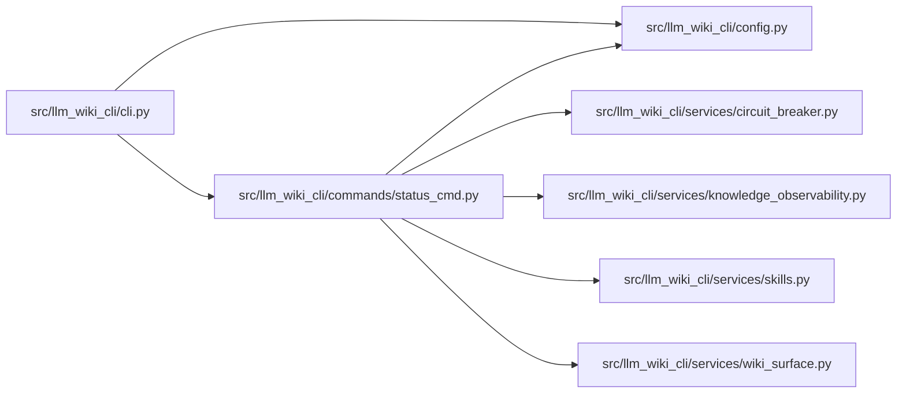

# status_cmd Module

**Path:** `src/llm_wiki_cli/commands/status_cmd.py`

## Description

_Auto-generated from `src/llm_wiki_cli/commands/status_cmd.py`._

## Imports

| Source | Symbols |
|--------|---------|
| `..config` | `DEFAULT_WIKI_DIR`, `IDE_AGENTS`, `get_agent_config_path`, `read_config`, `validate_source_root` |
| `..services` | `circuit_breaker` |
| `..services.knowledge_observability` | `knowledge_status_payload`, `load_snapshot_knowledge_observability` |
| `..services.skills` | `reference_skill_state` |
| `..services.wiki_surface` | `PageKind`, `canonical_path`, `iter_page_kinds` |
| `__future__` | `annotations` |
| `collections.abc` | `Mapping` |
| `pathlib` | `Path` |

## Local dependency map

<!-- Auto-generated local dependency summary. Do not edit by hand. -->

### Internal neighbors

| Direction | Module |
|---|---|
| Inbound | [cli](../modules/cli.md) |
| Outbound | [config](../modules/config.md) |
| Outbound | [circuit_breaker](../modules/circuit_breaker.md) |
| Outbound | [knowledge_observability](../modules/knowledge_observability.md) |
| Outbound | [skills](../modules/skills.md) |
| Outbound | [wiki_surface](../modules/wiki_surface.md) |

## Functions

| Function | Signature | Decorators | Description |
|----------|-----------|------------|-------------|
| `_count_markdown_files` | `(directory: Path) -> int` | — | — |
| `_status_label` | `(kind: PageKind, fallback: str) -> str` | — | — |
| `_count_surface_pages` | `(wiki_path: Path, entry) -> int` | — | — |
| `_architecture_page_count` | `(wiki_path: Path) -> int` | — | — |
| `_format_counts` | `(counts: object) -> str` | — | — |
| `_print_knowledge_status` | `(wiki_path: Path, src_dir: str, *, source_selection: str \| Path \| None = None) -> None` | — | — |
| `run` | `(args) -> None` | — | — |
