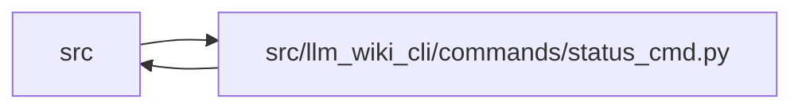

# status_cmd Module

**Path:** `src/llm_wiki_cli/commands/status_cmd.py`

## Description

_Auto-generated from `src/llm_wiki_cli/commands/status_cmd.py`._

## Imports

| Source | Symbols |
|--------|---------|
| `..config` | `AgentConfigInspection`, `AgentConfigState`, `DEFAULT_WIKI_DIR`, `IDE_AGENTS`, `config_requires_manual_recovery`, `inspect_config`, `validate_path`, `validate_source_root` |
| `..services` | `circuit_breaker` |
| `..services.io` | `first_unsafe_path_component` |
| `..services.knowledge_observability` | `knowledge_status_payload`, `load_snapshot_knowledge_observability` |
| `..services.paths` | `display_project_path`, `shell_quote` |
| `..services.rendering_lifecycle` | `LifecycleStatus`, `ManagedLifecycleState`, `classify_lifecycle_status` |
| `..services.schema` | `SCHEMA_FILENAMES`, `ManagedSchemaBlock`, `ManagedSchemaBlockState`, `classify_managed_schema_block`, `decode_managed_document_bytes`, `require_safe_schema_path` |
| `..services.skills` | `ReferenceSkillState`, `ReferenceSkillVerification`, `skills_install_dir`, `verify_reference_skill` |
| `..services.wiki_lifecycle` | `WikiScaffoldPathError`, `require_safe_wiki_scaffold` |
| `..services.wiki_surface` | `PageKind`, `canonical_path`, `iter_page_kinds` |
| `.hook_cmd` | `is_managed_hook_content` |
| `__future__` | `annotations` |
| `collections.abc` | `Mapping` |
| `os` | `os` |
| `pathlib` | `Path` |

## Local dependency map

<!-- Auto-generated local dependency summary. Do not edit by hand. -->

> Module-level dependencies exceed the generated-diagram limits, so the diagram and table below group them by top-level package. Counts report the number of module neighbors in each package.

### Internal neighbors

| Direction | Module |
|---|---|
| Inbound | `src` (1) |
| Outbound | `src` (11) |

> All 12 module neighbor(s) are summarized by package because the module-level view exceeds the 12-node limit.

## Functions

| Function | Signature | Decorators | Description |
|----------|-----------|------------|-------------|
| `_count_markdown_files` | `(directory: Path) -> int` | — | — |
| `_status_label` | `(kind: PageKind, fallback: str) -> str` | — | — |
| `_count_surface_pages` | `(wiki_path: Path, entry) -> int` | — | — |
| `_architecture_page_count` | `(wiki_path: Path) -> int` | — | — |
| `_format_counts` | `(counts: object) -> str` | — | — |
| `_print_knowledge_status` | `(wiki_path: Path, src_dir: str, *, source_selection: str \| Path \| None = None) -> None` | — | — |
| `_configured_agent` | `(config: AgentConfigInspection) -> str` | — | Return the validated agent value supplied by config inspection. |
| `_read_managed_schema` | `(path: Path) -> ManagedSchemaBlock` | — | Classify one schema path without allowing read errors to abort status. |
| `_managed_schema_candidates` | `() -> tuple[tuple[str, Path, ManagedSchemaBlock], ...]` | — | Return actionable current agent schema paths with any managed state. |
| `_diagnostic_schema_target` | `(config: AgentConfigInspection) -> tuple[str, Path, ManagedSchemaBlock, bool, bool]` | — | Choose live evidence for status without treating it as persisted intent. |
| `_upgrade_recovery` | `(*, wiki_dir: str, agent: str, enable_reference: bool, cleanup_source_agent: str \| None = None) -> str` | — | — |
| `_init_recovery` | `(*, wiki_dir: str, agent: str, reference_enabled: bool) -> str` | — | — |
| `_reference_recovery_prerequisites` | `(reference: ReferenceSkillVerification) -> tuple[str, ...]` | — | Explain what must happen before a reference refresh can converge. |
| `_recovery_guidance` | `(*, lifecycle: LifecycleStatus, reference: ReferenceSkillVerification, wiki_dir: str, agent: str, reference_enabled: bool, interrupted_switch: bool, malformed_paths: tuple[Path, ...] = (), unsafe_config_path: Path \| None = None, config_problem_reason: str \| None = None, ambiguous_paths: tuple[Path, ...] = (), obsolete_references: tuple[ReferenceSkillVerification, ...] = (), cleanup_source_agent: str \| None = None, ambiguous_agents: tuple[str, ...] = (), unsafe_schema_paths: tuple[tuple[Path, Path], ...] = (), ambiguous_references: tuple[tuple[str, ReferenceSkillVerification], ...] = (), untrusted_pending_agent: str \| None = None, invalid_agent_selection: bool = False, scaffold_error: str \| None = None) -> str` | — | Return a state-aware command that also rerenders the managed block. |
| `_print_reference_summary` | `(reference: ReferenceSkillVerification, *, skills_dir: Path, reference_enabled: bool, intent_trusted: bool) -> None` | — | — |
| `_print_managed_lifecycle` | `(*, wiki_dir: str, config: AgentConfigInspection, scaffold_error: str \| None = None) -> None` | — | Report live schema/reference state; persisted fields are evidence only. |
| `run` | `(args) -> None` | — | — |
