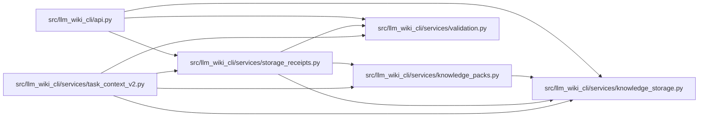

# storage_receipts Module

**Path:** `src/llm_wiki_cli/services/storage_receipts.py`

## Description

Encodes and expands versioned selected-storage receipts without removing their commitments, coordinates or work counts. Compact receipts share file tables, encode SHA-256 bytes with canonical base64url and reconstruct an exact expanded representation. Expansion checks the wire structure; task binding, authority and freshness remain separate validation responsibilities.

## Imports

| Source | Symbols |
|--------|---------|
| `.knowledge_packs` | `PACK_NAME`, `INDEX_PAGE_NAME`, `pack_path`, `index_page_path` |
| `.knowledge_storage` | `canonical_bytes` |
| `.validation` | `is_portable_relative_path` |
| `__future__` | `annotations` |
| `base64` | `base64` |
| `collections.abc` | `Mapping` |
| `re` | `re` |
| `typing` | `Any` |

## Local dependency map

<!-- Auto-generated local dependency summary. Do not edit by hand. -->

### Internal neighbors

| Direction | Module |
|---|---|
| Inbound | [api](../modules/api.md) |
| Inbound | [task_context_v2](../modules/task_context_v2.md) |
| Outbound | [knowledge_packs](../modules/knowledge_packs.md) |
| Outbound | [knowledge_storage](../modules/knowledge_storage.md) |
| Outbound | [validation](../modules/validation.md) |

## Functions

| Function | Signature | Decorators | Description |
|----------|-----------|------------|-------------|
| `_hash` | `(value: Any) -> str` | — | — |
| `_encode_hash` | `(commitment)` | — | — |
| `_decode_hash` | `(value)` | — | — |
| `_file_path` | `(kind: int, commitment: str) -> str` | — | — |
| `compact_storage_receipt` | `(receipt: Mapping[str, Any]) -> dict[str, Any]` | — | Encode each consumed path once; retain exact hashes, coordinates and work. |
| `expand_storage_receipt` | `(receipt: Mapping[str, Any]) -> dict[str, Any]` | — | Expand compact proof data without evaluating its authority or freshness. |
