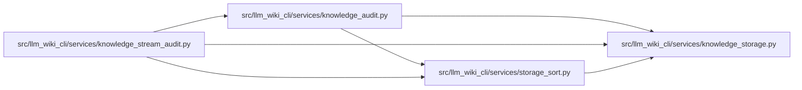

# storage_sort Module

**Path:** `src/llm_wiki_cli/services/storage_sort.py`

## Description

Orders complete audit records with bounded batches and external merge runs. Each merge opens at most 32 input files, and record and disk limits fail explicitly. Cleanup closes handles held by suspended consumers before removing temporary files, including on Windows.

## Imports

| Source | Symbols |
|--------|---------|
| `.knowledge_storage` | `KnowledgeStorageError`, `canonical_bytes` |
| `__future__` | `annotations` |
| `contextlib` | `ExitStack` |
| `heapq` | `heapq` |
| `json` | `json` |
| `pathlib` | `Path` |
| `tempfile` | `tempfile` |

## Local dependency map

<!-- Auto-generated local dependency summary. Do not edit by hand. -->

### Internal neighbors

| Direction | Module |
|---|---|
| Inbound | [knowledge_audit](../modules/knowledge_audit.md) |
| Inbound | [knowledge_stream_audit](../modules/knowledge_stream_audit.md) |
| Outbound | [knowledge_storage](../modules/knowledge_storage.md) |

## Classes

| Class | Line | Bases | Description |
|-------|------|-------|-------------|
| [SortedRuns](../entities/SortedRuns.md) | 14 | — | External merge sort with at most 32 input handles and fixed batch bytes. |
