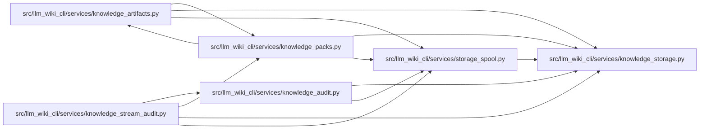

# storage_spool Module

**Path:** `src/llm_wiki_cli/services/storage_spool.py`

## Description

Provides request-owned byte and JSON spill buffers with bounded metadata and disk quotas. Stored byte commitments are verified on reads. A staged artifact exposes its original byte interface while its owner keeps the spool context open; closing that context releases the private data.

## Imports

| Source | Symbols |
|--------|---------|
| `.knowledge_storage` | `MAX_OBJECT_BYTES`, `KnowledgeStorageError` |
| `__future__` | `annotations` |
| `collections` | `OrderedDict` |
| `collections.abc` | `Iterator`, `MutableMapping` |
| `dataclasses` | `dataclass` |
| `hashlib` | `hashlib` |
| `json` | `json` |
| `pickle` | `pickle` |
| `tempfile` | `tempfile` |
| `typing` | `Any` |

## Local dependency map

<!-- Auto-generated local dependency summary. Do not edit by hand. -->

### Internal neighbors

| Direction | Module |
|---|---|
| Inbound | [knowledge_artifacts](../modules/knowledge_artifacts.md) |
| Inbound | [knowledge_audit](../modules/knowledge_audit.md) |
| Inbound | [knowledge_packs](../modules/knowledge_packs.md) |
| Inbound | [knowledge_stream_audit](../modules/knowledge_stream_audit.md) |
| Outbound | [knowledge_storage](../modules/knowledge_storage.md) |

## Classes

| Class | Line | Bases | Description |
|-------|------|-------|-------------|
| [ByteSpool](../entities/ByteSpool.md) | 21 | `MutableMapping[str, bytes]` | One private file, bounded index and byte quota, with synchronous backpressure. |
| [SpooledArtifactWrite](../entities/SpooledArtifactWrite.md) | 81 | — | Byte-compatible planned write whose buffers live in a request-owned spool. |
| [JsonSpool](../entities/JsonSpool.md) | 117 | `MutableMapping` | JSON values backed by one explicitly owned byte spool. |
| [DecodeCache](../entities/DecodeCache.md) | 140 | `MutableMapping` | Bound encoded cache weight; never reuse this cache across captures. |

## Functions

| Function | Signature | Decorators | Description |
|----------|-----------|------------|-------------|
| `spool_write` | `(write, spool: ByteSpool) -> SpooledArtifactWrite` | — | — |
