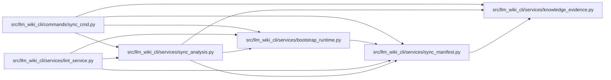

# sync_analysis Module

**Path:** `src/llm_wiki_cli/services/sync_analysis.py`

## Description

Read-only source/manifest diff analysis shared by sync and lint.

## Imports

| Source | Symbols |
|--------|---------|
| `.bootstrap_runtime` | `_module_name_from_path`, `_page_name_for_module`, `build_entity_page_map`, `build_module_page_map` |
| `.knowledge_evidence` | `hash_file`, `semantic_hash_for_file` |
| `.sync_manifest` | `SyncManifest` |
| `__future__` | `annotations` |
| `dataclasses` | `dataclass`, `field` |
| `pathlib` | `Path` |
| `typing` | `Mapping` |

## Local dependency map

<!-- Auto-generated local dependency summary. Do not edit by hand. -->

### Internal neighbors

| Direction | Module |
|---|---|
| Inbound | [sync_cmd](../modules/sync_cmd.md) |
| Inbound | [lint_service](../modules/lint_service.md) |
| Outbound | [bootstrap_runtime](../modules/bootstrap_runtime.md) |
| Outbound | [knowledge_evidence](../modules/knowledge_evidence.md) |
| Outbound | [sync_manifest](../modules/sync_manifest.md) |

## Classes

| Class | Line | Bases | Description |
|-------|------|-------|-------------|
| [SyncDiff](../entities/SyncDiff.md) | 20 | — | Categorised difference between a persisted manifest and live inventory. |

## Functions

| Function | Signature | Decorators | Description |
|----------|-----------|------------|-------------|
| `compute_sync_diff` | `(manifest: SyncManifest, inventory: dict, src_dir: str, *, entity_page_cache: dict[tuple[str, str], str] \| None = None, module_page_map: dict[str, str] \| None = None, source_content_hashes: Mapping[str, str] \| None = None) -> SyncDiff` | — | Compare a managed manifest with one live structural inventory. |
