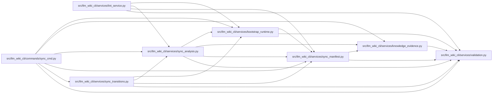

# sync_analysis Module

**Path:** `src/llm_wiki_cli/services/sync_analysis.py`

## Description

Read-only source/manifest diff analysis shared by sync and lint.

## Imports

| Source | Symbols |
|--------|---------|
| `.bootstrap_runtime` | `_module_name_from_path`, `_page_name_for_entity`, `_page_name_for_module`, `build_entity_occurrence_page_map`, `build_entity_page_map`, `build_module_page_map` |
| `.knowledge_evidence` | `hash_file`, `semantic_hash_for_file` |
| `.sync_manifest` | `ManifestPageSource`, `SyncManifest` |
| `.validation` | `is_portable_path_component`, `portable_path_key` |
| `__future__` | `annotations` |
| `collections` | `Counter`, `defaultdict` |
| `dataclasses` | `dataclass`, `field` |
| `pathlib` | `Path` |
| `typing` | `Mapping` |

## Local dependency map

<!-- Auto-generated local dependency summary. Do not edit by hand. -->

```mermaid
flowchart LR
    n0["src/llm_wiki_cli/commands/sync_cmd.py"]
    n1["src/llm_wiki_cli/services/bootstrap_runtime.py"]
    n2["src/llm_wiki_cli/services/knowledge_evidence.py"]
    n3["src/llm_wiki_cli/services/lint_service.py"]
    n4["src/llm_wiki_cli/services/sync_analysis.py"]
    n5["src/llm_wiki_cli/services/sync_manifest.py"]
    n6["src/llm_wiki_cli/services/sync_transitions.py"]
    n7["src/llm_wiki_cli/services/validation.py"]
    n0 --> n1
    n0 --> n2
    n0 --> n4
    n0 --> n5
    n0 --> n6
    n0 --> n7
    n1 --> n5
    n1 --> n7
    n2 --> n7
    n3 --> n1
    n3 --> n4
    n3 --> n5
    n3 --> n7
    n4 --> n1
    n4 --> n2
    n4 --> n5
    n4 --> n7
    n5 --> n2
    n5 --> n7
    n6 --> n1
    n6 --> n4
    n6 --> n5
    n6 --> n7
    click n0 "../modules/sync_cmd.md"
    click n1 "../modules/bootstrap_runtime.md"
    click n2 "../modules/knowledge_evidence.md"
    click n3 "../modules/lint_service.md"
    click n4 "../modules/sync_analysis.md"
    click n5 "../modules/sync_manifest.md"
    click n6 "../modules/sync_transitions.md"
    click n7 "../modules/validation.md"
```

### Internal neighbors

| Direction | Module |
|---|---|
| Inbound | [sync_cmd](../modules/sync_cmd.md) |
| Inbound | [lint_service](../modules/lint_service.md) |
| Inbound | [sync_transitions](../modules/sync_transitions.md) |
| Outbound | [bootstrap_runtime](../modules/bootstrap_runtime.md) |
| Outbound | [knowledge_evidence](../modules/knowledge_evidence.md) |
| Outbound | [sync_manifest](../modules/sync_manifest.md) |
| Outbound | [validation](../modules/validation.md) |

## Classes

| Class | Line | Bases | Description |
|-------|------|-------|-------------|
| [SyncOwnershipError](../entities/SyncOwnershipError.md) | 26 | `ValueError` | A page cannot be safely assigned to one recorded source entity. |
| [_RecordedEntityPages](../entities/RecordedEntityPages.md) | 46 | — | — |
| [SyncDiff](../entities/SyncDiff.md) | 138 | — | Categorised difference between a persisted manifest and live inventory. |

## Functions

| Function | Signature | Decorators | Description |
|----------|-----------|------------|-------------|
| `_ownership_error` | `(owner: EntityOwner, reason: str) -> SyncOwnershipError` | — | — |
| `_validated_recorded_page` | `(owner: EntityOwner, page: object) -> str` | — | — |
| `_recorded_entity_pages` | `(manifest: SyncManifest) -> _RecordedEntityPages` | — | Reconcile explicit ownership before considering any legacy fallback. |
| `compute_sync_diff` | `(manifest: SyncManifest, inventory: dict, src_dir: str, *, entity_page_cache: dict[tuple[str, str], str] \| None = None, module_page_map: dict[str, str] \| None = None, source_content_hashes: Mapping[str, str] \| None = None) -> SyncDiff` | — | Compare a managed manifest with one live structural inventory. |
