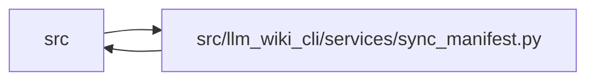

# sync_manifest Module

**Path:** `src/llm_wiki_cli/services/sync_manifest.py`

## Description

Service-level persistence boundary for the sync manifest v5 contract.

## Imports

| Source | Symbols |
|--------|---------|
| `..extractors.common` | `LANGUAGE_EXTENSIONS`, `inventory_language_for_path` |
| `.io` | `write_json_atomic` |
| `.knowledge_evidence` | `ENTITY_OBSERVATION_SCOPE`, `MODULE_OBSERVATION_SCOPE`, `ConceptObservationBasis`, `formatted_json_text`, `hash_file`, `is_valid_sha256`, `semantic_hash_for_file` |
| `.source_selection` | `SourceSelectionError`, `SourceSelectionPolicy`, `path_is_selected`, `source_selection_identity_from_generation_inputs`, `source_selection_inputs_from_generation_inputs` |
| `.source_snapshot` | `SourceSnapshot` |
| `.validation` | `portable_page_component`, `require_exact_fields`, `require_mapping`, `require_repository_relative_path` |
| `__future__` | `annotations` |
| `collections` | `Counter`, `defaultdict` |
| `collections.abc` | `Iterable`, `Mapping` |
| `copy` | `deepcopy` |
| `dataclasses` | `dataclass`, `field`, `replace` |
| `json` | `json` |
| `pathlib` | `Path` |
| `re` | `re` |
| `typing` | `TYPE_CHECKING`, `Any` |

## Local dependency map

<!-- Auto-generated local dependency summary. Do not edit by hand. -->

> Module-level dependencies exceed the generated-diagram limits, so the diagram and table below group them by top-level package. Counts report the number of module neighbors in each package.

### Internal neighbors

| Direction | Module |
|---|---|
| Inbound | `src` (24) |
| Outbound | `src` (6) |

> All 30 module neighbor(s) are summarized by package because the module-level view exceeds the 12-node limit.

## Classes

| Class | Line | Bases | Description |
|-------|------|-------|-------------|
| [SyncManifestError](../entities/SyncManifestError.md) | 60 | `ValueError` | Field-specific validation failure for decoded manifest state. |
| [SourceSelectionPruneResult](../entities/SourceSelectionPruneResult.md) | 71 | — | Manifest state removed because it falls outside a selected source set. |
| [ManifestPageSource](../entities/ManifestPageSource.md) | 147 | — | Last observed source coordinate for one module or entity page. |
| [ManifestEvidenceBaseline](../entities/ManifestEvidenceBaseline.md) | 252 | — | Known or explicitly unknown evidence for one active concept page. |
| [ManifestTombstone](../entities/ManifestTombstone.md) | 357 | — | Evidence retained for a stale module/entity page. |
| [ManifestArtifactHashes](../entities/ManifestArtifactHashes.md) | 446 | — | All-or-none exact-byte commitment to the generated artifact set. |
| [SyncManifest](../entities/SyncManifest.md) | 933 | — | Persistent v5 operational state used to generate the wiki. |

## Functions

| Function | Signature | Decorators | Description |
|----------|-----------|------------|-------------|
| `_validate_reason` | `(value: object, field_name: str) -> str` | — | — |
| `_validate_repository_path` | `(value: object, field_name: str) -> str` | — | — |
| `_validate_concept_page_path` | `(value: object, field_name: str) -> str` | — | — |
| `_validate_exact_keys` | `(value: Mapping[str, object], *, field_name: str, required: set[str], optional: Iterable[str] = ()) -> None` | — | — |
| `_mapping_value` | `(value: object, field_name: str) -> Mapping[str, object]` | — | — |
| `_basis_from_payload` | `(value: object, field_name: str, *, unknown_reason: str \| None) -> ConceptObservationBasis` | — | — |
| `_infer_language_from_path` | `(filepath: str) -> str \| None` | — | — |
| `_first_doc_line` | `(info: Mapping[str, Any]) -> str` | — | — |
| `_safe_page_component` | `(value: object, *, fallback: str = 'page') -> str` | — | — |
| `_page_name_with_extension` | `(filepath: str) -> str` | — | — |
| `_page_name_from_source_path` | `(filepath: str) -> str` | — | — |
| `_disambiguate_module_paths` | `(filepaths: list[str], stem: str) -> dict[str, str]` | — | — |
| `_build_module_page_map` | `(inventory: Mapping[str, Mapping[str, Any]]) -> dict[str, str]` | — | — |
| `_build_entity_occurrence_page_map` | `(inventory: Mapping[str, Mapping[str, Any]], module_page_map: Mapping[str, str]) -> dict[tuple[str, str, int], str]` | — | Preserve the legacy occurrence-map fallback without command imports. |
| `generated_semantics_for_file` | `(filepath: str, file_data: Mapping[str, Any]) -> dict[str, Any]` | — | Return generated description fields retained by current sync behavior. |
| `retained_concept_page_paths` | `(wiki_dir: Path) -> tuple[str, ...]` | — | Return retained module/entity Markdown paths without reading page text. |
| `_page_path` | `(scope: str, page_name: object, field_name: str) -> str` | — | — |
| `_put_page_mapping` | `(mappings: dict[str, ManifestPageSource], page_path: str, mapping: ManifestPageSource) -> None` | — | — |
| `_legacy_operational_state` | `(sources: Mapping[str, Mapping[str, Any]]) -> tuple[dict[str, ManifestPageSource], dict[str, ManifestEvidenceBaseline]]` | — | — |
| `_copy_sources` | `(value: object, field_name: str) -> dict[str, dict]` | — | — |
| `_copy_mapping` | `(value: object, field_name: str) -> dict[str, object]` | — | — |
| `_captured_source_hashes` | `(inventory: Mapping[str, object], value: Mapping[str, str] \| None) -> dict[str, str] \| None` | — | Validate an optional exact-hash replacement for source file reads. |
| `prune_manifest_for_source_selection` | `(manifest: SyncManifest, policy: SourceSelectionPolicy \| None, *, source_snapshot: SourceSnapshot \| None = None) -> SourceSelectionPruneResult` | — | Erase prior source/page state excluded by the current selection policy. |
