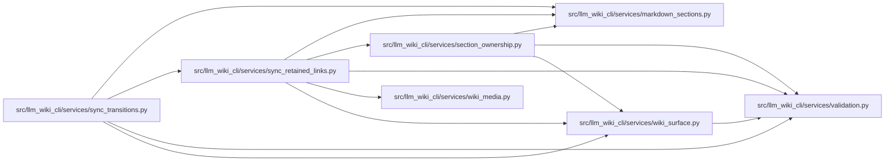

# sync_retained_links Module

**Path:** `src/llm_wiki_cli/services/sync_retained_links.py`

## Description

Pure, ownership-scoped link repairs for retained source pages.

## Imports

| Source | Symbols |
|--------|---------|
| `.markdown_sections` | `description_table_cells`, `parse_markdown_document` |
| `.section_ownership` | `SectionOwnership`, `classify_section_ownership` |
| `.validation` | `portable_path_key` |
| `.wiki_media` | `iter_markdown_link_targets`, `iter_mermaid_click_targets`, `mask_markdown_code` |
| `.wiki_surface` | `PageKind` |
| `__future__` | `annotations` |
| `collections` | `defaultdict` |
| `collections.abc` | `Iterator`, `Mapping` |
| `posixpath` | `posixpath` |
| `urllib.parse` | `quote`, `unquote`, `urlsplit` |

## Local dependency map

<!-- Auto-generated local dependency summary. Do not edit by hand. -->

### Internal neighbors

| Direction | Module |
|---|---|
| Inbound | [sync_transitions](../modules/sync_transitions.md) |
| Outbound | [markdown_sections](../modules/markdown_sections.md) |
| Outbound | [section_ownership](../modules/section_ownership.md) |
| Outbound | [validation](../modules/validation.md) |
| Outbound | [wiki_media](../modules/wiki_media.md) |
| Outbound | [wiki_surface](../modules/wiki_surface.md) |

## Functions

| Function | Signature | Decorators | Description |
|----------|-----------|------------|-------------|
| `_structural_cells` | `(text: str) -> Iterator[tuple[int, int]]` | — | Locate structural cells without reformatting mixed table rows. |
| `_new_destination` | `(target: str, relative: str, moves: Mapping[str, str]) -> str \| None` | — | — |
| `_rewrite_region` | `(text: str, relative: str, moves: Mapping[str, str], *, mermaid: bool) -> str` | — | — |
| `repair_retained_page_links` | `(text: str, relative: str, kind: PageKind, moves: Mapping[str, str]) -> str` | — | Apply each old-to-final mapping once, only to generated structure. |
