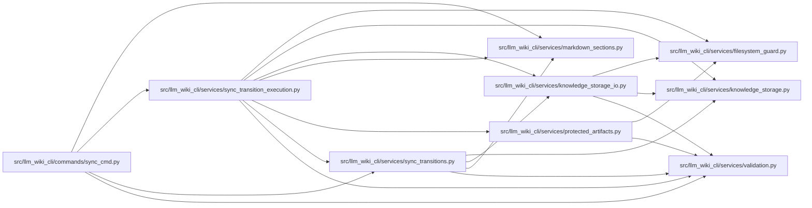

# sync_transition_execution Module

**Path:** `src/llm_wiki_cli/services/sync_transition_execution.py`

## Description

Guarded execution of source-page moves, with retained failure recovery data.

## Imports

| Source | Symbols |
|--------|---------|
| `.filesystem_guard` | `atomic_write_guarded_bytes`, `atomic_write_private_bytes`, `ensure_guarded_directory`, `guarded_tree_manifest`, `remove_guarded_tree`, `unlink_guarded_bytes` |
| `.knowledge_storage` | `MAX_EXPANDED_BYTES`, `KnowledgeStorageError` |
| `.knowledge_storage_io` | `StorageReadSession`, `read_guarded` |
| `.markdown_sections` | `normalize_markdown` |
| `.protected_artifacts` | `ProtectedArtifactStore` |
| `.sync_transitions` | `PageTransitionError`, `PageTransitionPlan` |
| `.validation` | `portable_path_key` |
| `__future__` | `annotations` |
| `hashlib` | `hashlib` |
| `json` | `json` |
| `pathlib` | `Path` |
| `stat` | `stat` |
| `sys` | `sys` |
| `uuid` | `uuid` |

## Local dependency map

<!-- Auto-generated local dependency summary. Do not edit by hand. -->

### Internal neighbors

| Direction | Module |
|---|---|
| Inbound | [sync_cmd](../modules/sync_cmd.md) |
| Outbound | [filesystem_guard](../modules/filesystem_guard.md) |
| Outbound | [knowledge_storage](../modules/knowledge_storage.md) |
| Outbound | [knowledge_storage_io](../modules/knowledge_storage_io.md) |
| Outbound | [markdown_sections](../modules/markdown_sections.md) |
| Outbound | [protected_artifacts](../modules/protected_artifacts.md) |
| Outbound | [sync_transitions](../modules/sync_transitions.md) |
| Outbound | [validation](../modules/validation.md) |

## Classes

| Class | Line | Bases | Description |
|-------|------|-------|-------------|
| [PageTransitionExecution](../entities/PageTransitionExecution.md) | 48 | — | Keep rename originals until the surrounding generation/commit succeeds. |

## Functions

| Function | Signature | Decorators | Description |
|----------|-----------|------------|-------------|
| `assert_no_pending_page_moves` | `(wiki_dir: Path) -> None` | — | — |
| `_decode` | `(content: bytes) -> str` | — | — |
